# 1.Comparison between session and JWT

## 1.1.session-based authentication

### 1.1.1.General

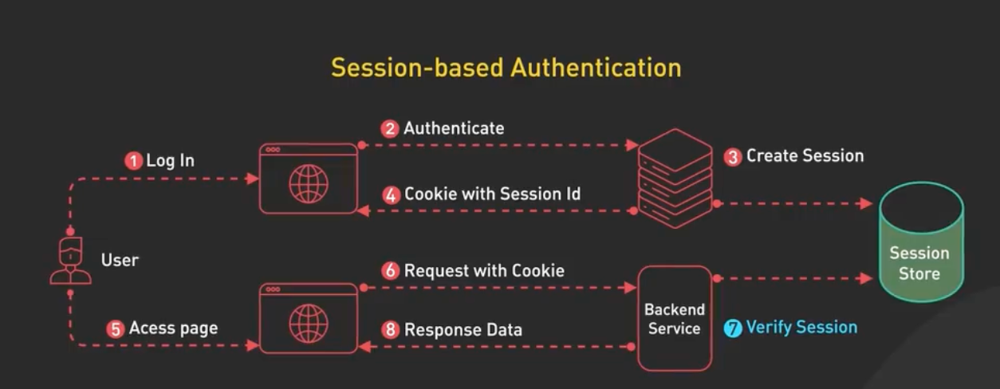

- user sends login credentials to authentication server;
- server verify credentials, if it's valid, it creates session and store session in session store, typically in a database or memory cache like redis(session data includes UserID, expiration time and other meta data);
- authentication server sends back session Id and fontend application stores it in Cookies;
- user accesses pages by carrying Sessioin ID and backend app verify session before sending back request data;

### 1.1.2.Pro&Con 

**Upsides:**

- revoking a session is easy, only need to expire session data using sessionID as its key;

**Downsides:** 

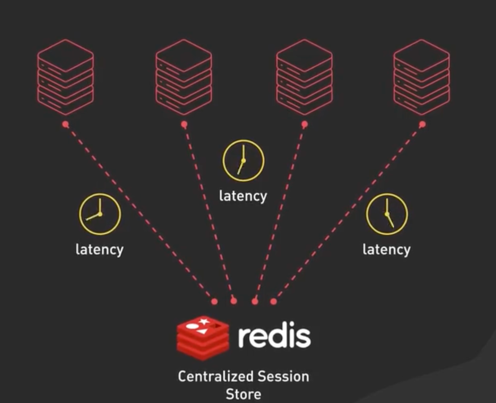

- backend app has to acquire session data from centralized session store, which will cause latency ;
- Scaling involving centralized session store ;

## 1.2.JWT (Json Web Token)

### 1.2.1.General

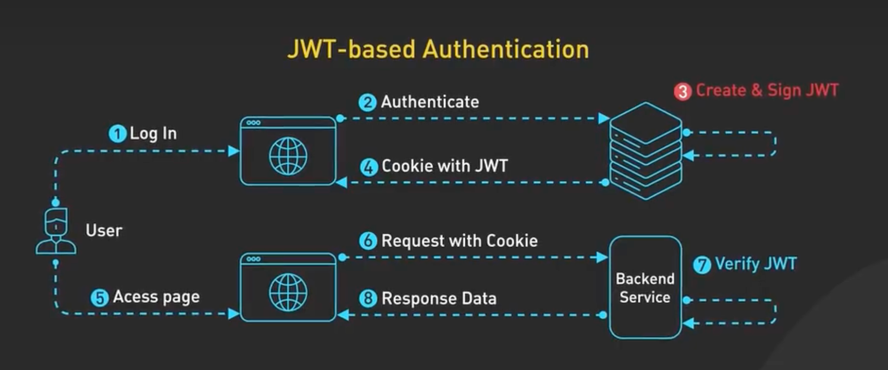

- When authenticated, server sends back:
  - access token: carry each request;
  - refresh token: carry only when access token expired;

### 1.2.2.Pro&Con

pro:

- No separate storage needed, no need to set up session store;
- invalidation of a JWT is not easy;
- scaling client and server is easy, cuz JWT is **stateless**;

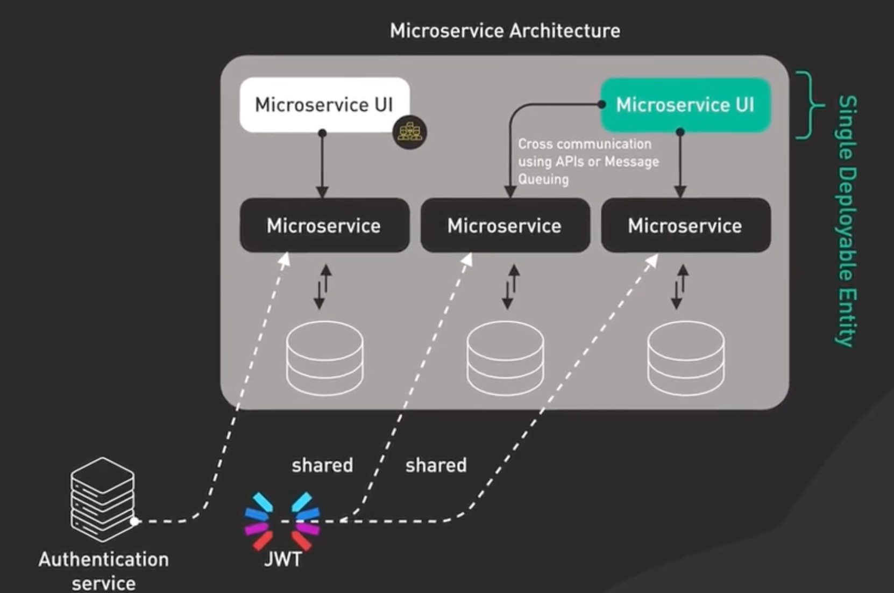

### 1.2.3.Algorithm choices

**HMAC vs RSA vs ECDSA** 

- 第一个 为 对称加密, 加解密需要同一个密钥, 适用于单体架构 ;
- 后两者 为 非对称加密, 私钥加密, 公钥解密, 更安全, 各个instance使用公钥都可解密, 但需要更高的计算成本, 适用于微服务集群 ;  

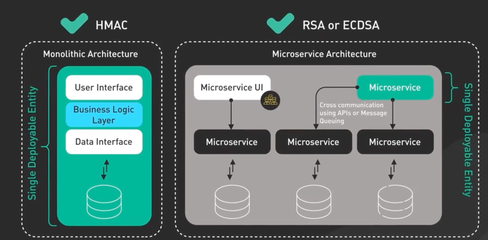

### 1.2.4.Short-lived access token and long-lived refresh token

**Balance between security and user experience** :

- for security concern, leveraging short-lived access token who has a life expectation as session;
- for user experience, like the fact that you don't have to sign in each time on Google, using refresh token;

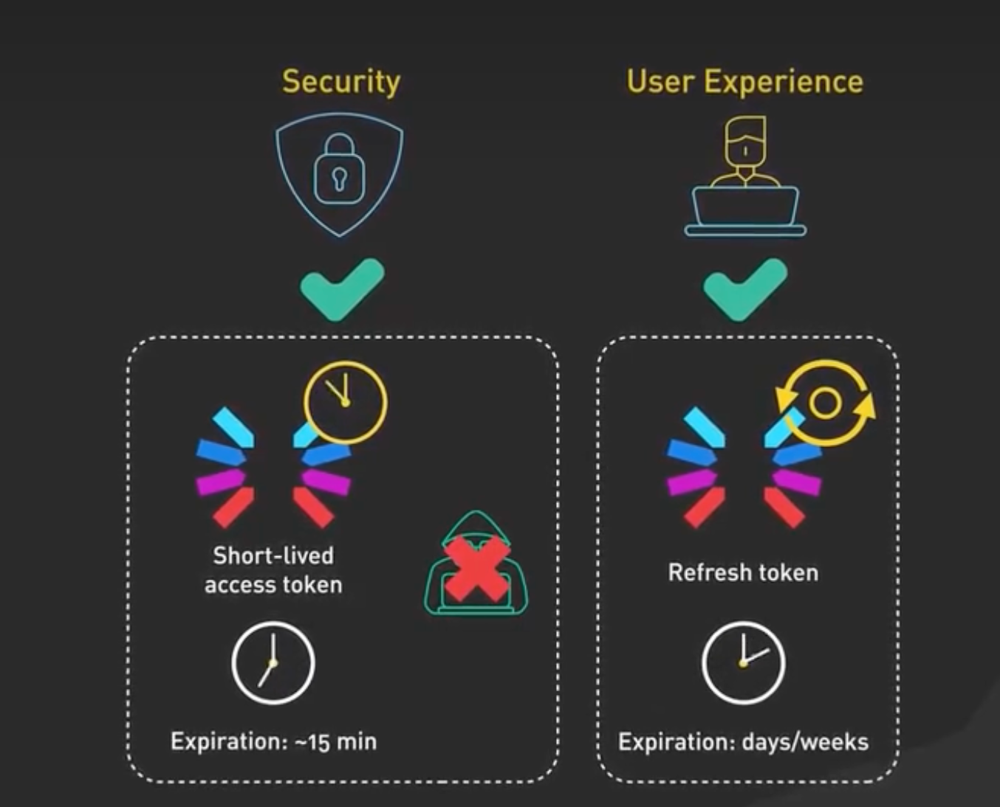

### 1.2.5.Refresh procedure

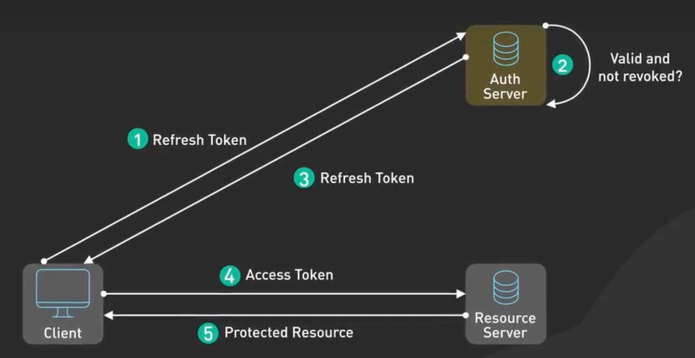

- if everything <u>checks out</u>, auth server <u>issues</u> a new access token

# 2.Oauth2 Authentication

## 2.1.场景一: 显式登录

- 笔记应用提供笔记页面登录窗口, 获取用户账号密码, 登录网盘进行操作;
- 安全风险大——若笔记应用擅自手机用户账号密码呢?
- 仅适用于 组织内部各个微服务间调用

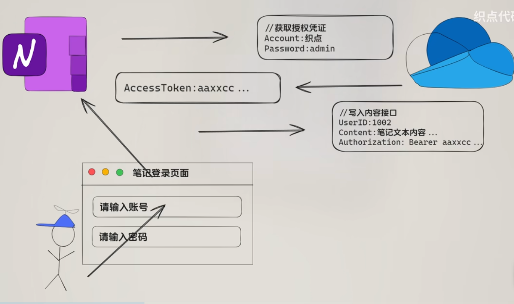

## 2.1.场景二: 隐式授权

- 隐式授权: 跳转到网盘登录页面, 让用户自己输入账号密码进行鉴权
- 弊端: access token在url里传递, 存在巨大泄露风险

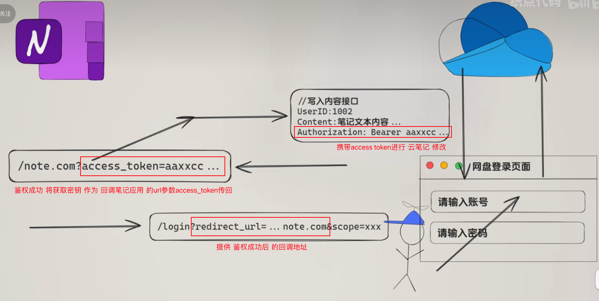

## 2.3.授权码授权

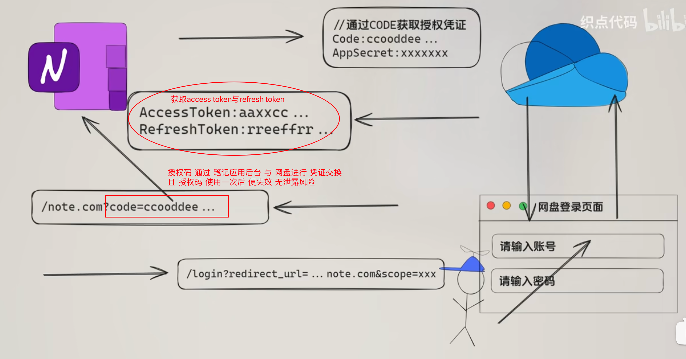

# 3.UI Permissions handling

## 3.1.Basic Approach

### 3.1.1.General Function

- hasPermission方法

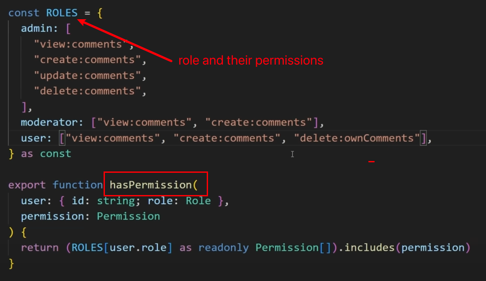

### 3.1.2.View

- 是否需要显示删除按钮 ? 利用 hasPermission传入 当前角色 与 当前按钮所对应权限

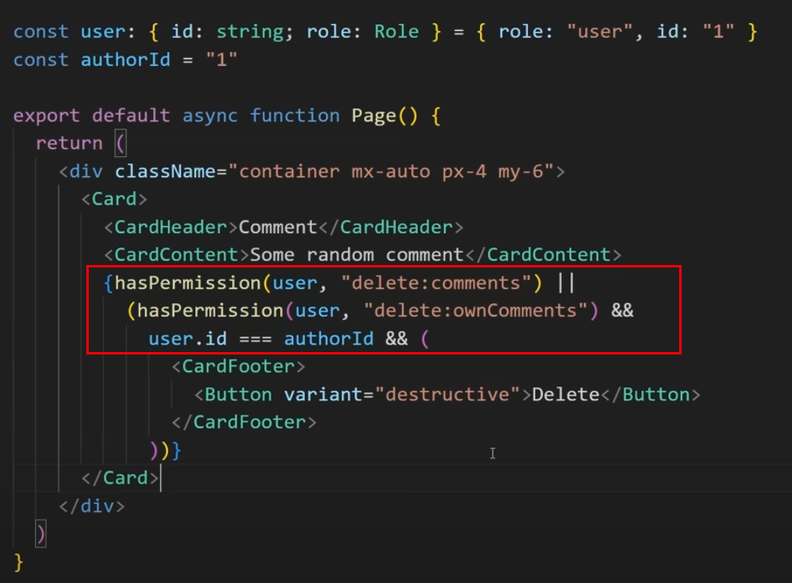

## 3.2.Basic Database Tables

### 3.2.1.General

- 最下方的 蓝色框格 等同于 table, 绿色框格 等同于 两者的joint table
- 最上的 蓝色框格 对于任何鉴权系统设计 都类似, 给 组织/公司 设计一套 user/role系统

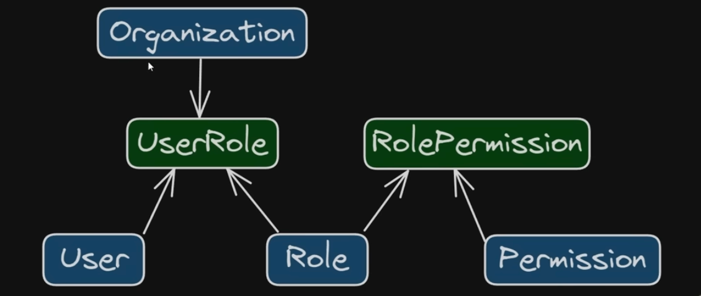

- 但以上结构存在不足:
  - 如果除了一般意义上的 user/role系统, 还有一些个性化的资源需要进行 权限规划怎么办? 比如google drive文件分享权限、图片编辑权限、blog权限等等
  - 解决办事: 为当前用户 定制一套 独立的角色与权限系统 

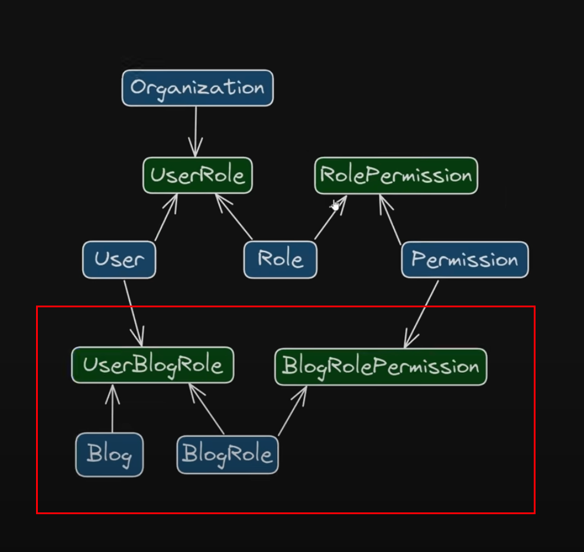

### 3.2.2.Attribute-based Access Control (ABAC)

**前言:** 至此, 问题并未完美解决, 如果需要 添加权限管理的资源 有多个呢? 难道要 复制粘贴 多套红框中的架构 吗?

**解决办法:** generic table, 将 资源标识 作为参数 传入

## 3.3.Final Solution

