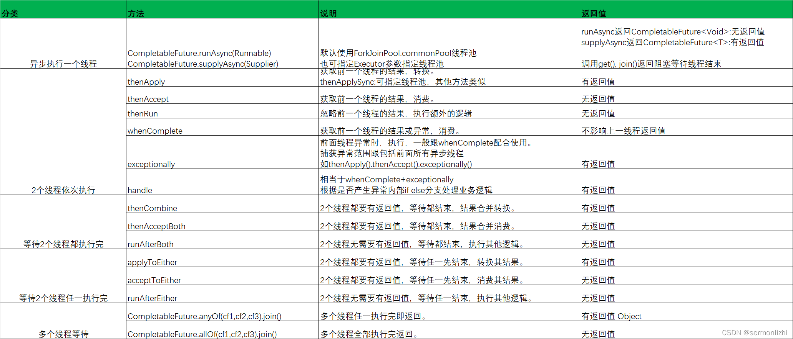

# Completable Future

` 真实案例：https://mp.weixin.qq.com/s?__biz=MzkyMzU5Mzk1NQ==&mid=2247506533&idx=1&sn=b553200af38373f4d740e7c379d8e6f9&source=41#wechat_redirect`


## 1. 优势

1、结果返回 非阻塞

- 使用Future时只能通过isDone( )方法判断任务是否完成，或者通过**get()方法阻塞线程等待结果返回，它不能非阻塞的情况下，执行更进一步的操作**。

2、灵活性

- 假设你有多个Future异步任务，你希望 最快的任务执行完 时，或者 所有任务都执行完 后，进行一些其他操作；

- Future的局限性，它没法直接对多个任务进行链式、组合等处理，需要借助并发工具类，比如completionStage，才能完成，实现逻辑比较复


## 2. 常用方法



### 依赖关系

thenApply()：把前面任务的执行结果，交给后面的Function
thenCompose()：用来连接两个有依赖关系的任务，结果由第二个任务返回

### and集合关系

thenCombine()：合并任务，有返回值
thenAccepetBoth()：两个任务执行完成后，将结果交给thenAccepetBoth处理，无返回值
runAfterBoth()：两个任务都执行完成后，执行下一步操作(Runnable类型任务)

### or聚合关系

applyToEither()：两个任务哪个执行的快，就使用哪一个结果，有返回值
acceptEither()：两个任务哪个执行的快，就消费哪一个结果，无返回值
runAfterEither()：任意一个任务执行完成，进行下一步操作(Runnable类型任务)

### 并行执行

allOf()：当所有给定的 CompletableFuture 完成时，返回一个新的 CompletableFuture
anyOf()：当任何一个给定的CompletablFuture完成时，返回一个新的CompletableFuture


## 3. demo代码

###  3.1. 创建CompletableFuture

```java
public static CompletableFuture<Void> runAsync(Runnable runnable);   
// 创建无返回值的异步任务

public static CompletableFuture<Void> runAsync(Runnable runnable, Executor executor);     
// 无返回值，可指定线程池（默认使用ForkJoinPool.commonPool）

public static <U> CompletableFuture<U> supplyAsync(Supplier<U> supplier);           
// 创建有返回值的异步任务

public static <U> CompletableFuture<U> supplyAsync(Supplier<U> supplier, Executor executor); // 有返回值，可指定线程池
```


### 3.2. get / join

- join()和get()方法都是用来获取CompletableFuture异步之后的返回值

- join()方法抛出的是uncheck异常（即未经检查的异常),不会强制开发者抛出

- get()方法抛出的是经过检查的异常，ExecutionException, InterruptedException 需要用户手动处理（抛出或者 try catch）
  

```java
CompletableFuture<String> future = CompletableFuture.supplyAsync(() -> {
    System.out.println("有返回值的异步任务");
    try {
        Thread.sleep(5000);
    } catch (InterruptedException e) {
        e.printStackTrace();
    }
    return "Hello World";
});
String result = future.get();
```


### 3.3. whenComplete / exceptionnally


```java
CompletableFuture<String> future = CompletableFuture.supplyAsync(() -> {
    try {
        TimeUnit.SECONDS.sleep(1);
    } catch (InterruptedException e) {
    }
    if (new Random().nextInt(10) % 2 == 0) {
        int i = 12 / 0;
    }
    System.out.println("执行结束！");
    return "test";
});

// 任务完成或异常方法完成时执行该方法, 如果出现了异常, 任务结果为null
future.whenComplete(new BiConsumer<String, Throwable>() {
    @Override
    public void accept(String t, Throwable action) {
        System.out.println(t+" 执行完成！");
    }
});
// 出现异常时先执行该方法
future.exceptionally(new Function<Throwable, String>() {
    @Override
    public String apply(Throwable t) {
        System.out.println("执行失败：" + t.getMessage());
        return "异常xxxx";
    }
});
future.get();
```


### 3.4. thenRun/Accept/Apply

- 由于Completable Future继承了Future, 所以也可以通过future.get()方法获取异步任务的结果，但会阻塞地等待任务完成, CompletableFuture提供了几个回调方法，可以不阻塞主线程，在 **异步任务完成后自动执行回调方法中的代码** （回调：不阻塞主流程，等 请求发起 或 分流程走完时再回头调用）
- 带有Async后缀的方法，可以指定 线程池 进行后继方法的执行单位；

```java
//无参数、无返回值
public CompletableFuture<Void> thenRun(Runnable runnable);            

//接受参数，无返回值
public CompletableFuture<Void> thenAccept(Consumer<? super T> action);        
//接受参数T，有返回值U 
public <U> CompletableFuture<U> thenAccept(Function<? super T, ? extends U> fn); 
```


### 3.5. thenCompose

- thenCompose参数Function的返回值为CompletionStage；
- thenApply则为返回值本身；

```java
public <U> CompletableFuture<U> thenCompose(
  	Function< ? super T, ? extends CompletionStage<U> > fn);

public <U> CompletableFuture<U> thenComposeAsync(
  	Function<? super T, ? extends CompletionStage<U>> fn) ;
```

代码实例：

```java
CompletableFuture<Integer> future = CompletableFuture
    .supplyAsync(new Supplier<Integer>() {
        @Override
        public Integer get() {
            int number = new Random().nextInt(30);
            System.out.println("第一次运算：" + number);
            return number;
        }
    })
    .thenCompose(new Function<Integer, CompletionStage<Integer>>() {
        @Override
        public CompletionStage<Integer> apply(Integer param) {
            
          return CompletableFuture.supplyAsync(new Supplier<Integer>() {
                @Override
                public Integer get() {
                    int number = param * 2;
                    System.out.println("第二次运算：" + number);
                    return number;
                }
            });
          
        }
    });

```


### 3.6. thenAcceptBoth

`thenAcceptBoth`函数的作用是，当两个`CompletionStage`都正常完成计算的时候，就会执行提供的`action`消费两个异步的结果。

```java
public <U> CompletionStage<Void> thenAcceptBoth(
  CompletionStage<? extends U> other,
  BiConsumer<? super T, ? super U> action
);

public <U> CompletionStage<Void> thenAcceptBothAsync(
  CompletionStage<? extends U> other,
  BiConsumer<? super T, ? super U> action
);
```

代码实例：

```java
CompletableFuture<Integer> futrue1 = CompletableFuture.supplyAsync(new Supplier<Integer>() {
    @Override
    public Integer get() {
        int number = new Random().nextInt(3) + 1;
        try {
            TimeUnit.SECONDS.sleep(number);
        } catch (InterruptedException e) {
            e.printStackTrace();
        }
        System.out.println("任务1结果：" + number);
        return number;
    }
});

CompletableFuture<Integer> future2 = CompletableFuture.supplyAsync(new Supplier<Integer>() {
    @Override
    public Integer get() {
        int number = new Random().nextInt(3) + 1;
        try {
            TimeUnit.SECONDS.sleep(number);
        } catch (InterruptedException e) {
            e.printStackTrace();
        }
        System.out.println("任务2结果：" + number);
        return number;
    }
});

// 获取2次future的返回值， 作为第二个参数的入参
futrue1.thenAcceptBoth(future2, new BiConsumer<Integer, Integer>() {
    @Override
    public void accept(Integer x, Integer y) {
        System.out.println("最终结果：" + (x + y));
    }
});

```


### 3.7. thenCombine

- thenCombine VS thenAcceptBoth：后者只能接收参数，前者接收以外还能 返回值，所以前者第二个参数类型为BiFunction，前者为BiConsumer

```java
public <U,V> CompletableFuture<V> thenCombine(
  CompletionStage<? extends U> other,
  BiFunction<? super T,? super U,? extends V> fn
);

public <U,V> CompletableFuture<V> thenCombineAsync(
  CompletionStage<? extends U> other,
  BiFunction<? super T,? super U,? extends V> fn
);

public <U,V> CompletableFuture<V> thenCombineAsync(
  CompletionStage<? extends U> other,
  BiFunction<? super T,? super U,? extends V> fn, 
  Executor executor
);
```

代码实例：

```java
CompletableFuture<Integer> future1 = CompletableFuture
    .supplyAsync(new Supplier<Integer>() {
        @Override
        public Integer get() {
            int number = new Random().nextInt(10);
            System.out.println("任务1结果：" + number);
            return number;
        }
    });
CompletableFuture<Integer> future2 = CompletableFuture
    .supplyAsync(new Supplier<Integer>() {
        @Override
        public Integer get() {
            int number = new Random().nextInt(10);
            System.out.println("任务2结果：" + number);
            return number;
        }
    });

CompletableFuture<Integer> result = future1
    .thenCombine(future2, new BiFunction<Integer, Integer, Integer>() {
        @Override
        public Integer apply(Integer x, Integer y) {
            return x + y;
        }
    });
System.out.println("组合后结果：" + result.get());

```


### 3.8.  runAfterEither / acceptEither / applyToEither

- runAfterEither：两个线程任务相比较，有任何一个执行完成，就进行下一步操作，不关心运行结果；
- acceptEither：两个线程任务相比较，先获得执行结果的，就对该结果进行下一步的消费操作；
- applyToEither：两个线程任务相比较，先获得执行结果的，就对该结果进行下一步的转化操作；

```java
CompletableFuture<Integer> future1 = CompletableFuture.supplyAsync(new Supplier<Integer>() {
    @Override
    public Integer get() {
        int number = new Random().nextInt(10) + 1;
        // ...
        return number;
    }
});

CompletableFuture<Integer> future2 = CompletableFuture.supplyAsync(new Supplier<Integer>() {
    @Override
    public Integer get() {
        int number = new Random().nextInt(10) + 1;
        // ...
        return number;
    }
});

// --------runAfterEither--------
future1.runAfterEither(future2, new Runnable() {
    @Override
    public void run() {
        System.out.println("已经有一个任务完成了");
    }
}).join();

// --------acceptEither--------
future1.acceptEither(future2, new Consumer<Integer>() {
    @Override
    public void accept(Integer number) {
        System.out.println("最快结果：" + number);
    }
});

// --------applyToEither--------
future1.applyToEither(future2, new Function<Integer, Integer>() {
    @Override
    public Integer apply(Integer number) {
        System.out.println("最快结果：" + number);
        return number * 2;
    }
});
```


### 3.9. anyOf / allOf

方法：

```java
public static CompletableFuture<Object> anyOf(CompletableFuture<?>... cfs)
  
public static CompletableFuture<Void> allOf(CompletableFuture<?>... cfs)
```

代码实例：

```java
Random random = new Random();

CompletableFuture<String> future1 = CompletableFuture.supplyAsync(() -> {
    try {
        TimeUnit.SECONDS.sleep(random.nextInt(5));
    } catch (InterruptedException e) {
        e.printStackTrace();
    }
    return "hello";
});

CompletableFuture<String> future2 = CompletableFuture.supplyAsync(() -> {
    try {
        TimeUnit.SECONDS.sleep(random.nextInt(1));
    } catch (InterruptedException e) {
        e.printStackTrace();
    }
    return "world";
});

CompletableFuture<Object> result = CompletableFuture.anyOf(future1, future2);
CompletableFuture<Object> result = CompletableFuture.allOf(future1, future2);
```


## 4. 真实场景

将长List分批后（Lists.partition()），可获得dataList，之后：

```java
CompletableFuture[] futureArray = 
  dataList.stream()
     .map( // map流方法可将每个元素逐个映射成另一个stream
  		data -> CompletableFuture
          .supplyAsync(() -> query(data), asyncExecutor)
          .whenComplete((result, th) -> {})
         )
  // whenComplete后返回CompletableFuture
  // 将所有CompletableFuture组装为数组
  .toArray(CompletableFuture[]::new);

// allOf等待所有线程完成任务
CompletableFuture.allOf(futureArray).join();
```

