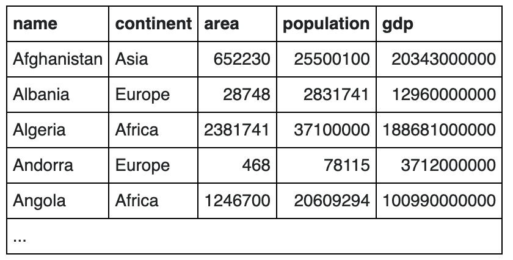
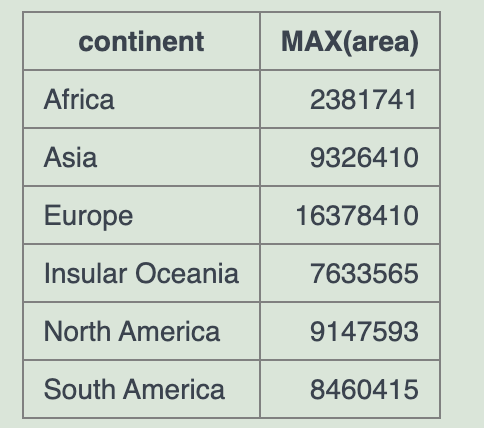

# 1.world table




## 1.1.人均GDP大于英国的国家

Show the countries in Europe with a per capita GDP greater than 'United Kingdom'.

```sql
SELECT name
   FROM world
WHERE continent = 'Europe'
AND (gdp/population) > 
    (SELECT (gdp/population)
     FROM world
     WHERE name = 'United Kingdom')
```


## 1.2.每个大洲最多人口的国家

> Find the largest country (by area) in each continent, show the **continent**, the **name** and the **area**: The above example is known as a **correlated** or **synchronized** sub-query. Using correlated subqueries

```sql
SELECT continent, name, area
FROM world x
WHERE area = (
  SELECT MAX(area)
  FROM world y
  WHERE y.continent = x.continent
);
```

个人瓶颈:

```sql
SELECT continent, MAX(area) 
FROM world
group by continent
```

就此走不下去, 只找到了每个大洲的最大面积国家的面积数, 问题在于: 如何能拿到每个大洲对应的最大面积数?




## 1.3.每个大洲所有国家按字母顺序排列

- List each continent and the name of the country that comes first alphabetically. 

- 只返回第一个国家 ,和上例一个道理

```sql
select continent, name
from world x
where name = (
  select name from world y
  where x.continent = y.continent
  order by name
  limit 1
)
```


## 1.4.所有国家人口都小于x的大洲内所有国家

Find the continents where all countries have a population <= 25000000. Then find the names of the countries associated with these continents. Show name, continent and population

<u>**原因**</u>: 没有group by 直接上 having max(population), 响应invalid use of group function(也就是max函数)

```sql
SELECT name, continent, population
FROM world
WHERE continent IN (
    SELECT continent
    FROM world
    GROUP BY continent
    HAVING MAX(population) <= 25000000
)
```


## 1.5.人口总数大于邻国总人口三倍的国家

Some countries have populations more than three times that of all of their neighbours (in the same continent). Give the countries and continents.

```sql
SELECT w1.name, w1.continent
FROM world w1
JOIN world w2 ON w1.continent = w2.continent AND w1.name != w2.name
# join部分语句获取 当前国 邻国所有国家list
WHERE w1.population > 3 * (
    SELECT SUM(w3.population)
    FROM world w3
    WHERE w3.continent = w1.continent AND w3.name IN (
        SELECT neighbor
        FROM neighbors
        WHERE country = w1.name
    )
);
```


# 88.英语描述

## 1. 嵌套查询

The SQL statement you've provided is designed to retrieve the names of countries from a table named `world` where their GDP (Gross Domestic Product) is greater than the maximum GDP of all countries in Europe. Here's a breakdown of the statement:

1. **<u>Subquery (Inner Query)</u>:**
   
   ```sql
   (select max(gdp) from world where continent = 'Europe')
   ```
   This <u>subquery</u> calculates the maximum GDP value among all countries that belong to the continent 'Europe'. It filters the `world` table to include only rows where the `continent` column is 'Europe', and <u>then applies the `max()` function to the `gdp` column</u> to find the highest GDP value among these countries.
   
2. **<u>Main Query (Outer Query)</u>:**
   
   ```sql
   select name from world where gdp > (Subquery)
   ```
   The main query selects the `name` column from the `world` table where the `gdp` value of each country is greater than the maximum GDP value obtained from the subquery. This means it retrieves the names of countries whose GDP is higher than the highest GDP of any country in Europe.

**Explanation:**
- The <u>subquery acts as a filter criterion for the main query</u>. It provides a threshold value (the maximum GDP of European countries) which is used to filter out countries in the main query.
- The main query then selects the names of countries that <u>surpass this threshold</u>, indicating that these countries have a higher GDP than the richest country in Europe.


## 2.goupBy and Having

In SQL, the `having` and `groupBy` (commonly referred to as `group by`) operators are used in conjunction to filter and aggregate data based on specific conditions. Here's how each operator is used and their combined use case:

1. **GROUP BY**:
   - The `group by` clause is used to group rows that have the same values in specified columns into aggregated data.
   - It is often used with aggregate functions like `COUNT()`, `SUM()`, `AVG()`, `MAX()`, and `MIN()` to perform operations on the grouped data.
   - For example, if you have a table of sales data, you might use `group by` to calculate the total sales per product or per region.

   ```sql
   SELECT product, SUM(quantity) as total_quantity
   FROM sales
   GROUP BY product;
   ```

2. **HAVING**:
   - The `having` clause is used to filter the results of a `group by` clause.
   - It is similar to the `where` clause but operates on aggregated data.
   - You can use `having` to specify conditions on the aggregated results, such as only showing groups where the total quantity sold exceeds a certain threshold.

   ```sql
   SELECT product, SUM(quantity) as total_quantity
   FROM sales
   GROUP BY product
   HAVING SUM(quantity) > 100;
   ```

Combined Use Case:
- The combined use of `group by` and `having` allows you to perform complex data analysis by first grouping data and then applying filters on the aggregated results.
- This is particularly useful in scenarios where you need to analyze large datasets and extract meaningful insights based on aggregated data.
- For instance, in a business context, you might use these operators to find out which products have sold more than a certain amount, or which regions have contributed the most to the total sales.

In summary, the `group by` and `having` operators in SQL are powerful tools for data aggregation and filtering, enabling users to derive insights from large and complex datasets.

# 99.SQL技巧

## 保留2位小数

```sql
SELECT ROUND(column1 / column2, 2) AS result FROM table;
```


## 数学运算时默认值

**Using `COALESCE`**: `COALESCE` is used to <u>handle cases where there might be no neighbors</u> (returning 0 instead of null). This is important to avoid null values in the multiplication operation. 避免返回null

```sql
COALESCE( SUM(population), 0 ) # 如果population都为null, sum值返回0即可
```

