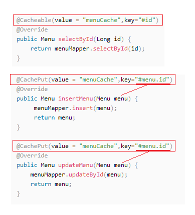
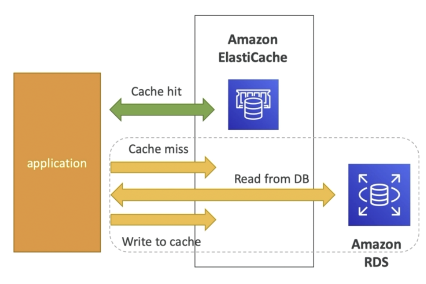
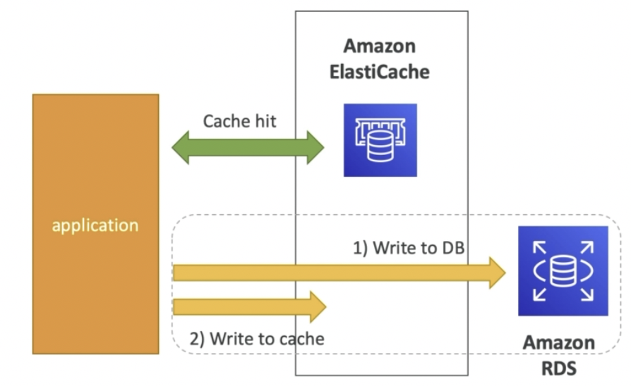

# 如何保证缓存和数据库的一致性？

## 基本逻辑

- 缓存 都是为了 读取, 如果加了缓存逻辑, 则每次先读缓存, 没有再读数据库;
- cache miss, 读库, 把读取到的数据 更新到 缓存;
- 区别在于, 每次 更新数据库 后, 如何 同步 到 缓存 的问题:
  - update: 每次更新数据库都更新缓存, 可能浪费系统资源, 无用操作;
  - delete: 最佳, 但仍存在隐患
    - A线程更新数据库(主库), 删缓存, B线程cache miss, 跑去读 从库replica, 此时数据库主从复制未完成
    - 解决办法: 依靠MQ, 延时双删

## 方案对比

### 「 更新数据库 + 更新缓存 」

**缺点：**

并不是每次更新后的数据马上会被读取，<u>每次更新都同步更新缓存，不仅缓存利用率不高，还会造成机器性能的浪费</u>

**并发问题：**

线程A更改x=1 

---> 线程B更改x=2 (最新值) 

---> 线程B更改缓存x=2 (最新值) ---> 线程B更改缓存x=1 (旧值) <--- 用户读取

### 「 删除缓存 + 更新数据库 」

**为什么不能先删除缓存？**

1. 线程 A 要更新 X = 2
2. 线程 A 先删除缓存
3. 线程 B 读缓存，发现不存在，从数据库中读取到旧值（X = 1）
4. 线程 A 将新值写入数据库（X = 2）
5. 线程 B 将旧值写入缓存（X = 1 旧值） <--- 用户读取将都是错误的X值

### 「  更新数据库 + 删除缓存  」

**该方案下，什么时候会发生数据不一致情况？**

1. 缓存中 X 不存在（数据库 X = 1）
2. 线程 A 读取数据库，得到旧值（X = 1）
3. 线程 B 更新数据库（X = 2)
4. 线程 B 删除缓存
5. 线程 A 将旧值写入缓存（X = 1）

## 主从库延迟和延迟双删问题

1. 线程 A **更新主库**  X = 2（原值 X = 1）；
2. 线程 A **删除缓存**；
3. 线程 B **查询缓存，没有命中，查询「从库」**得到旧值（从库 X = 1）；
4. 从库「同步」完成（主从库 X = 2）；
5. 线程 B 将「旧值」写入缓存（X = 1）；

**解决办法：缓存延迟双删策略**

**解决第一个问题**：在线程 A 删除缓存、更新完数据库之后，先「休眠一会」，再「删除」一次缓存。

**解决第二个问题**：线程 A 可以生成一条「延时消息」，写到消息队列中，消费者延时「删除」缓存。

**这个「延迟删除」缓存，延迟时间到底设置要多久呢？**

- 问题1：延迟时间要大于「主从复制」的延迟时间
- 问题2：延迟时间要大于 线程 B 读取数据库 + 写入缓存的时间

但是，这个时间在分布式和高并发场景下，其实是很难评估的，很多时候，都是凭借经验大致估算这个延迟时间，例如延迟 1-5s，只能尽可能地降低不一致的概率。

## Redis Spingboot注解

- 在启动类上添加@EnableCaching注解
- 每次查询都优先从redis进行查询，若无数据，则前往数据库查询（@Cacheable注解）;
- 针对插入、更新，**直接操作数据库**，每次均会同步到redis，注意是删除缓存（@CachePut注解）

# Caching Implementation Considerations

- Read more at: https://aws.amazon.com/caching/implementation=considerations/
- Is it safe to cache data? Data may be out of date, eventually consistent
- Is caching effective for that data?
    - Pattern: data changing slowly, few keys are frequently needed
    - Anti patterns: data changing rapidly, all large key space frequently needed
- Is data structured well for caching ?
    - example: key value caching, or caching of aggregations results
- Which caching design pattern is the most appropriate ?

## Lazy Loading / Cache-Aside / Lazy Population

懒加载: 即最常见的策略, 缓存不命中则查询数据库, 返回数据后写入缓存

- Pros
  - Only requested data is cached (the cache isn't filled up with unused data)
  - Node failures are not fatal (just increased latency to warm the cache)
- Cons
  - **Cache miss penalty** that results in 3 round trips, noticeable delay for that request
  - Stale data: data can be updated in the database and outdated in the cache 这能忍??

## Write Through - add or update cache when database is updated

缓存直写 : 更新数据库时同步更新缓存

- Pros:
  - Data in cache is never stale 不新鲜的, reads are quick
  - Write penalty vs Read penalty (each write requires 2 calls)
- Cons:
  - Missing Data until it is added / updated in the DB 若目标数据永远没有被更新则它就一直是缺失的
  - Mitigation 减轻罪行 is to implement Lazy Loading strategy as well 可以结合 懒加载 策略, 缓存无数据则添加到缓存
  - Cache churn - a lot of the data will never be read
