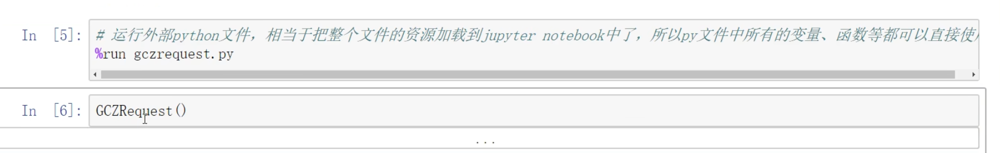
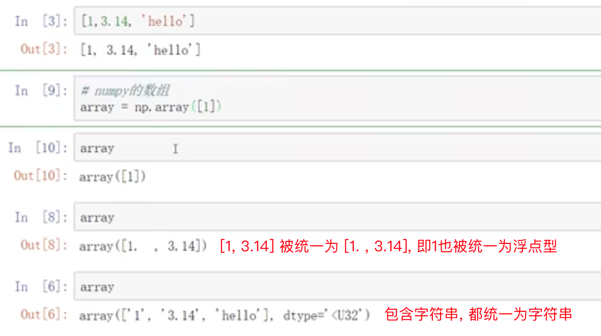

# 基础与环境

## 基本指令

```shell
python3 --version

pip3 install xx
```


## 环境配置

```bash
# 查看版本 注意: 不是-v
python --version 

# 创建虚拟环境
python3 -m venv path/to/venv 
# 如下 则在当前目录下生成.venv目录
python3 -m venv .venv

# 激活venv !import
	# win
.venv\Scripts\activate
	# MacOS
source .venv/bin/activate 
# 或 关闭terminal重开

# 此时命令行如下:
(.venv) luoran@LUOs-MacBook-Air foto-to-compress % 

# 直接vscode run
/opt/homebrew/bin/python3 /Users/luoran/Downloads/foto-to-compress/image-processor.py

# 提示: 是否安装venv ? Yes
/Users/luoran/Downloads/foto-to-compress/.venv/bin/python -m pip3 install PIL
```


## 工作目录

py文件中所指的目录为 执行命令行的目录, 也就是 > 左边的部分


## 多版本安装与切换

### pyenv

- Context: 本想在homebrew里安装python3.7, 但通过brew search发现brew维护的python里没有这个formulea(=版本), 于是安装了pyenv —— via homebrew lol

```shell
brew install pyenv

# zsh
echo 'eval "$(pyenv init -)"' >> ~/.zshrc
source ~/.zshrc

# bash
echo 'eval "$(pyenv init -)"' >> ~/.bash_profile  
source ~/.bash_profile  

pyenv install --list

pyenv install 3.11.5
pyenv global 3.7.17
pyenv local 3.7.17

python --version

pyenv versions

# 版本下第三方包位置
cd ~/.pyenv/versions/3.11.5/lib/python3.11/site-packages
```


### homebrew

```bash
brew list | grep python

brew info python@3.12

# all packages intalled by Homebrew python go to:
cd /opt/homebrew/Cellar/python-packaging/24.2/lib/python3.13/site-packages


/opt/homebrew/Cellar/python@3.12/3.12.2_1/bin
/opt/homebrew/Cellar/python@3.13/3.13.1/bin
```


# 语法

## 三元表达式

当然，Python中的三元条件表达式（也称为条件运算符）的语法是：`value_if_true if condition else value_if_false`。以下是一些例子：

1. **根据成绩输出评价**
   ```python
   grade = 85
   result = "优秀" if grade >= 90 else "良好" if grade >= 80 else "及格" if grade >= 60 else "不及格"
   print(result)  # 输出："良好"
   ```

2. **计算温度单位转换**
   ```python
   temperature = 25
   converted_temp = f"{temperature}℃" if temperature > 0 else f"{temperature * 9/5 + 32}℉"
   print(converted_temp)  # 如果温度大于0，则输出："25℃"；否则将其转换为华氏度并输出
   ```

3. **检查列表是否为空并返回适当消息**
   ```python
   my_list = []
   message = "列表不为空" if my_list else "列表为空"
   print(message)  # 输出："列表为空"
   ```

4. **设置默认值**
   ```python
   user_input = input("请输入一个数字：")
   number = int(user_input) if user_input.isdigit() else None
   print(number)  # 如果用户输入的是数字，则转换为整数并打印；否则设置为None
   ```

以上这些示例展示了如何在一行代码中使用三元条件表达式进行简洁的条件判断和赋值操作。

## 字符串操作

### 格式化字符串

```
name = "Tom"
age = 18
print(f"My name is {name}, and I am {age} years old.")
```

### 查找正则

```python
import re

txt = 'xxxx'
splits = re.findall('(['\u4e00-\u9fa5'])+\|([A-Z]+)', txt)
```


## 集合操作

### 列表转字典

```python
lst = [[‘中国’, ‘cn’],[‘美国’,‘us’],[‘欧盟’,‘eu’],[‘日本’,‘JAP’]]

dict = dict(lst) # 直接转化为字典
```


## 列表操作

获取列表最后一个元素 lst[-1]


## 继承关系

Python 中可以通过定义抽象基类（Abstract Base Classes, ABCs）来模拟接口的概念。Python 的内置模块 `abc` 提供了 `ABC` 类和 `abstractmethod` 装饰器来创建抽象基类和抽象方法。当一个普通类继承自这样的抽象基类并实现了所有抽象方法时，可以看作是实现了相应接口。语法示例如下：

```python
from abc import ABC, abstractmethod

class MyInterface(ABC):
    @abstractmethod
    def required_method(self):
        ...

class MyClass(MyInterface):
    def required_method(self):
        # 实现抽象方法
        ...
```

在上述代码中，`MyClass` 继承自 `MyInterface` 抽象基类，并实现了其中的抽象方法 `required_method`，这就是 Python 中模拟接口实现的一种方式。

总结来说，Python 中的继承关系通过在定义类时在其名称后直接列出父类名来表示，如 `class 子类名(父类名):`。而实现关系在 Python 中通常是指类通过继承抽象基类并实现其中的抽象方法来模拟接口实现，这涉及到 `abc` 模块的 `ABC` 类和 `abstractmethod` 装饰器的使用。


## 多线程

### 从GCS中下载文件

使用 Google Cloud Storage (GCS) 的 Python SDK (`google-cloud-storage`) 进行批量下载文件的操作可以通过以下步骤实现。我们将编写一个脚本来列出桶中的所有文件，并逐个下载它们到本地目录。


### 安装 Google Cloud Storage SDK

首先，确保你已经安装了 `google-cloud-storage` 库。你可以使用以下命令进行安装：

```sh
pip install google-cloud-storage
```

### 身份验证

在使用 GCS SDK 之前，你需要进行身份验证。通常，你可以使用服务账户密钥文件进行身份验证。将服务账户密钥文件的路径设置为环境变量 `GOOGLE_APPLICATION_CREDENTIALS`：

```sh
export GOOGLE_APPLICATION_CREDENTIALS="/path/to/your-service-account-file.json"
```

### 编写批量下载脚本

以下是一个示例脚本，展示了如何批量下载一个桶中的所有文件：

```python
from google.cloud import storage
import os

def download_files_from_bucket(bucket_name, local_directory):
    # 初始化 GCS 客户端
    storage_client = storage.Client()

    # 获取桶
    bucket = storage_client.get_bucket(bucket_name)

    # 列出桶中的所有文件
    blobs = bucket.list_blobs()

    # 确保本地目录存在
    if not os.path.exists(local_directory):
        os.makedirs(local_directory)

    # 下载每个文件
    for blob in blobs:
        # 构建本地文件路径
        local_path = os.path.join(local_directory, blob.name)
        
        # 确保本地目录结构存在
        os.makedirs(os.path.dirname(local_path), exist_ok=True)
        
        # 下载文件
        blob.download_to_filename(local_path)
        print(f"Downloaded {blob.name} to {local_path}")

if __name__ == "__main__":
    # 设置桶名称和本地目录
    bucket_name = "your-bucket-name"
    local_directory = "./downloaded_files"

    # 执行批量下载
    download_files_from_bucket(bucket_name, local_directory)
```

### 解释

1. **初始化 GCS 客户端**：
   - `storage_client = storage.Client()` 创建一个 GCS 客户端实例。

2. **获取桶**：
   - `bucket = storage_client.get_bucket(bucket_name)` 获取指定名称的桶。

3. **列出桶中的所有文件**：
   - `blobs = bucket.list_blobs()` 列出桶中的所有文件（Blob 对象）。

4. **确保本地目录存在**：
   - `os.makedirs(local_directory, exist_ok=True)` 确保本地目录存在，如果不存在则创建。

5. **下载每个文件**：
   - 遍历 `blobs` 列表，对于每个 Blob 对象，构建本地文件路径并确保目录结构存在。
   - 使用 `blob.download_to_filename(local_path)` 将文件下载到本地路径。
   - 打印下载信息以便跟踪进度。


Google Cloud Storage (GCS) 的 Python SDK 目前并没有提供直接的批量下载方法。因此，遍历文件并逐个下载是常见的做法。然而，你可以通过优化遍历和下载过程来提高效率，例如使用多线程或多进程来并行下载文件。

### 使用多线程进行批量下载

你可以使用 Python 的 `concurrent.futures` 模块来实现多线程下载，从而加快下载速度。以下是一个示例：

```python
from google.cloud import storage
import os
import concurrent.futures

def download_blob(bucket_name, blob_name, local_path):
    """下载单个文件"""
    storage_client = storage.Client()
    bucket = storage_client.get_bucket(bucket_name)
    blob = bucket.blob(blob_name)
    
    # 确保本地目录结构存在
    os.makedirs(os.path.dirname(local_path), exist_ok=True)
    
    # 下载文件
    blob.download_to_filename(local_path)
    print(f"Downloaded {blob_name} to {local_path}")

def download_files_from_bucket(bucket_name, local_directory, max_workers=5):
    """批量下载文件"""
    storage_client = storage.Client()
    bucket = storage_client.get_bucket(bucket_name)
    blobs = bucket.list_blobs()
    
    # 确保本地目录存在
    if not os.path.exists(local_directory):
        os.makedirs(local_directory)
    
    # 使用线程池并行下载文件
    with concurrent.futures.ThreadPoolExecutor(max_workers=max_workers) as executor:
        futures = []
        for blob in blobs:
            local_path = os.path.join(local_directory, blob.name)
            future = executor.submit(download_blob, bucket_name, blob.name, local_path)
            futures.append(future)
        
        # 等待所有任务完成
        for future in concurrent.futures.as_completed(futures):
            try:
                future.result()
            except Exception as e:
                print(f"An error occurred: {e}")

if __name__ == "__main__":
    # 设置桶名称和本地目录
    bucket_name = "your-bucket-name"
    local_directory = "./downloaded_files"

    # 执行批量下载
    download_files_from_bucket(bucket_name, local_directory)
```

### 解释

1. **`download_blob` 函数**：
   - 这个函数负责下载单个文件。它接受桶名称、Blob 名称和本地路径作为参数。
   - 使用 `storage_client.get_bucket(bucket_name).blob(blob_name)` 获取 Blob 对象。
   - 确保本地目录结构存在。
   - 使用 `blob.download_to_filename(local_path)` 下载文件。

2. **`download_files_from_bucket` 函数**：
   - 这个函数负责批量下载文件。
   - 使用 `concurrent.futures.ThreadPoolExecutor` 创建一个线程池，`max_workers` 参数指定最大线程数。
   - 遍历 `blobs` 列表，为每个 Blob 提交一个下载任务到线程池。
   - 使用 `as_completed` 方法等待所有任务完成，并处理可能的异常。

### 注意事项

- **线程数**：根据你的系统资源和网络带宽，适当调整 `max_workers` 参数。过多的线程可能会导致性能下降。
- **错误处理**：在 `as_completed` 循环中捕获并处理可能的异常，以确保程序的健壮性。
- **文件路径**：确保 `local_directory` 和 `blob.name` 的组合路径是有效的，特别是当文件路径中包含子目录时。

通过使用多线程，你可以显著提高批量下载文件的效率。


# Selenium


##  依赖

```
from selenium import webdriver
from selenium.webdriver.common.keys import Keys
from selenium.webdriver.common.by import By
from selenium.webdriver.support import expected_conditions as ec
from selenium.webdriver.support.ui import WebDriverWait as webDriverWait
```


## XPATH Helper插件

注: 谷歌浏览器的XPATH Helper插件可帮助查验XPATH


## 获取元素

```python

# 筛选出有数据的tr，去掉属性为datatran的tr 
trains=driver. find_elements_by_xpath (' //tbody®id="queryLeftTable"]/tr[not (@datatran)]')
```


## 获取Cookie

```
driver.get_cookies()
driver.get_cookie('BAIDU')
driver.add_cookie({'name':'zhangsan','value':8})
driver.delete_cookie('zhangsan')
driver.delete_all_cookies()
```


## 等待

```python
from selenium.webdriver.support import expected_conditions as ec
from selenium.webdriver.support.ui import WebDriverWait as webDriverWait

# 等待某元素的value为xx
WebDriverWait(drive, 100).until(
	ec.text_to_be_present_in_element_value((By.ID, 'fromStationText'), '长春')
)

# 等待url为xx
WebDriverWait(drive, 100).until(
	ec.url_to_be('url')
)

# 特定元素出现, 如等待id为queryLeftTable的tbody出现
WebDriverWait(drive, 100).until(
	ec.presence_of_element_located((By.XPATH, '//tbody[@id="queryLeft"]/tr'))
)

# 等待‘页面加载出 待勾选乘车人信息’
WebDriverWait (driver, 1000). until( ec.presence_of_element_located((By.XPATH,'//ul[@id="normal_passenger_id"]/li/label')) 
)
```


# Jupyter


## Basics

> A - 上方新增cell
> B - 下方新增cell
> X - 剪切
> C - 复制
> V - 粘贴
> Z - 撤销
> Y - codes模式
> M - markdown模式

ctrl+enter 可以进行run

```python
help(len)
?len
# shift + table 结合查看某个函数解释
```


直接运行外部, 可将所有资源加载到notebook内, 之后即可直接引用其方法或变量, 如下方的GCZRequest()




#time和#timeit

下划线可以表输出, 比如`_17` 表示17格cell的输出内容, `_`表示上一格输出内容


## Numpy


数组vs列表

数组: 要求元素类型相同

列表: 即 指针数组, 每个元素存储的其实是当前元素实体所在的内存地址(内存地址 的 类型总该一样了吧)


```python
import Numpy as np

np.array([1, 3.14, 'hello'])
```


numpy设计初衷是用于运算的，所以对数据类型进行统一优化
注意：
• numpy默认ndarray的所有元素的类型是相同的
• 如果传进来的列表中包含不同的类型，则统一为同一类型，优先级：str > float > int

如果输入的数组元素包含字符串, 则所有元素都统一为 字符串
若包含float, 且不存在字符串, 则都统一为float




2. 使用np的routines函数创建


8） 正态分布函数
• np.random.randn（do, d1， ...， dn） 标准正态分布
• np.random.normal（） 普通正态分布

```python
import Numpy as np

# --- ones --- 
np.ones(shape, dtype=None, order='C')

# --- zeros --- 
np.zeros(shape, dtype=float, order='C')

# --- full --- 
np.full(shape, fill_ value, dtype=None, order='C')
np.full(shape=(2,3), fill_value=6, dtype=None, order='C')

# --- eye --- 
пр.eye(N, M=None, k=0, dtype=float)
# 即生成单位矩阵, 如下例生成三阶单位矩阵
np.eye(N=3)
# k值控制对角线左右平移单位
np.eye(N=3, k=1)

# --- linspace --- 
np.linspace(start, stop, num=50, endpoint=True, retstep=False, dtype=None)
# 生成等差数列, endpoint:是否包含最后一个元素
np.linspace(start=0, stop=5, num=5, endpoint=False)
[0,1,2,3,4,5]

# --- arange --- 
пр.arange([start, ]stop, [step, ]dtype=None)

# --- random.randint --- 
np.random.randint(low, high=None, size=None, dtype=1)
# 生成随机整数

# --- random.randn --- 
np.random.randn(d0, d1, ..., dn） 
# 标准正态分布

# --- random.normal --- 
np.random.normal()
np.random.normal(loc=170, scale=5, size=(5,5))
                
# --- random.random --- 
np.random.random(size=(5,5))
# 生成0-1的随机小数, 左闭右开
                
# --- random.permutation --- 
np.random.permutation(10)
# 生成长度为10的数组的随机排序索引
```


4个必记参数：

• ndim：维度

• shape：形状（各维度的长度）

• size：总长度

• dtype：元素类型


高维数组

3维: 图像

4维: 视频
