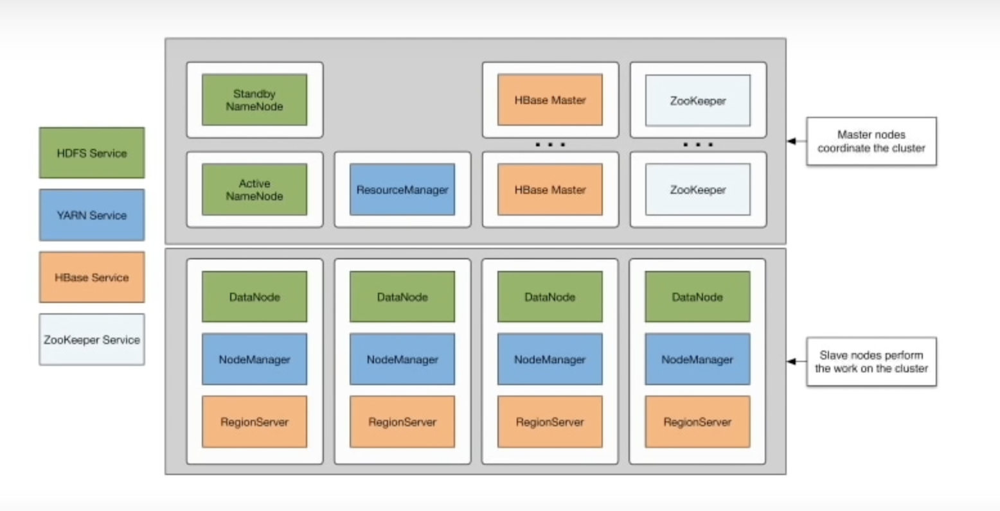
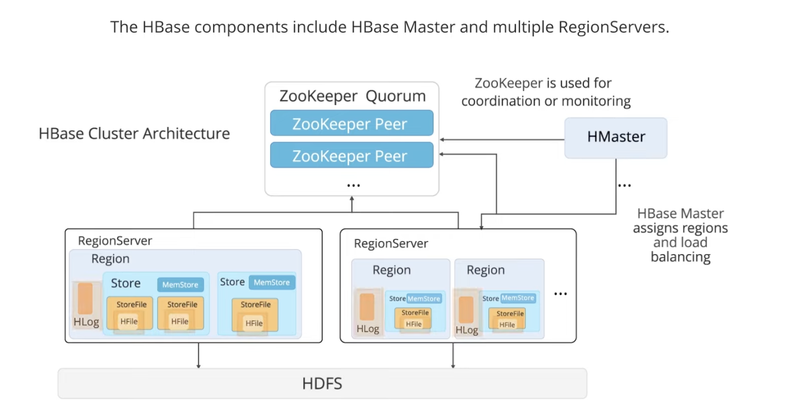
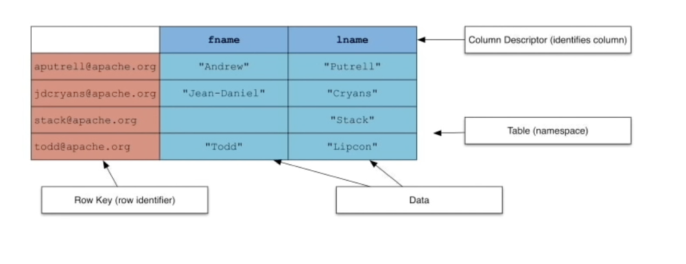
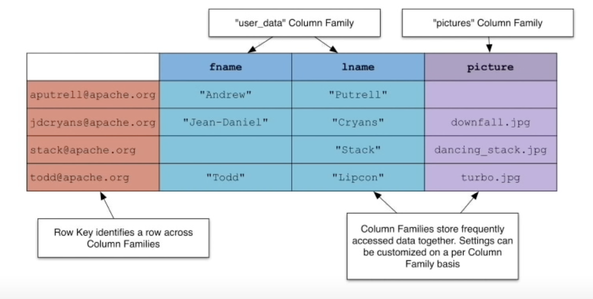
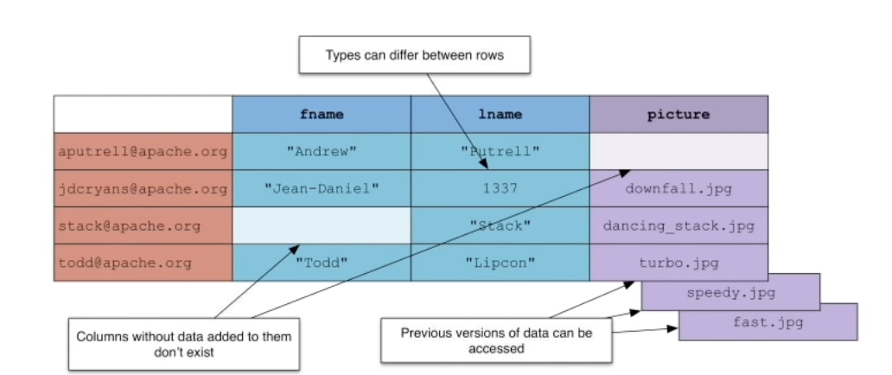
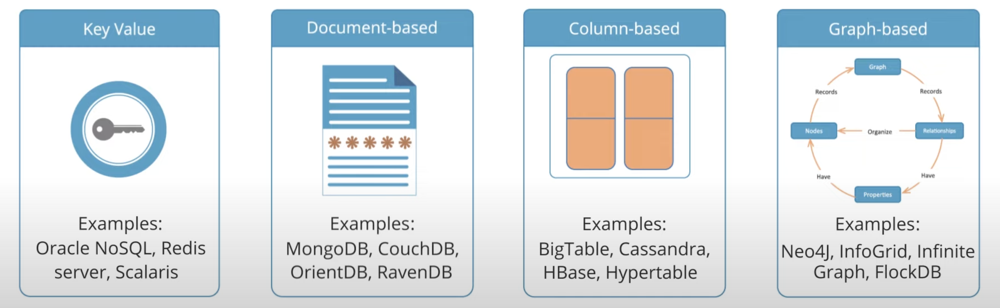
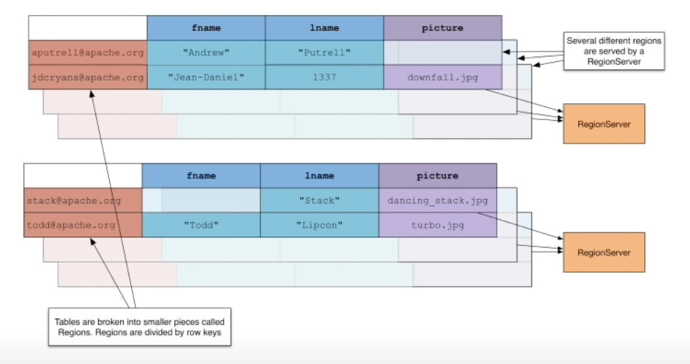

# 1.What is HBase

- NoSQL Datastore built on top of the HDFS filesystem
- HBase is a **column family oriented** database 比如需要获取某个column所有值作加成分析等, 而非获取A用户的姓名、电话、住址等信息

> HBase is a database in which tables have no schema. At the time of table creation, column families are defined, not columns. 数据库中的Schema，为数据库对象的集合，一个用户一般对应一个schema。

- Based on the Google BigTable paper
- Uses HDFS for storage
- Data can be retrieved quickly or batch processed with MapReduce

# 2.HBase Use Cases

- Need Big Data TB/PB ---> 数据体量以terabyte / petabyte为单位, 而非gigabyte
- High throughput
- Variable columns
- Need random reads and writes 随机读取某个key的某个值, 而非全局scan

# 3.HBase Daemons

daemon : 后台驻留程序

zoo keeper一般需要3-5个

yarn service一般用于数据processing工作




## Master and Region Server

HBase has two types of nodes : 
Master
	• Single Master node running at a time
	• Manages cluster operations
	• Not a part of the read or write path

RegionServer
	• One or more RegionServers running at a time
	• Hosts tables and performs reads and buffer writes
	• Communicated in order to read and write data

A region in HBase is the **subset of a table's rows**. The Master node detects the status of RegionServers and assigns regions to it. 


## Components




# 4.NoSQL Table Architecture

## 4.1.basic




## 4.2.Column Families 

- 数据列家庭column family存储那些 一般会retrieved together的数据




## 4.3.Nosql

- nosql特性包括: 
  - 1.同一个column的数据类型可不同; 
  - 2.某个数据会有版本; 
  - 3.无的数据无需存储, 而不是如关系型数据库一般要放个null




No-sql数据库分类及代表:




## 4.4.Regions

1. 数据分区region, 类似于shard ;
2. 需要明确




# 5.Command Syntax

## 5.1 创建列族column family

```hbase
create 'user',{NAME => 'country', VERSIONS => 2},{NAME => 'color', VERSIONS => 2},{NAME => 'style', VERSIONS => 2}
```

- 这条HBase建表语句用于创建一个名为 `user` 的表，并定义了三个列族（Column Family）及其属性：
  - `'user'` 是要创建的表名。

  - `{NAME => 'country', VERSIONS => 2}` 定义了一个名为 `country` 的列族，其中 `VERSIONS => 2` 表示在该列族下最多保留每行数据的2个历史版本。这意味着对于同一行键下的每个`country`列族中的单元格，系统将存储最近的两次更新记录。

  - 同理，`{NAME => 'color', VERSIONS => 2}` 和 `{NAME => 'style', VERSIONS => 2}` 分别定义了两个额外的列族：`color` 和 `style`，它们同样各自保留2个版本的数据。


因此，整个语句的作用是创建一个有三个列族的HBase表，这三个列族分别用来存储与用户相关的国家信息、颜色信息和风格信息，并且在每个列族中都只维护每行数据的最新两次更改记录。

## 5.2 列族内定义‘字段’

在HBase中，列族（Column Family）下并不直接创建“字段”，而是通过行键（Row Key）与列限定符（Column Qualifier）的组合来唯一标识一个单元格（Cell）。因此，如果你要在同一个列族里表示两个不同的“字段”，可以为这两个字段设置不同的列限定符。

例如，在上述`user`表中，假设我们已经在`info`列族下想要存储用户的姓名和年龄信息：

```hbase
create 'user', {NAME => 'info', VERSIONS => 2}
```

然后向这个表中插入数据时，就可以通过不同的列限定符区分不同字段：

```hbase
put 'user', 'rowkey1', 'info:name', 'John Doe'
put 'user', 'rowkey1', 'info:age', '30'
```

这里`info:name`和`info:age`就是我们在`info`列族下的两个“字段”。


