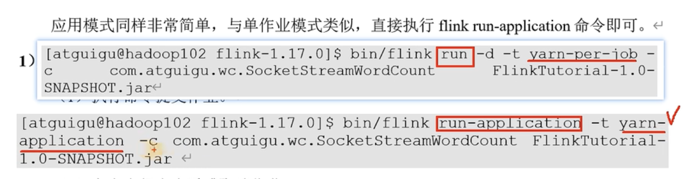

# 1. 引言

## 1.1 batch processing与stream processing对比

比如来自kafka里支付、位置、点击、订单等信息的数据, 需要进行实时的计算与处理

- 一般的数据源source产生数据, 会直接存储到data warehouse/data lake, 也就是一般的数据库, 之后batch processing会基于时间戳进行区间batch processing (邮储作业中心处理模型) ;
- stream processing则是近乎实时地对数据进行处理或分析 ;


## 1.2 Flink Use cases


### 应用场景


### 应用行业


## 1.3 API分层

DataStream针对流处理, DataSet针对批处理, 但目前而言后者几乎被弃用, 前者可涵盖所有


最底层的有状态处理 = process functions


## 1.4 Flink与Spark对比

- 微批处理, 采取RDD模型, 一组组小数据RDD的集合
- Spark底层也是批处理架构, 假“实时”, 设置批次间隔


## 1.5 flink infrastructure

### 1.5.1 架构示例图


### 1.5.2 参数示例

#### conf文件

- **jobmanager.memory.process.size**： 对 JobManager进程可使用到的全部内存进行配置，包括JVM元空间和其他开销，默认为1600M，可以根据集群规模进行适当调整。
- **taskmanager.memory process.size**： 对 TaskManager 进程可使用到的全部内存进行配置，包括JVM元空间和其他开销，默认为1728M，可以根据集群规模进行适当调整
- **taskmanager:numberOfTaskSlots**： 对每个 TaskManager 能够分配的Slot 数量进行配置，默认为1，可根据 TaskManager 所在的机器能够提供给Flink 的CPU数量决定。所谓Slot 就是 TaskManager 中具体运行一个任务所分配的计算资源。

#### master文件

也许更改为对应主机

#### workers文件

也许更改为对应主机


## 1.6 入门代码


很智能: 同一个key为同个线程处理


# 2.集群搭建


## 2.1 打包注意事项

- 以下针对打包job到服务器上操作:
  - maven的pom.xml文件里, flink相关的依赖最好用provided, 包括flink-streaming-java及flink-client (此时若直接运行IDE包错, 则在启动配置里, 将Include dependencies with ‘provided’ scope的选项勾选) ;
  - 为什么最好用provided ? 否则上传到 服务器 上执行时, 可能与服务器的包冲突
  - 打包插件最好用maven-shade-plugin, 而不是assembly

```yaml
<build>
<plugins>
<plugin>
<groupId>org.apache.maven.plugins</groupId>
<artifactId>maven-shade-plugin</artifactId>
<version>3.2.4</version>
<executions>
<execution>
<phase>package</phase>
<goals>
<goal>shade</goal>
</goals>
<configuration>
<artifactSet>
<excludes>
<exclude>com.google.code.findbugs:jsr305</exclude>
<exclude>org.slf4j:*</exclude>
<exclude>log4j:*</exclude>
</excludes>
</artifactSet>
<filters>
<filter>
<!-- Do not copy the signatures in
the META-INF folder.
Otherwise, this might cause
SecurityExceptions when using the JAR. -->
<artifact>*:*</artifact>
<excludes>
<exclude>META-INF/*.SF</exclude>
<exclude>META-
INF/*.DSA</exclude>
<exclude>META-
INF/*.RSA</exclude>
</excludes>
</filter>
</filters>
<transformers combine.children="append">
<transformer
implementation="org.apache.maven.plugins.shade.resource.ServicesRes
ourceTransformer">
</transformer>
</transformers>
</configuration>
</execution>
</executions>
</plugin>
</plugins>
</build>
```


## 2.2 提交作业

### 2.2.1 UI页面提交

submit new job栏目


### 2.2.2 命令行提交

进入jobmanager目录, 执行以下命令, 需要声明:

- jobmanager主机及端口
- jar执行类路径
- 包路径

```shell
[atguigu@hadoop102 flink-1.17.0]$ bin/flink run
-m hadoop102:8081
-c com.atguigu.wc. WordCountStreamUnboundedDemo
./FlinkTutorial-1.17-1.0-SNAPSHOT.jar
```


## 2.3 部署模式

### 2.3.1 分类

集群的生命周期以及资源的分配方式；以及应用的main方法到底在哪里执行——客户端（Client）还是JobManager。


#### 会话模式（Session Mode）

- 启动一个集群, **保持一个回话** (而非上传job时才启动集群), 在该对话中提交作业, 所有提交的作业将竞争集群中的资源, 适用于单个规模小、执行时间短的大量作业
- 对资源竞争较大


#### 单作业模式（Per-Job Mode）

- 为每个作业启动一个集群
- 由于已被淘汰, 被AM替代


#### 应用模式（Application Mode）

- 上述两种模式，应用代码都是在 客户端client上 执行，然后由客户端提交给JobManager的。但是这种方式客户端需要占用大量网络带宽，去下载依赖和把二进制数据发送给JobManager ; 加上很多情况下我们提交作业用的是同一个客户端，就会加重客户端所在节点的资源消耗 ;
- 因此, Application Mode直接把应用提交到JobManger上运行。而这也就代表着，我们需要为每一个提交的应用单独启动一个JobManager，也就是创建一个集群。这个JobMaager只为执行这一个应用而存在，执行结束之后JobManager也就关闭了，这就是所谓的应用模式 ;


## 2.4 Standalone与YARN对比

### 2.4.1 概述

- standalone模式资源分配方面不够灵活
- Yarn基于hadoop实现 (甚至大部分大数据的架构), 后者有1.HDFS存储 2.Yarn资源调度 3.MR

> 客户端把Flink应用提交给Yarn的ResourceManager，Yarn的ResourceManager会向Yarn的NodeManager申请容器。在这些容器上，Flink会部署JobManager和TaskManager的实例，从而启动集群。
>
> Flink会根据运行在JobManger上的作业所需要的Slot数量, **动态分配TaskManager资源**。


### 2.4.2 Yarn模式

#### 2.4.2.1 对话模式


```
利用yarn-session.sh --help可以查看指令
-d 分离模式,非一直窗口占用,不带-d则ctrl+c则可退出
-jm 指定jopmanager内存
-nm 指定应用名
-qu 指定每个task的slot数量
-tm 指定task的内存
```


中止会话模式

- 直接在hadoop yarn界面, 应用内部左上角kill;
- 用命令行在yarn服务器上kill

> echo "stop" | ./bin/yarn-session.sh -id application_1680702304497_0003


#### 2.4.2.2. per-job模式

注意: 单作业模式, 只要在client处cancel job, hadoop的应用就被finished了


list命令查看状态

cancel中止任务


#### 2.4.2.3应用模式

##### 命令行启动

- 将jar上传到目录中
- 启动指令与per-job模式仅存在小区别:




##### HDFS启动

```
# 在hadoop中创建HDFS文件夹
[atguigu@hadoop102 flink-1.17.0]$ hadoop fs -mkdir /flink-dist

# 将lib目录传入文件夹
[atguigu@hadoop102 flink-1.17.0]$ hadoop fs -put lib/ /flink-dist

# 将plugins目录传入文件夹
[atguigu@hadoop102 flink-1.17.0]$ hadoop fs -put plugins/ /flink-dist

# 创建放置jar包的hdfs文件并放置
[atguigu@hadoop102 flink-1.17.0]$ hadoop fs -mkdir /flink-jars
[atguigu@hadoop102 flink-1.17.0]$ hadoop fs -put FlinkTutorial-1.0-SNAPSHOT.jar /flink-jars

# 启动
[atguigu@hadoop102 flink-1.17.0]$ bin/flink run-application -t yarn-application	-Dyarn.provided.lib.dirs="hdfs://hadoop102:8020/flink-dist"	-c com.atguigu.wc.SocketStreamWordCount  hdfs://hadoop102:8020/flink-jars/FlinkTutorial-1.0-SNAPSHOT.jar
```


##### K8S启动

(了解)


# 3.运行架构与核心概念

## 3.1 内部架构


## 3.2核心概念

### 3.2.1并行度Parallellism


如上图所示，当前数据流中有source、map、window、sink四个算子，其中sink算子的并行度为1，其他算子的并行度都为2。所以这段流处理程序的并行度就是2。


#### 设置方式

1.代码设置

2.提交任务时设置(命令行/UI界面)

3.配置文件中配置

​	> flink-conf.yaml 中的 parallelism.default: 2


### 3.2.2算子链Operator Chain

one-to-to forwarding: 链路直通, 一对一, 如source -> map

redistributing: 再分区, 如map -> keyBy / window / apply


#### **算子链合并**

<u>并行度相同 且 一对一（one to one）算子操作</u>，可以直接链接在一起形成一个“大”的任务（task）, 如下图的source + map 因为为一对一,所以可以合并为大任务


#### 禁用算子链

- 将算子链接成task是非常有效的优化：可以减少线程之间的切换和基于缓存区的数据交换，在减少时延的同时提升吞吐量

- Flink默认会按照算子链的原则进行链接合并，如果我们想要禁止合并或者自行定义，也可以在代码中对算子做一些特定的设置


### 3.2.3任务槽Task Slot

- Flink中每一个TaskManager都是一个JVM进程，它可以启动多个独立的线程，来并行执行多个子任务（subtask）
- 通过 flink-conf.yaml 的 taskmanager.numberOfTaskSlots: 8进行配置
- slot目前仅仅用来隔离内存，不会涉及CPU的隔离。在具体应用时，可以将slot数量配置为机器的CPU核心数, 给JVM配置2.1G内存, 3个slot, 则每个slot只能用0.7G去完成任务, 相互隔离


#### 任务对任务槽的共享

- 一个完整的任务线为“source+map->keyBy->sink”, 三个流程为其subtask, 即子任务, 子任务可以共享一个slot;
- slot共享另一个好处就是允许我们保存完整的作业管道。这样一来，即使某个TaskManager出现故障宕机，其他节点也可以完全不受影响，作业的任务可以继续执行;
- 当然也可以让某个slot只做一个特定的子任务, 如slot 1只做source+map, 代码里可以写为 `.map(word -> Tuple2.of(word, 1L)).slotSharingGroup("1");` , 即所有map都在slot名为‘1’的slot里处理, 结果是: 某个slot宕机, 线路中断


#### important!插槽与并行度关系

- 集群 **插槽的总数必须小于等于并行度**, 若插槽为9, 并行度设为12, 不会说9个现运行完, 剩下的3个才继续, 要么一起按并行度一起做, 要么都不做;


- 在启动jobmanager时, 输入如下命令, 此时启动报错, could not acquire the minimum required resources, 没有足够的插槽供使用, -p 12则并行度为12, 但配置的插槽仅为9

> bin/flink run -m hadoop102:8081 -p 12 -c com.atguigu.wc.WordcountStreamUnbou
> ndedDemo old-jars/FlinkTutorial-1.17-1.0-SNAPSHOT.jar


# 4.DataStream API

## 4.1.源算子(source)

### 4.1.1从文件/socket读取数据

- 通常情况下，我们会从存储介质中获取数据，一个比较常见的方式就是读取日志文件, 需要导入依赖flink-connector-files
- 参数可以是目录，也可以是文件；还可以从HDFS目录下读取，使用路径hdfs://...
- 这也是批处理中最常见的读取方式

```java
public static void main(String[] args) throws Exception {

        StreamExecutionEnvironment env = StreamExecutionEnvironment.getExecutionEnvironment();
# 导入文件数据
        FileSource<String> fileSource = FileSource.forRecordStreamFormat(new TextLineInputFormat(), new Path("input/word.txt")).build();
  env.fromSource(fileSource,WatermarkStrategy.noWatermarks(),"file")
    .print();

        env.execute();
}

```


- 从socket读取文本流, 则为流处理场景, 但由于吞吐量小, 多用于测试:

` DataStream<String> stream = env.socketTextStream("localhost", 7777);`


### 4.1.2.从kafka中读取数据

- 从外部导入数据都需要引入connector的依赖;
- 配置kafka源配置:

```java
public class SourceKafka {
    public static void main(String[] args) throws Exception {

        StreamExecutionEnvironment env = StreamExecutionEnvironment.getExecutionEnvironment();

        KafkaSource<String> kafkaSource = KafkaSource.<String>builder()
          /* 配置kafka主机 */
            .setBootstrapServers("hadoop102:9092, hadoop103:9092, hadoop104:9092")
                    /* 配置kafka topic */
            .setTopics("topic_1")
                    /* 配置kafka groupId */
            .setGroupId("atguigu")
                    /* kafka关键属性 */
            .setStartingOffsets(OffsetsInitializer.latest())
                    /* 配置kafka消息反序列化方式,目前基于产出数据类型string配置(可见上方KafkaSource的范型String) */
            .setValueOnlyDeserializer(new SimpleStringSchema()) 
            .build();

        DataStreamSource<String> stream = env.fromSource(kafkaSource, WatermarkStrategy.noWatermarks(), "kafka-source");

        stream.print("Kafka");

        env.execute();
    }
}
```

> kafka消费者的參数：
> 	auto. reset. offsets 
> 		earliest: 如果有offset，Moffset继父消费；如果没有offset，从 最早 消费
> 		Latest: 如果有offset，Moffset继纹消费；如果没有offset，从 最新 消费
>
> flink的kafkasource, offset消费策略略有差异：OffsetsInitializer，默认是 earliest
> 	earliest: 一定从 最早 消贵
> 	Latest：一定人 環新 消贵


### 4.1.3.数据类型

- Flink使用“类型信息”（Type Information）来统一表示数据类型
- TypeInformation类是Flink中所有类型描述符的基类, 它涵盖了类型的一些基本属性，并为每个数据类型生成<u>特定的序列化器、反序列化器和比较器</u>。

- 自定义POJO类需要满足一定要求:
  - 类是公有（public）的
  - 有一个无参的构造方法
  - 所有属性都是公有（public）的
  - 所有属性的类型都是可以序列化的


#### 类型提示(Type Hints)

- 由于Java中泛型擦除 (语法糖) 的存在，在某些特殊情况下（比如Lambda表达式中），自动提取的信息是不够精细的, 比如 ` .map(word -> Tuple2.of(word, 1L))`, lambda表达只传达出 会输入一个数据 之后 返回一个元祖Tuple2, 但并不知道元祖的元素是什么类型(Tuple2<String, Long>), 于是出现了returns方法 :

```java
.map(word -> Tuple2.of(word, 1L))
.returns(Types.TUPLE(Types.STRING, Types.LONG));
```


## 4.2.转换算子(transformation)

数据源读入数据之后，我们就可以使用各种转换算子，将一个或多个DataStream转换为新的DataStream


### 4.2.1.映射map

- map是大家非常熟悉的大数据操作算子，主要用于将数据流中的数据进行转换，形成新的数据流。简单来说，就是一个“一一映射”，消费一个元素就产出一个元素。
- 我们只需要基于DataStream调用map()方法就可以进行转换处理。方法需要传入的参数是接口MapFunction的实现；返回值类型还是DataStream，不过泛型（流中的元素类型）可能改变
- 下面的代码用不同的方式，实现了提取WaterSensor中的id字段的功能

```java
public class TransMap {
    public static void main(String[] args) throws Exception {

        StreamExecutionEnvironment env = StreamExecutionEnvironment.getExecutionEnvironment();

        DataStreamSource<WaterSensor> stream = env.fromElements(
                new WaterSensor("sensor_1", 1, 1),
                new WaterSensor("sensor_2", 2, 2)
        );

        // 方式一：传入匿名类，实现MapFunction
        stream.map(
          new MapFunction<WaterSensor, String>() {
            @Override
            public String map(WaterSensor e) throws Exception {
                return e.id;
            }
        }
        ).print();

        // 方式二：传入MapFunction的实现类
        stream.map(new UserMap()).print();

        env.execute();
    }

    public static class UserMap implements MapFunction<WaterSensor, String> {
        @Override
        public String map(WaterSensor e) throws Exception {
            return e.id;
        }
    }
}

```


#### 4.2.2.过滤filter

- filter转换需要传入的参数需要实现FilterFunction接口，而FilterFunction内要实现filter()方法，就相当于一个返回布尔类型的条件表达式;
- 下面的代码会将数据流中传感器id为sensor_1的数据过滤出来 :

```java
public class TransFilter {
    public static void main(String[] args) throws Exception {

        StreamExecutionEnvironment env = StreamExecutionEnvironment.getExecutionEnvironment();

        DataStreamSource<WaterSensor> stream = env.fromElements(
                
new WaterSensor("sensor_1", 1, 1),
new WaterSensor("sensor_1", 2, 2),
new WaterSensor("sensor_2", 2, 2),
new WaterSensor("sensor_3", 3, 3)
        );

        // 方式一：传入匿名类实现FilterFunction
        stream.filter(new FilterFunction<WaterSensor>() {
            @Override
            public boolean filter(WaterSensor e) throws Exception {
                return e.id.equals("sensor_1");
            }
        }).print();

        // 方式二：传入FilterFunction实现类
        stream.filter(new UserFilter()).print();
        
        env.execute();
    }
    public static class UserFilter implements FilterFunction<WaterSensor> {
        @Override
        public boolean filter(WaterSensor e) throws Exception {
            return e.id.equals("sensor_1");
        }
    }
}
```


#### 4.2.3.扁平映射flatMap

- 主要是将数据流中的整体（一般是集合类型）拆分成一个一个的个体使用。消费一个元素，可以产生0到多个元素
- flatMap可以认为是“扁平化”（flatten）和“映射”（map）两步操作的结合，也就是先按照某种规则对数据进行打散拆分，再对拆分后的元素做转换处理

- 如果输入的数据是sensor_1，只打印vc；如果输入的数据是sensor_2，既打印ts又打印vc :

```java
public class TransFlatmap {
    public static void main(String[] args) throws Exception {

        StreamExecutionEnvironment env = StreamExecutionEnvironment.getExecutionEnvironment();

        DataStreamSource<WaterSensor> stream = env.fromElements(
                
new WaterSensor("sensor_1", 1, 1),
new WaterSensor("sensor_1", 2, 2),
new WaterSensor("sensor_2", 2, 2),
new WaterSensor("sensor_3", 3, 3)

        );

        stream.flatMap(
          new MyFlatMap()
        ).print();

        env.execute();
    }

    public static class MyFlatMap implements FlatMapFunction<WaterSensor, String> {

        @Override
        public void flatMap(WaterSensor value, Collector<String> out) throws Exception {

            if (value.id.equals("sensor_1")) {
                out.collect(String.valueOf(value.vc));
            } else if (value.id.equals("sensor_2")) {
                out.collect(String.valueOf(value.ts));
                out.collect(String.valueOf(value.vc));
            }
        }
    }
} 

```


## 4.3.输出算子(sink)

### 4.3.1.连接到外部系统

- DataStream API专门提供了向外部写入数据的方法：addSink。与addSource类似，addSink方法对应着一个“Sink”算子，主要就是用来实现与外部系统连接、并将数据提交写入的
- ` stream.addSink(new SinkFunction(…));` addSink方法同样需要传入一个参数，实现的是SinkFunction接口。在这个接口中只需要重写一个方法invoke()，用来将指定的值写入到外部系统中。这个方法在每条数据记录到来时都会调用

- Flink官方为我们提供了一部分的框架的Sink连接器。如下图所示，列出了Flink官方目前支持的第三方系统连接器, 部分是即可作source, 也可以作sink :


### 4.3.2.输出到文件

Flink专门提供了一个流式文件系统的连接器：FileSink，为批处理和流处理提供了一个统一的Sink，它可以将分区文件写入Flink支持的文件系统


### 4.3.3.输出到kafka

- 输出至kafka代码如下 :

```java
public class SinkKafka {
    public static void main(String[] args) throws Exception {
        StreamExecutionEnvironment env = StreamExecutionEnvironment.getExecutionEnvironment();
        env.setParallelism(1);

        // 如果是精准一次，必须开启checkpoint（后续章节介绍）
        env.enableCheckpointing(2000, CheckpointingMode.EXACTLY_ONCE);


        SingleOutputStreamOperator<String> sensorDS = env
                .socketTextStream("hadoop102", 7777);

        /**
         * Kafka Sink:
         * TODO 注意：如果要使用 精准一次 写入Kafka，需要满足以下条件，缺一不可
         * 1、开启checkpoint（后续介绍）
         * 2、设置事务前缀
         * 3、设置事务超时时间：   checkpoint间隔 <  事务超时时间  < max的15分钟
         */
        KafkaSink<String> kafkaSink = KafkaSink.<String>builder()
                // 指定 kafka 的地址和端口
                .setBootstrapServers("hadoop102:9092,hadoop103:9092,hadoop104:9092")
                // 指定序列化器：指定Topic名称、具体的序列化
                .setRecordSerializer(
                        KafkaRecordSerializationSchema.<String>builder()
                                .setTopic("ws")
                                .setValueSerializationSchema(new SimpleStringSchema())
                                .build()
                )
                // 写到kafka的一致性级别： 精准一次、至少一次
                .setDeliveryGuarantee(DeliveryGuarantee.EXACTLY_ONCE)
                // 如果是精准一次，必须设置 事务的前缀
                .setTransactionalIdPrefix("atguigu-")
                // 如果是精准一次，必须设置 事务超时时间: 大于checkpoint间隔，小于 max 15分钟
                .setProperty(ProducerConfig.TRANSACTION_TIMEOUT_CONFIG, 10*60*1000+"")
                .build();


        sensorDS.sinkTo(kafkaSink);


        env.execute();
    }
}

```


### 4.3.4.输出到Mysql(JDBC)

可输出到所有支持Java JDBC框架的数据库


### 4.3.5.自定义sink输出

- 如果我们想将数据存储到我们自己的存储设备中，而Flink并没有提供可以直接使用的连接器，就只能自定义Sink进行输出了。与Source类似，Flink为我们提供了通用的SinkFunction接口和对应的RichSinkDunction抽象类，只要实现它，通过简单地调用DataStream的.addSink()方法就可以自定义写入任何外部存储
- ` stream.addSink(new MySinkFunction<String>());`

- 在实现SinkFunction的时候，需要重写的一个关键方法invoke()，在这个方法中我们就可以实现将流里的数据发送出去的逻辑。
- 这种方式比较通用，对于任何外部存储系统都有效；**不过自定义Sink想要实现状态一致性并不容易，所以一般只在没有其它选择时使用**。


# 5.时间与窗口


## 5.1.窗口概述

Flink是一种流式计算引擎，主要是来处理无界数据流的，数据源源不断、无穷无尽。想要更加方便高效地处理无界流，一种方式就是将无限数据切割成有限的“数据块”进行处理，这就是所谓的“窗口”（Window）


## 5.2.窗口分类

- 窗口其实就是如何截取数据, 一般可分为 时间窗口 和 计数窗口;
- 按窗口分配数据的规则, 则可分为以下四种窗口:滚动窗口（Tumbling Window）、滑动窗口（Sliding Window）、会话窗口（Session Window），以及全局窗口（Global Window）


### 5.2.1.滚动窗口tumbling window

窗口间无重叠, 无间隔, 首尾相接


BI: business intelligence


### 5.2.2.滑动窗口sliding window


比如: 每隔5分钟, 获取最近一个小时数据的处理结果


### 5.2.3.会话窗口

超时时间概念, 一直有数据就一直接, 停了10mins (超时时间), 重新又来数据, 则开始重新会话

特点: 窗口size不固定


### 5.2.4.全局窗口 

- 全局有效, 无结束时间, 若希望对数据进行计算, 需自定义触发器


## 5.3.时间语义

- processing time VS event time

- 在实际应用中，事件时间语义会更为常见。一般情况下，业务日志数据中都会记录数据生成的时间戳（timestamp），它就可以作为事件时间的判断基础。

- 在Flink中，由于处理时间比较简单，早期版本默认的时间语义是处理时间；而考虑到事件时间在实际应用中更为广泛，从Flink1.12版本开始，Flink已经将**事件时间作为默认的时间语义**了。


## 5.4.水位线

### 5.4.1.概念

- 水位线是插入到数据流中的一个标记，可以认为是一个特殊的数据
- 水位线主要的内容是一个时间戳，用来表示当前事件时间的进展
- 水位线是基于数据的时间戳生成的
- 水位线的时间戳必须单调递增，以确保任务的事件时间时钟一直向前推进
- 水位线可以通过设置延迟，来保证正确处理乱序数据
- 一个水位线Watermark（t），表示在当前流中事件时间己经达到了时间戳t，这代表t之前的所有数据都到齐了，之后流中不会出现时间戳t≤的数据


#### 如何保证水位线的时间戳为递增

- 理想情况下为 有序信息流;
- 但由于网络波动的原因, 事件时间S7的数据可能晚于S10的抵达 (乱序) , 所以每次生成水位线都判断是否比之前的大, 否则将不再生成水位线;


#### 如何保证水位线考虑到‘迟到’数据

- 将 逻辑时钟 延迟一定时间, 比如2s, s9抵达了, 但此时逻辑时间为7s, 当11s岛时才真正是 9s, 此时 0-9s都到齐了, 0-9s的窗口才开始真正开始计算


## 5.4.2.窗口与水位线关系

- 10s的时间窗口, 左开右闭, [0,10) ;
- 注意: 当11来时, 逻辑时间减2秒, 于是才9s, 由于10s才是逻辑时间, 所以水位线还没到 ! 还不关桶, 所以窗口不会关闭 ;
- 也正是因为如此, 后面来的9s可以正常进入[0,10)桶里;
- 后面12s来了, 逻辑时间进展到了12-2s, 到10s了! 桶1可以关闭;
- 即便11s、12s逻辑时间被减2, 但还是该去桶2就去桶2;


### 5.4.3.代码实现

#### 有序

```java
// 顺序水位线处理, 无等待时间
WatermarkStrategy.forMonotonousTimestamps() 
```


#### 乱序

```java
WatermarkStrategy. forBoundedOutOfOrderness()

WatermarkStrategy<WaterSensor> watermarkStrategy = WatermarkStrategy.<WaterSensor>forBoundedOutOfOrderness(
  Duration.ofSeconds(3)) //此时的参数3则为延迟3秒等待

```


### 5.4.4.水位线传递

> source - map - process - print

- 多个算子之间wm可能是不同的, 可能后三个算子wm还为1, source就已经进展到2
- 当一个任务接收到多个上游并行任务传递来的水位线时，应该以 **最小的那个作为当前任务的事件时钟**
- 如下: 
  - task处理着2、4、3、6, 此时水位线为最小的2; 
  - 4抵达, 最小变为3;
  - 7抵达, 最小依旧是3;
  - 6抵达, 最小变为4;


#### 案例:水位线传递对输出的影响

>依次输入事件时间为  1,5,7,10,13,14 的数据, 且由于keyBy, 处理时均会聚合到一个算子中进行

- 假设窗口长度为10, 并行度为1, 乱序延迟时间为3, 则在输入13回车后, 则马上会触发窗口处理;
- 但若并行度设为2, 则当输入14时, 才会触发窗口处理:
  - 13抵达process时, 最小的wm还不是它; 只有当14来时, 它才变为最小wm出发窗口;
  - <u>**存在一个大问题, 若14一直不来 ? 则窗口一直不触发 ! 解决: 设置空闲等待时间**</u>


#### 设置空闲时间

withIdleness(Duration.ofSeconds(5))

```java
// 自定义分区器：数据%分区数，只输入奇数，都只会去往map的一个子任务
        SingleOutputStreamOperator<Integer> socketDS = env
                .socketTextStream("hadoop102", 7777)
                .partitionCustom(new MyPartitioner(), r -> r)
                .map(r -> Integer.parseInt(r))
                .assignTimestampsAndWatermarks(
                        WatermarkStrategy
                                .<Integer>forMonotonousTimestamps()
                                .withTimestampAssigner((r, ts) -> r * 1000L)
                                .withIdleness(Duration.ofSeconds(5))  //空闲等待5s
                );

```


### 5.4.5.迟到数据处理

#### 一般迟到数据处理

- Flink的窗口，也允许迟到数据。当触发了窗口计算后，会先计算当前的结果，但是此时并不会关闭窗口
- 以后 每来一条迟到数据，就触发一次这条数据所在窗口计算(增量计算)。直到wartermark 超过了窗口结束时间+推迟时间，此时窗口会真正关闭

```java
.window(TumblingEventTimeWindows.of(Time.seconds(5)))
.allowedLateness(Time.seconds(3)) // 允许迟到3秒
```

案例:


#### 最终补救: 侧输出流

- 如上例中, 仍存在迟到数据无法被处理完全的情况, 比如后面的4 ;
- 解决办法: 侧输出流

```java
.windowAll(TumblingEventTimeWindows.of(Time.seconds(5)))
.allowedLateness(Time.seconds(3))
.sideOutputLateData(lateWS)
```


### 5.4.6.总结: 乱序与迟到

- 乱序与迟到的区别
  - 乱序：数据的顺序乱了，时间小的 比 时间大的 晚来	
  - 迟到：数据的时间殿＜ 当前的watermark

- 乱序、迟到数据的处理
  - watermark中指定 乱序等待时间
  - 如果开窗，设置窗口允许迟到
    - 推迟关窗时间，在关窗之前，迟到数据来了，还能被窗口计算，来一条迟到数据触发一次计算
    - 关窗后，迟到数据不会被计算
  - 关窗后的迟到数据，放入侧输出流


如果 watermark 等待3s，窗口允许迟到2s，为什么不直接 watermark等待5s 或者 窗口允许迟到5s？

=》  watermark等待时间不会设过大 ===》 影响的计算延迟

​	如果3s ==》窗口第一次触发计算和输出，13s的数据来才触发
​	如果5s ==》 窗口第一次触发计算和输出，15s的数据来才触发

=》 窗口允许迟到，是对 大部分迟到数据的处理，尽量让结果准确
	如果只改置 允许迟到5S，那么 就会导致 频繁 重新输出


> 设置经验
> 1、watermark等待时间，设置一个不算特别大的，一般是秒級，在 乱序和 延迟 取舍;
> 2、设置一定的窗口允许迟到，只考虑大部分的迟到数据，极端小部分迟到很久的数据，无视
> 3、极端小部分迟到很久的数据，放到侧输出流, 获取到之后可以做各种处理


# 6.容错机制


## 6.1.检查点checkpoint

### 6.1.1.检查点的保存

- 检查点的保存是周期性触发的，间隔时间可以进行设置 ;
- 我们应该在 <u>所有任务（算子）都恰好处理完一个相同的输入数据</u> 的时候，将它们的状态保存下来
- 比如, 当source处理到第3条时存储, sum算子也在进展到第三条加和处理时 存储
- 如果出现故障，我们恢复到之前保存的状态，只需要让源（source）任务向数据源重新提交偏移量、请求重放数据即可, 比如偏移量从第四条开始处理


### 6.1.2.检查点的算法

在Flink中，采用了基于Chandy-Lamport算法的分布式快照，可以在不暂停整体流处理的前提下，将状态备份保存到检查点

- 借鉴水位线的设计，在数据流中插入一个特殊的数据结构(所以barrier也是一条生成数据, 和watermark一样)，专门用来表示触发检查点保存的时间点。收到保存检查点的指令后，Source任务可以在当前数据流中插入这个结构；之后的所有任务只要遇到它就开始对状态做持久化快照保存

- watermark指示的是“之前的数据全部到齐了”，而barrier指示的是“之前所有数据的状态更改保存入当前检查点”：它们都是一个“截止时间”的标志

  

  

Flink使用了Chandy-Lamport算法的一种变体，被称为“异步分界线快照”算法。算法的核心就是两个原则：

- 当上游任务向多个并行下游任务发送barrier时，需要广播出去；
- 而当多个上游任务向同一个下游任务传递分界线时，需要在下游任务执行“分界线对齐”操作，也就是需要等到所有并行分区的barrier都到齐，才可以开始状态的保存。


#### 6.1.2.1.Barrier对齐-精准一次

- 精准一次 指 即使重启恢复, 所有数据 都 精准地只处理了一次 ;
- 案例:
  - source处需要存储处理次数的状态 ;
  - map处无需存储, 但向sum传递时由于有2条下游, 于是map1、map2都需要各向sum1、sum2发送barrier;
  - 每个sum都会收到2个barrier, exactly-once指sum收到第一个barrier以后, 会阻塞等待(不再处理数据, 即sum结果则一直都停留在当前状态), 直到第二个barrier来, 保存好当前状态, 再继续处理数据;
  - 此时, 若重启恢复数据, 可以保证一切没发生过一样, 照样从barrier处继续处理
  - 问题: 处理性能下降, 会有延迟等待barrier的瓶颈


#### 6.1.2.2.Barrier对齐-至少一次

- 至少一次at-lease-once, 指部分数据可能会被处理至少一次;
- 与精确一次的区别在于, 第一个barrier来后, 处理进程不会延迟等待, 而是会继续处理, 第二个barrier到来后完成检查点存储;
- 若barrier 1之后紧接barrier2, 则与精确一次无差, 但若中间有间隔数据, 比如sum累计到了3和1(总计到4), 但sum由于再等2个barrier来时, 多处理到了5、6的数据, 叠加数据也统计上了5、6的数据才最终存储 ;
- 此时 即使恢复, sum依然从source(3、1)的进度开始处理, 意味着5、6将会再次被处理, 只能保证最少一次的处理;
- 优点: 无延迟, 处理流程顺畅


#### 6.1.2.3.非Barrier对齐 (Unaligned checkpoint)

- 除了 记录状态 的source的数据 及 sum数据, 非barrier对齐还会存储in-flight的数据, 比如在 输入/出缓冲区 的数据;
- 即barrier一到sum就直接将它移动到出口最前, 同时 记录sum in-flight的所有数据;
- **特点**: 不存在延迟等待, 即来即走, 同时保证精确一次性处理,但检查点保存数据量大, 若数据量大恢复也费时


#### 6.1.2.4.检查点算法的总结

> Barrier对齐: 一个Task 收到 所有上游 同一个编号的 barrier之后，才会对自已的本地状态做 备份

精准一次：
	在barrier对齐过程中，barrier后面的数据 阻塞等待（不会越过barrier）
至少一次：
	在barrier对齐过程中，先到的barrier，其后面的数据 不阻塞 接着计算

> 非Barrier对齐：一个Task 收到 第一个 barrier时，就开始 执行备份，能保证 精准一次（flink 1.11出的新算法）

先到的barrier:

​	将 本地状态 备份，其后面的数据 接着计算输出

未到的barrier:
	其 前面的数据 接者计算输出，同时也保存到 备份中

最后个barrier到达  该Task时，这个Task的备份结束


### 6.1.3.检查点的配置

- 检查点的作用是为了故障恢复，我们不能因为保存检查点占据了大量时间、导致数据处理性能明显降低
- 为了兼顾容错性和处理性能，我们可以在代码中对检查点进行各种配置
- 默认情况下，Flink程序是禁用检查点的。如果想要为Flink应用开启自动保存快照的功能，需要在代码中显式地调用执行环境的.enableCheckpointing()方法

#### 6.1.3.1.基本配置

```java
StreamExecutionEnvironment env = 
StreamExecutionEnvironment.getExecutionEnvironment();

// 每隔1秒启动一次检查点保存
env.enableCheckpointing(1000);

// 配置存储检查点到JobManager堆内存(测试)
env.getCheckpointConfig().setCheckpointStorage(new JobManagerCheckpointStorage());

// 配置存储检查点到文件系统(实际)
env.getCheckpointConfig().setCheckpointStorage(new FileSystemCheckpointStorage("hdfs://namenode:40010/flink/checkpoints"));
```


#### 6.1.3.2.高级配置

- 对齐检查点超时时间（alignedCheckpointTimeout）

  该参数只有在启用非对齐检查点的时候有效。参数默认是0，表示一开始就直接用非对齐检查点; 如果设置大于0，一开始会使用对齐的检查点，当对齐时间超过该参数设定的时间，则会自动切换成非对齐检查点

- 若配置为unaligned, 必须配置为exactly-once, 且 同时运行中的checkpoint的最大数量(MaxConcurrentCheckpoints) 不能大于1, 否则会出现多个checkpoint同时运行, barrier满天飞, 一直在备份的情况

```java
public class CheckpointConfigDemo {
    public static void main(String[] args) throws Exception {
        StreamExecutionEnvironment env = StreamExecutionEnvironment.createLocalEnvironmentWithWebUI(new Configuration());
        env.setParallelism(1);

        // 代码中用到hdfs，需要导入hadoop依赖、指定访问hdfs的用户名
        System.setProperty("HADOOP_USER_NAME", "atguigu");

        // 检查点配置
        // 1、启用检查点: 默认是barrier对齐的，周期为5s, 精准一次
        env.enableCheckpointing(5000, CheckpointingMode.EXACTLY_ONCE);
        CheckpointConfig checkpointConfig = env.getCheckpointConfig();
        // 2、指定检查点的存储位置
        checkpointConfig.setCheckpointStorage("hdfs://hadoop102:8020/chk");
        // 3、checkpoint的超时时间: 默认10分钟
        checkpointConfig.setCheckpointTimeout(60000);
        
      // 4、同时运行中的checkpoint的最大数量
        checkpointConfig.setMaxConcurrentCheckpoints(1);
        
      // 5、最小等待间隔: 上一轮checkpoint结束 到 下一轮checkpoint开始 之间的间隔，设置了>0,并发就会变成1
        checkpointConfig.setMinPauseBetweenCheckpoints(1000);
        
      // 6、取消作业时，checkpoint的数据 是否保留在外部系统
        // DELETE_ON_CANCELLATION:主动cancel时，删除存在外部系统的chk-xx目录 （如果是程序突然挂掉，不会删）
        // RETAIN_ON_CANCELLATION:主动cancel时，外部系统的chk-xx目录会保存下来
        checkpointConfig.setExternalizedCheckpointCleanup(CheckpointConfig.ExternalizedCheckpointCleanup.RETAIN_ON_CANCELLATION);
        // 7、允许 checkpoint 连续失败的次数，默认0--》表示checkpoint一失败，job就挂掉
        checkpointConfig.setTolerableCheckpointFailureNumber(10);

        // TODO 开启 非对齐检查点（barrier非对齐）
        // 开启的要求： Checkpoint模式必须是精准一次，最大并发必须设为1
        checkpointConfig.enableUnalignedCheckpoints();
        // 开启非对齐检查点才生效： 默认0，表示一开始就直接用 非对齐的检查点
        // 如果大于0， 一开始用 对齐的检查点（barrier对齐）， 对齐的时间超过这个参数，自动切换成 非对齐检查点（barrier非对齐）
        checkpointConfig.setAlignedCheckpointTimeout(Duration.ofSeconds(1));


        env
                .socketTextStream("hadoop102", 7777)
                .flatMap(
                        (String value, Collector<Tuple2<String, Integer>> out) -> {
                            String[] words = value.split(" ");
                            for (String word : words) {
                                out.collect(Tuple2.of(word, 1));
                            }
                        }
                )
                .returns(Types.TUPLE(Types.STRING, Types.INT))
                .keyBy(value -> value.f0)
                .sum(1)
                .print();

        env.execute();
    }
}

```


#### 6.1.3.3.通用增量chackpoint (changeLog)

- 每次checkpoint都是生成新文件, checkpoint完成后删除旧文件, 所以存在一个时刻, 存在两个文件, 如chk123, chk124;
- 增量快照则是追加模式: 在 1.15 之前，只有RocksDB 支持增量快照, 从 1.15 开始，不管hashmap还是rocksdb 状态后端, 都支持

##### 通过配置文件配置

```properties
state.backend.changelog.enabled: true
state.backend.changelog.storage: filesystem 
# 存储 changelog 数据
dstl.dfs.base-path: hdfs://hadoop102:8020/changelog 
execution.checkpointing.max-concurrent-checkpoints: 1
execution.savepoint-restore-mode: CLAIM
```


##### 通过代码设置

```
# 引入依赖
<dependency>
    <groupId>org.apache.flink</groupId>
    <artifactId>flink-statebackend-changelog</artifactId>
    <version>${flink.version}</version>
    <scope>runtime</scope>
</dependency>

# 代码中配置
env.enableChangelogStateBackend(true);
```


### 6.1.4.保存点savepoint

#### 6.1.4.1.概述

- 保存点的原理和算法与检查点完全相同，只是多了一些额外的元数据;
- 保存点 为 主动保存 手动存盘 >< 检查点 为 后台自动执行, 自动存盘;

- 保存点可以当作一个强大的运维工具来使用。我们可以在需要的时候创建一个保存点，然后停止应用，做一些处理调整之后再从保存点重启。它适用的具体场景有：发版 !
- 需要注意的是，保存点能够在程序更改的时候依然兼容，前提是状态的 <u>拓扑结构和数据类型不变</u>, 比如sum算子依旧是sum算子, 而不是变成了process, 产出的数据类型无变化
- 对于 没有设置ID的算子，Flink默认会自动进行设置，所以 在重新启动应用后可能会导致ID不同而无法兼容以前的状态。所以为了方便后续的维护，强烈建议在程序中为每一个算子手动指定ID, 通过下方的uid方法:

```java
DataStream<String> stream = env
    .addSource(new StatefulSource()).uid("wc-source")
    .map(new StatefulMapper()).uid("wc-mapper")
    .print();
```

> 为什么需要设置id?
>
> 比如 旧版本为 source -> map -> sum -> sink
>
> 新版本多了一个与sum平行的process, 这是可以的, 但前提必须是设定过sum的id, 启动新程序时才能知道平行的 sum / process, 究竟该对应哪个


#### 6.1.4.1.使用保存点

##### 基本保存指令

```
# 保存点文件保存路径 选填
bin/flink savepoint :jobId [:targetDirectory]

# 可在配置文件中配置
state.savepoints.dir: hdfs:///flink/savepoints

# 也可在代码中配置
env.setDefaultSavepointDir("hdfs:///flink/savepoints");

# 最普遍: 在停止任务同时, 将状态保存到保存点
bin/flink stop --savepointPath [:targetDirectory] :jobId
```


##### 从保存点重启应用

```
bin/flink run -s :savepointPath [:runArgs]
```

- 如果是基于yarn的运行模式还需要加上 -yid application-id
- 使用savepoint恢复状态的时候，也可以更换状态后端。但是有一点需要注意的是，不要在代码中指定状态后端了， 通过配置文件来配置或者-D 参数配置

```
bin/flink run-application -d 
-t yarn-application 
-s hdfs://hadoop102:8020/sp/savepoint-267cc0-47a214b019d5
-Dstate.backend=hashmap 
-c com.atguigu.checkpoint.SavepointDemo 
FlinkTutorial-1.0-SNAPSHOT.jar
```

其中的 Dstate.backend=hashmap 就是状态后端

- 如果停止作业时，忘了触发保存点也不用担心，现在版本的flink支持 <u>从保留在外部系统的checkpoint恢复作业</u>(下方指令的-s指定checkpoint位置)，但是恢复时不支持切换状态后端

```
bin/flink run-application -d 
-t yarn-application 
-Dstate.backend=rocksdb 
-s hdfs://hadoop102:8020/chk/532f87ef414c137d33d4a6/chk-175 
-c com.atguigu.checkpoint.SavepointDemo 
./FlinkTutorial-1.0-SNAPSHOT.jar
```


## 6.2.状态一致性

### 6.2.1.一致性的概念和级别

一般说来，状态一致性有三种级别：

- **最多一次（At-Most-Once）**:数据只会提供一次, 不可能有第二次, 丢了就只能丢了

- **至少一次（At-Least-Once）** 

- **精确一次（Exactly-Once）**


### 6.2.2.端到端的状态一致性

- 完整的流处理应用，应该包括了数据源、流处理器和外部存储系统三个部分

- 这个完整应用的一致性，就叫做“端到端（end-to-end）的状态一致性”，它取决于三个组件中最弱的那一环。一般来说，能否达到at-least-once一致性级别，主要看数据源能够重放数据；而能否达到exactly-once级别，流处理器内部、数据源、外部存储都要有相应的保证机制


## 6.3.端到端精确一次End-To-End Exactly-Once

### 6.3.1.输入端保证

- 数据源可重放数据，或者说可重置读取数据偏移量，加上Flink的Source算子将偏移量作为状态保存进检查点，就可以保证数据不丢 --> kafka可以!

### 6.3.2.输出端保证

能够保证exactly-once一致性的写入方式有两种：

- **幂等写入**

- **事务写入**
  - **预写日志(write-ahead-log)**: 只能当完成写入外部系统, 且外部系统回复ack时才是一个完整的成功checkpoint, 问题: 若外部写入完成, 但回复的ack未正常送达, 则被认为checkpoint失败, 导致重复写入
  - **两阶段提交(two-phase-commit, 2PC)**: 先做“预提交”，等检查点完成之后再正式提交。这种提交方式是真正基于事务的，它需要外部系统提供事务支持。比如 barrier来时, 预提交, 在输出端类似于贴了“等待提交”标签, 读不到但存在, 当checkpoint完成, 输出端只要 撕掉标签, 让其入库即可, 若checkpoint失败, 则直接丢弃即可
    - 需要注意: 外部系统超时时间 必须大于  最大检查点时间, 否则外部系统事务直接超时了, 导致保存失败


### 6.3.3.flink与kafka连接时的精确一次性保证


------

xsync xxx.tar 可分发文件

xcall jps 可在所有主机上执行命令
