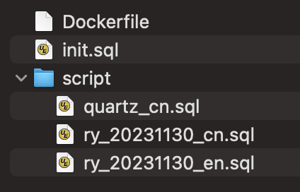
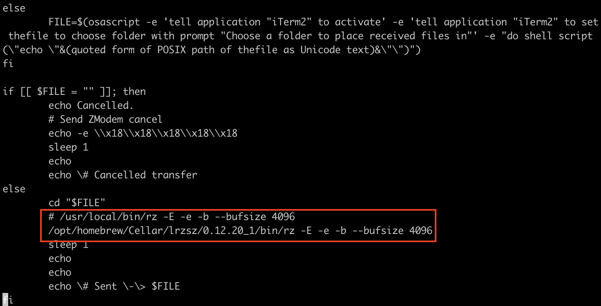
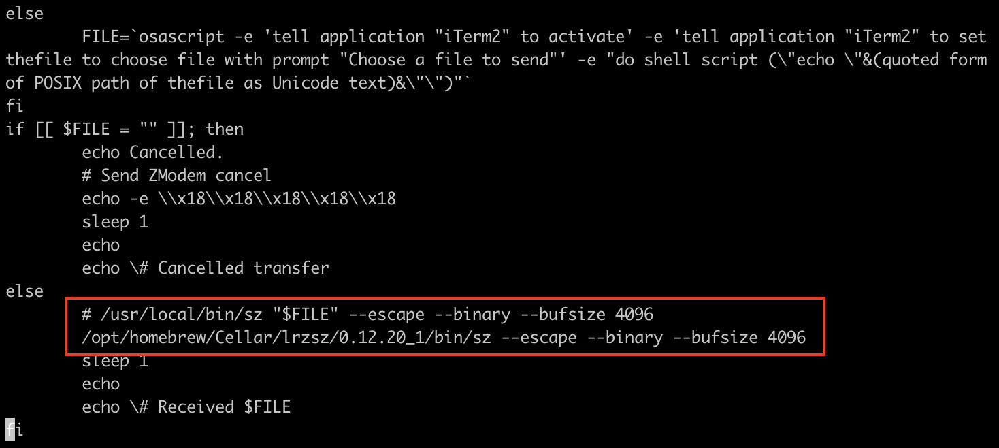
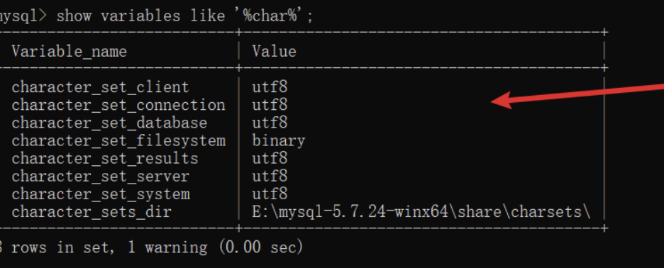

# 1.Introduction

## 1.1.Objectif

Objectif: deploy Ruoyi project on Huawei cloud server by leveraging Docker for Mysql and Redis installation, Java,Vue and Nginx will be installed directly.

## 1.2.Command Repository

```shell
docker cp /home/mysql/ry_20231130_en.sql ec04f1f1d781:/etc/

docker exec -i ec04f1f1d781 mysql -u root -proot ruoyidb < /home/mysql/ry_20231130_en.sql

# scp jar package
scp /Users/luoran/Workspace/01-java/02-ruoyi-vue/ruoyi-admin/target/ruoyi-admin.jar root@114.115.207.149:/home/application/

# Java launch command
nohup java -jar /home/application/ruoyi-admin.jar --spring.profiles.active=dbprod > nohup-ruoyi.out &

# compress dist folder, scp then remove
cd ~/Workspace/01-java/02-ruoyi-vue/ruoyi-ui && zip -r dist.zip dist/

scp /Users/luoran/Workspace/01-java/02-ruoyi-vue/ruoyi-ui/dist.zip root@114.115.207.149:/home/web/

rm ~/Workspace/01-java/02-ruoyi-vue/ruoyi-ui/dist.zip

# unzip 
rm -rf /home/web/dist
unzip /home/web/dist.zip

# check url
curl http://114.115.207.149:80/stage-api/captchaImage
curl http://114.115.207.149:80/stage-api/captchaImage

vi /var/log/nginx/access.log
vi /var/log/nginx/error.log;

sudo /usr/sbin/nginx
sudo service nginx start
sudo systemctl start nginx

intranet host: 192.168.0.204

telnet 114.115.207.149 8080
```


# 2.Installation

## 2.1.Mysql

1.prepare the base image

```shell
docker pull mysql:latest

docker images # check images
```

2.prepare dockerfile and base folder on linux



3.dockerfile defined how the container will be initialized

```shell
# choose your base image
FROM mysql:latest

# contact
MAINTAINER laurenl luoran1122@hotmail.com

# working directory in container
WORKDIR /docker-entrypoint-initdb.d

# set environment variable
ENV MYSQL_ROOT_PASSWORD=root

# copy needed files to container
COPY ./init.sql /docker-entrypoint-initdb.d/
COPY ./script /docker-entrypoint-initdb.d/script

# above ready then run 'mysqld' command in container
# which will trigger init.sql
CMD ["mysqld"]

```

4.create database and run scripts in init.sql

```shell
CREATE DATABASE IF NOT EXISTS ruoyidb CHARACTER SET utf8mb4 COLLATE utf8mb4_unicode_ci;

USE ruoyidb;
SOURCE ./script/quartz.sql;
SOURCE ./script/ry_20231130.sql;
```

5.files ready, run the build dockerfile command then a self defined image will be made ; run this image

```shell
# .means current folder
docker build -t yourCustomerImageName . 

docker run 
--name mysql_3309 
-e MYSQL_ROOT_PASSWORD=root 
-p 3309:3306 
-d yourCustomerImageName
```


## 2.2.Redis

1.find a redis image in dockerhub ` https://hub-stage.docker.com`

2.simple run the image

```shell
docker run 
--name myRedis 
--restart=always 
-d 
-p 6379:6379 
redis
```

3.in case that we need a configured redis installation, we need to have configuration file ready in linux(eg. /docker/redis/redis.conf), where we can set our own password and for exemple persistence mechanism mode and frequency 

```shell
docker run 
-p 16379:6379 # host machine's port 16379 is used
--name myRedis  
-v /docker/redis/redis.conf:/etc/redis/redis.conf 
-v /docker/redis/data:/data
# before colon: host machine file path ; after: container mounted directory
--restart=always # start container once docker started
-d  # detached mode
redis:7.0.4 # redis image
redis-server /etc/redis/redis.conf # location of configuration file in container
```


## 2.3.Java

1.use IDEA maven package option to get a jar package

2.upload to server and run java

3.for different environments, specify in start command line

```shell
nohup java 
-jar ruoyi-admin.jar 
--spring.profiles.active=dev
--spring.profiles.include=dbdev
> nohup-ruoyi.out &
```

4.in case that we need a application docker image, it's possible to use JDK11 as  base file, jar file together with dockerfile will do


## 2.4.Vue

1.in project repository, run `npm run build:prod` or `npm run build:stage`to get the `dist` static folder;

2.different environments parameters were set in `.env.development` / `.env.production`, `.env.staging`

3.upload the dist folder to linux


## 2.5.Nginx

1. knowing that Nginx is crucial to prevent cross-origin in the non-development environment, browser request through http protocol which is through port 80 of server host and it is Nginx who do the routing based on uri path;
2. here are steps to take to install, restart nginx on a ubuntu server:

```shell
apt install nginx

whereis nginx # find out nginx location

vi /etc/nginx/nginx.conf # edit configuration file
vi /var/log/nginx/error.log; # path in config file
vi /var/log/nginx/access.log;

# check if config file syntax's ok
sudo nginx -t

# curiously can't reload for port occupied
# need to kill and start
ps -ef|grep nginx # nginx pid
kill -9 pid # kill the master worker then 

sudo /usr/sbin/nginx
sudo systemctl restart nginx
sudo service nginx reload
```


3. java application running on port 8080, so uri with `wildcard asterisk hyphen api` prefix will all be pass to proxy_pass: localhost:8080;

```json
server {
    listen 80;
    server_name lawson.com;

    # 使用正则表达式匹配 /stage-api/ 或 /prod-api/ 开头的URI，并移除前缀后转发到后端服务器
    location ~ ^/(stage|prod)-api/(.*) {
        rewrite ^/(\w+)-api/(.*) /$2 break;
        proxy_pass http://127.0.0.1:8080;
        proxy_set_header Host $host;
        proxy_set_header X-Real-IP $remote_addr;
        proxy_set_header X-Forwarded-For $proxy_add_x_forwarded_for;
        proxy_set_header X-Forwarded-Proto $scheme;
    }

    # 其他请求则提供静态文件服务
    location / {
        root /home/web/dist;
        index index.html;

        # 支持SPA应用的路由重定向
        try_files $uri $uri/ /index.html =404;
    }
}
```

# 3.Troubleshooting

## 3.1.Problems & Solution

### 3.1.1.rz/sz issue

#### Situation

1. Can't send or receive from cloud server, stuck or with endless pop-out windows to select file to upload;
2. path problem solved, `sz` command works, file transfered from server to local, but `rz`still doesn't work;
3. INSTEAD, using scp command

```shell
# from target to application directory
scp /Users/luoran/Workspace/01-java/02-ruoyi-vue/ruoyi-admin/target/ruoyi-admin.jar root@114.115.207.149:/home/application/

# need to unzip
scp /Users/luoran/Workspace/01-java/02-ruoyi-vue/ruoyi-ui/dist.zip root@114.115.207.149:/home/web/
```


#### Solution 

1. in `/usr/local/bin/`, there might be path wrongly set in `iterm2-send-zmodem.sh` and ` iterm2-recv-zmodem.sh` for brew installation






### 3.1.2.Database encoding settings

#### Situation

1.`docker exec` to enter the database container, login and select, chinese characters show up just fine;

2. connect database from IDEA or application, UI pages show <u>messy, unreadable</u> chinese characters;
3. thought it should be Database encoding problem;


#### Solution

1.using `show variableslike %char%` to check related variables in my.ini ;



2.enter container, find `my.cnf`, tried editting, no vi..., had to transfer bidirectionally, still failed, saying there ain't no such parameters...

3.translate the insert sql, re-do the script  :

```shell
docker exec 
-i ec04f1f1d781 
mysql -u root -proot ruoyidb 
< /home/mysql/ry_20231130_en.sql # DOESN'T copy the file to container
```


### 3.1.3.Cross-origin

#### Situation

1.dev environment, `/captchaImage` works alright ;

2.On production, with Nginx in the middle,  `/stage-api/captchaImage` prompt ‘resource loading...’ and curiously response show a HTML codes;

3.At the begining, I did't realize that it was the index.html file that was loading


#### Solution

1.First Break through ! `curl http://114.115.207.149:8080/stage-api/captchaImage` return html file AGAIN (gone to index.html) ! but ` curl http://114.115.207.149:80/captchaImage` works ! So, swagger configuration does't mean adding any prefix to controller path 

第一步: 先用curl确保哪个uri才能请求到资源 !

```yaml
# Swagger配置
swagger:
  # 是否开启swagger
  enabled: true
  # 请求前缀
  pathMapping: /dev-api
```

2.compare to local request which is a successful one, on production request headers includes : 

```
Sec-Fetch-Dest 
Sec-Fetch-Mode
Sec-Fetch-Site
```

3. Is Vue adding these headers to request ? No, browser did. Suddenly I knew it must be a cross-origin situation, the browser MUST make sure, request goes THE SAME HOST/PORT as origin ! For http protocole, it all goes to http://114.115.207.149:80

4. In dev environment, how does Vue do to trick browser that request port is the same as its port ? see `vue.config.js`, By doing this, vue pretends to be started on the same port as request target whici is ` http://localhost:8080` , browser thinks well it is a same-origin request, those three headers will be added, application won't reply 403, because it's not a cross-origin request !

   ```javascript
   devServer: {
       host: '0.0.0.0',
       port: port,
       open: true,
       proxy: process.env.NODE_ENV === 'development' ? {
         [process.env.VUE_APP_BASE_API]: {
           target: `http://localhost:8080`,
           changeOrigin: true,
           pathRewrite: {
             ['^' + process.env.VUE_APP_BASE_API]: ''
           }
         }
       } : undefined,
   ```

   

5. Nginx is crucial to prevent cross-origin in the non-development environment, browser request through http protocol which is through port 80 of server host and it is Nginx who do the routing based on uri path


### 3.1.4.SSL variable issue

#### Situation

run ` npm run dev`, then get `Error: error:0308010C:digital envelope routines::unsupported`

#### Solution

- in ` package.json` file, add  `export NODE_OPTIONS=--openssl-legacy-provider && `
- This is also where I found out that `npm run serve` can be replaced by ` npm run dev` 

```json
  "scripts": {
    "dev": "export NODE_OPTIONS=--openssl-legacy-provider && vue-cli-service serve",
    "build:prod": "export NODE_OPTIONS=--openssl-legacy-provider && vue-cli-service build",
    "build:stage": "export NODE_OPTIONS=--openssl-legacy-provider && vue-cli-service build --mode staging",
    "preview": "node build/index.js --preview",
    "lint": "eslint --ext .js,.vue src"
  },
```


