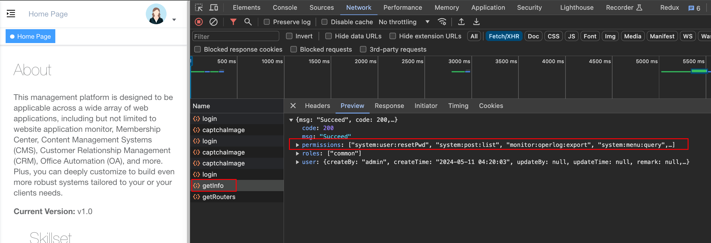

# 01.权限设计

- 一般在登录时, 将获取 用户相关信息以及权限, 存入store;
- 按钮的v-permit属性若存在于permission中, 则显示该按钮; 




前端代码实现:

- 自定义一个v-hasPermi的 vue指令 实现, 内部基于inserted钩子方法进行操作;

> Vue提供了一个特殊的 **<u>生命周期钩子函数`inserted`</u>**，用于处理DOM元素插入到页面时的操作, 比如在DOM元素插入到页面之后进行一些操作，比如绑定事件、初始化一些插件等。
>
> `inserted`钩子函数会在 **<u>被绑定元素插入到父节点中</u>** 时调用，可以用来执行一些需要DOM渲染完成后才能进行的操作, 比如基于vuex管理的permissions判断该按钮是否应该显示

```js
import store from '@/store'

export default {
  
  inserted(el, binding, vnode) {
    const { value } = binding
    const all_permission = "*:*:*";
    const permissions = store.getters && store.getters.permissions

    if (value && value instanceof Array && value.length > 0) {
      const permissionFlag = value

      const hasPermissions = permissions.some(permission => {
        return all_permission === permission || permissionFlag.includes(permission)
      })

      if (!hasPermissions) {
        el.parentNode && el.parentNode.removeChild(el)
      }
    } else {
      throw new Error(`请设置操作权限标签值`)
    }
  }
}

```

# 02.国际化

## 2.1.React项目国际化实现

在React中实现网站内容的国际化可以通过使用React Intl库来实现。以下是一些步骤可以帮助你开始：

1. 安装React Intl库：使用npm或者yarn安装React Intl库。运行以下命令进行安装：

```
npm install react-intl
```

或者

```
yarn add react-intl
```

2. 创建语言文件：在你的项目中创建一个文件夹来保存不同语言版本的内容。例如，你可以创建一个`locales`文件夹，并在其中创建`en.json`、`fr.json`、`es.json`等文件来保存英文、法语、西班牙语的翻译文本。

3. 配置React Intl提供的IntlProvider：在你的应用的根组件中，使用`IntlProvider`组件将React Intl配置为全局提供者。在`IntlProvider`组件中，你可以指定当前选择的语言以及语言文件的路径。

```jsx
import React from 'react';
import { IntlProvider } from 'react-intl';
import messages from './locales/en.json'; // 替换为当前选择的语言文件

function App() {
  return (
    <IntlProvider locale="en" messages={messages}>
      {/* 所有子组件 */}
    </IntlProvider>
  );
}

export default App;
```

4. 在组件中使用翻译文本：在需要国际化的文本位置，使用`FormattedMessage`组件来包裹文本，并使用一个唯一的键来引用对应的翻译文本。

```jsx
import React from 'react';
import { FormattedMessage } from 'react-intl';

function MyComponent() {
  return (
    <div>
      <FormattedMessage id="welcomeMessage" defaultMessage="Welcome!" />
    </div>
  );
}

export default MyComponent;
```

5. 在语言文件中添加翻译：打开你的语言文件，根据需要提供对应的翻译文本。例如，在`en.json`文件中，你可以添加以下内容：

```json
{
  "welcomeMessage": "Welcome!"
}
```

6. 切换语言：你可以添加一个语言切换器组件，让用户能够选择不同的语言。当用户选择不同的语言时，更新`IntlProvider`组件中的`locale`和`messages`属性的值，以使用对应的语言文件。

7.添加一个语言切换器组件，你可以创建一个新的React组件并在其中放置语言切换的UI元素（例如下拉菜单或按钮）。然后，你可以在语言切换器组件中使用React Intl提供的`useIntl`钩子来获取当前的语言信息并更新语言设置。

以下是一个示例代码：

```jsx
import React from 'react';
import { useIntl } from 'react-intl';

function LanguageSwitcher() {
  const intl = useIntl();

  const handleChangeLanguage = (e) => {
    const selectedLanguage = e.target.value;
    intl.locale = selectedLanguage; // 更新当前语言

    // 根据需要，你可以将当前语言保存在本地存储（localStorage）中，以便在刷新页面后保持设置

    window.location.reload(); // 刷新页面以应用新的语言设置
  };

  return (
    <select onChange={handleChangeLanguage}>
      <option value="en">English</option>
      <option value="fr">Français</option>
      <option value="es">Español</option>
      {/* 添加更多语言选项 */}
    </select>
  );
}

export default LanguageSwitcher;
```

在上面的代码中，我们使用`useIntl`钩子获取`intl`对象，该对象提供了一些有用的方法和属性，包括当前的语言信息。在`handleChangeLanguage`函数中，我们通过`e.target.value`获取用户选择的语言，并将其赋值给`intl.locale`来更新当前的语言设置。然后，我们可以将当前语言保存在本地存储中（如localStorage），以便在刷新页面后保持设置。最后，我们使用`window.location.reload()`方法刷新页面以应用新的语言设置。

要让语言切换器组件生效，只需在你的应用中使用该组件，并确保将其放置在`IntlProvider`组件的范围内，以便在切换语言时实时更新翻译内容。

```jsx
import React from 'react';
import { IntlProvider } from 'react-intl';
import LanguageSwitcher from './LanguageSwitcher';
import messages from './locales/en.json'; // 替换为当前选择的语言文件

function App() {
  return (
    <IntlProvider locale="en" messages={messages}>
      <LanguageSwitcher />
      {/* 其他组件 */}
    </IntlProvider>
  );
}

export default App;
```

现在，当用户选择不同的语言时，语言切换器组件将更新当前的语言设置，并刷新页面以应用新的语言。同时，React Intl将根据新的语言设置来提供正确的翻译内容。


## 2.2.Vue项目国际化实现

在Vue项目中实现国际化可以使用Vue I18n库来实现。以下是一些具体步骤：

1. 安装Vue I18n库：使用npm或者yarn安装Vue I18n库。运行以下命令进行安装：

```
npm install vue-i18n 或者 yarn add vue-i18n
```

2. 创建语言文件：在你的项目中创建一个文件夹来保存不同语言版本的内容。例如，你可以创建一个`locales`文件夹，并在其中创建`en.js`、`fr.js`、`es.js`等文件来保存英文、法语、西班牙语的翻译文本。

3. 配置Vue I18n：在你的Vue应用的入口文件中，引入Vue I18n，并创建一个Vue I18n实例。在实例的构造函数中，你可以指定当前选择的语言以及语言文件的路径。

```javascript
import Vue from 'vue';
import VueI18n from 'vue-i18n';
import messages from './locales/en'; // 替换为当前选择的语言文件

Vue.use(VueI18n);

const i18n = new VueI18n({
  locale: 'en',
  messages,
});

new Vue({
  i18n,
  // 其他配置
}).$mount('#app');
```

4. 在组件中使用翻译文本：在需要国际化的文本位置，使用Vue I18n提供的`$t`方法来获取对应的翻译文本。

```html
<template>
  <div>
    {{ $t('welcomeMessage') }}
  </div>
</template>

<script>
export default {
  // 组件的其他配置
}
</script>
```

5. 在语言文件中添加翻译：打开你的语言文件，根据需要提供对应的翻译文本。例如，在`en.js`文件中，你可以添加以下内容：

```javascript
export default {
  welcomeMessage: 'Welcome!',
};
```

6. 切换语言：你可以添加一个语言切换器组件，让用户能够选择不同的语言。当用户选择不同的语言时，更新Vue实例中的`$i18n.locale`属性的值，以使用对应的语言文件。

这样，你的Vue项目就可以根据用户选择的语言来显示不同的翻译内容了。你只需要在语言文件中提供对应的翻译文本，并在需要国际化的地方使用`$t`方法来获取翻译文本即可。

请注意，上述步骤是基本的Vue I18n配置，你可以根据具体需求进行更多的定制和优化。例如，你可以使用语言切换器组件来更新`$i18n.locale`属性，并将其保存在本地存储中，以便在刷新页面后保持设置。

# 03.SEO优化

总结有三策略:

1. 提高关键词在title、description里出现的频次;
2. 内部链接也可以带上关键词, 以便 搜索引擎爬虫 可以理解网站的 路由布局与关键词 之间的关系 +  若能争取权威外链网站 对我方网站的直接转发 则最佳 + 社交媒体, 增加曝光、点击与转发
3. 技术: 提高网站响应速度、由于react用js动态生成, 需要用SSR技术 或 静态站点生成器Gatsby 来生成静态HTML


当你希望在谷歌搜索结果中排名靠前时，以下是一些建议来优化你的React网站的SEO：

1. 确保网站内容是可被搜索引擎索引的：React应用通常是单页应用（SPA），这意味着内容在页面加载时是通过JavaScript动态生成的。为了确保搜索引擎能够正确地索引你的网站内容，你需要**使用服务器端渲染（SSR = server-side render）或静态站点生成器（如Gatsby）来生成静态HTML页面，并将这些页面提供给搜索引擎爬虫进行索引**。

2. 关键词优化：对于你希望在谷歌搜索结果中排名靠前的关键词（如"generative AI"），确保在你的网站内容中有相关的关键词出现频率较高。包括在页面标题、元描述、标题标签、正文内容等位置使用关键词。但要注意不要过度使用关键词，要保持内容的自然流畅度。

3. 内部链接优化：在你的网站内部，使用相关关键词来创建链接，将页面与页面之间进行关联。这有助于搜索引擎理解你的网站结构和内容之间的关联性。

4. 元数据优化：**确保每个页面都有一个唯一的标题标签（Title）和描述标签（Meta Description）**。标题应该简明扼要地描述页面内容，并包含相关关键词。描述标签应该是有吸引力的、相关的，并且能准确地描述页面内容。

5. 提供高质量的内容：搜索引擎越来越注重网站的内容质量。确保你的网站内容是有价值、有深度的，并且能够回答用户的问题。优质的内容有利于提高用户体验和网站的可信度，从而有助于提升搜索排名。

6. 提高网站速度：网站加载速度是搜索引擎排名的一个重要因素。确保你的React网站加载速度快，可以通过压缩代码、优化图片、使用缓存等技术手段来提高网站性能。

7. 外部链接建设：**争取其他高质量网站的外部链接指向你的网站。这些外部链接被认为是权威和信任的来源**，有助于提升你的网站在搜索引擎中的排名。

8. 利用社交媒体：在社交媒体平台上分享你的网站内容，增加你的网站曝光度，并鼓励其他人分享和链接你的内容。

记住，SEO是一个长期的过程，需要持续的努力和优化。以上建议只是一些基本的优化方法，你可以根据具体情况进行更多的研究和实践。


# 04.跨域问题

- 在本地进行测试时, 由于后端与前端必然不在同一端口上启动, 在浏览器看来必然是——跨域了! 如何让浏览器忽视该问题以顺利进行测试? 让前端项目假装和后端启动在同一端口上, 在config.js文件中添加devServer:

```json
devServer: {
    host: '0.0.0.0',
    port: port,
    open: true,
    proxy: process.env.NODE_ENV === 'development' ? {
      [process.env.VUE_APP_BASE_API]: {
        target: `http://localhost:8080`,
        changeOrigin: true,
        pathRewrite: {
          ['^' + process.env.VUE_APP_BASE_API]: ''
        }
      }
    } : undefined,
```

补充: 如果浏览器发现跨域, 请求头上将携带如下headers, Sec-Fetch-Dest 、Sec-Fetch-Mode、Sec-Fetch-Site


