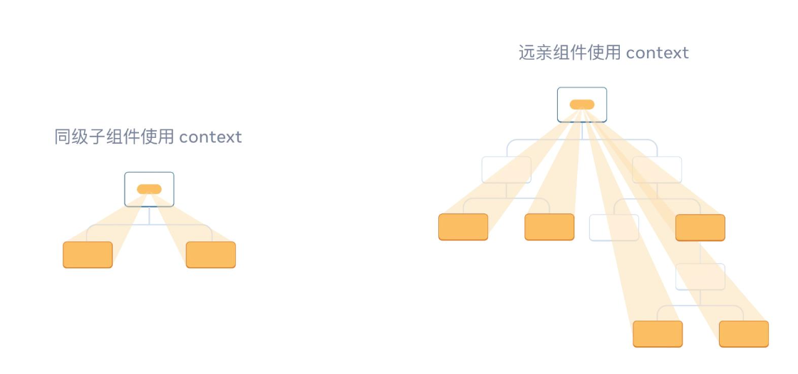
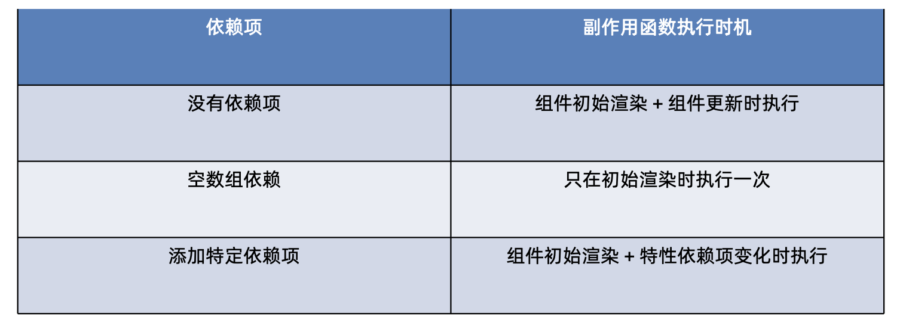
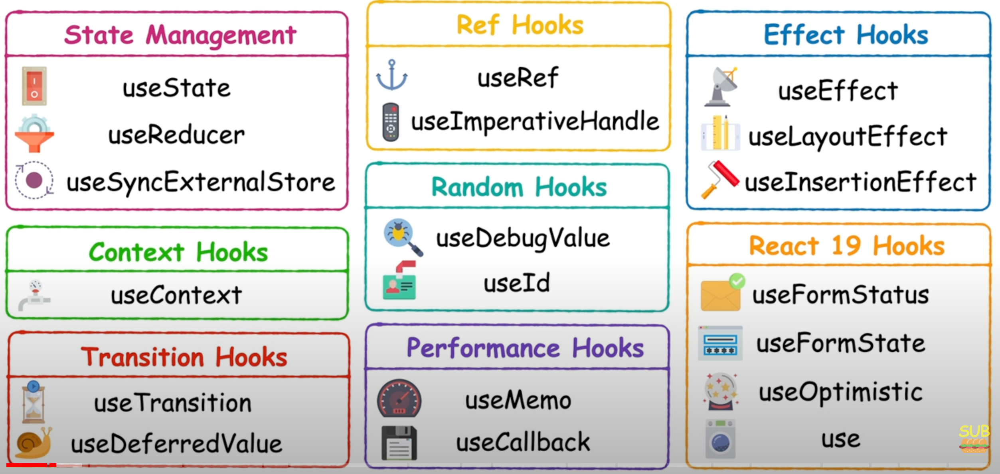

​	

# 00.Important

## 0.1.语法注意点

**Parentheses ? Curly ?** 

```jsx
// 声明useXXX
const { commentsLst, setCommentsLst } = useGetCommments()

// 定义组件(!!!注意引入父组件参数时, 外围的花括号!!!)
function Item( { item, onDel } ) { return (...) }

// 事件
onClick={ () => onDel(item.rpid) }

// 遍历channelList并渲染option标签
{ 
  channelList.map(
  item => 
  <option 
    key={item.id} 
    value={item.id}
    >
    {item.name}
  </option>) 
}

// 注意useState用数组接收! 不然就要提示你 setImageList is not a function
const [ imageList, setImageList ] = useState([])

// 指的是 传入参数, return 一个对象的函数, 此处return可省略
(state) => ({ count: state.count + 1 })

// ts中, 入参id会被提示可能为string | null, 此时 ! 起到断言作用, id必然不为空
const res = await fetchDetailAPI(id!)

```


- 标签里的事件方法, 比如用lambda: `onClick={() => handleTabChange(item.type)}`, 必要时还可引入事件对象e, 注意此时的item.type不需要花括号包裹 ;


- 当事件类型触发, 比如onConfirm/onChange方法需要获取标签内容, 比如DatePIcker的日期、输入框的输入值时, 几乎都是 自定义方法获取, 而非`onClick={() => handleTabChange(item.type)}`模式, 多为如下方式, why ? 此时传入的value才是我们需要的 日期 或 输入框内容

```jsx
// date state
const [dateVisible, setDateVisible] = useState(false)
const [datePicked, setDatePicked] = useState()

// ------------------------------------
// 正确示范
// ------------------------------------
const confirmDatePick = (value) => {
        setDateVisible(false)
        setDatePicked(value) // 
}

<DatePicker
    className="kaDate"
    title="记账日期"
    max={new Date()}
    visible={dateVisible}
  	// 直接定义函数
    onConfirm={confirmDatePick}
    onCancel={() => setDateVisible(false)}
    onClose={() => setDateVisible(false)}
/>

// ------------------------------------
// 错误示范
// ------------------------------------
<Input
    className="input"
    placeholder="0.00"
    type="number"
    value={ money }
    onChange={ () => setMoney(value) }	 // 错误!此方法拿不到value值
/>
```


- JSX对列表参数进行遍历, `{listField.map(item => (...))}`, 注意=>后为小括号 ;
- 当JSX字符串内部有判断何时需要拼接 class decorator时: 
  - 最外为backticks, 内部需要拼接的部分才为 ''
  - 需要借助${}进行判断逻辑

```html
<span
className={`nav-item ${item.type == type && 'active'}`}>
  content
</span>
```

> In some programming languages like JavaScript, Python, and PHP, backticks are used to define template literals or string literals. These allow for multi-line strings and often support embedded expressions, which can be evaluated and interpolated into the string. 用来包裹将被解析为string的结构, 内部embeded了表达式

- 注意各种蛋疼的大小写问题: `import classNames from 'classnames'`


## 0.2.包安装与引入

- 安装包: 添加-D后, 只安装在开发环境, 包括package.json内部都是devDependencies括号内出现
- `npm i package-name` 安装到项目依赖路径, `npm install package-name -D` 安装到开发依赖目录

```js
// 项目创建
 npx create-react-app react-bill-test
 
// 装多个依赖
npm i @reduxjs/toolkit react-redux react-router-dom dayjs classnames antd-mobile axios
 
// 安装package.json里的dependencies
npm install  // npm作为管理工具
yarn  // yarn作为管理工具
 
// uuid生成
npm install uuid
import { v4 as uuidv4} from 'uuid'

// 格式化日期
npm install dayjs
import dayjs from 'dayjs'

// 类名拼接工具
import classNames from 'classnames'

// 本地模拟服务器
npm i json-server -D
json-server db.json --port 3004 // 启动本地服务器

// 安装scss支持组件
npm i -D sass

// css重适应工具
npm install normalize.css
```


## 0.3.JS常用API

```javascript
// cartList 为 购物车列表, 以下reduce方法可对列表进行遍历stream处理
// 0为初始值
// 比如 购物车总额 的计算 =》reduce 
const totalPrice = cartList.reduce((acc, curr) => acc + curr.count * curr.price, 0)

// toFixed方法 对 计算结果进行两位小数取整操作
{ totalPrice.toFixed(2) } 
```


## 0.4.复制用组件代码

```jsx
const App = () => {
  return <div>This is app</div>
}

export default App
```


# 01.Basics

## 1.1.基础项目

` npx create-react-app react-basic`

## 1.2.认识JSX

### 1.2.1.大括号语法{}

在JSX中可以通过 大括号语法{} 识别 JavaScript中的表达式，比如常见的变量、函数调用、方法调用等等

1. 使用 引号传递字符串 
2. 使用 JavaScript变量 
3. 函数调用 和 方法调用 
4. 使用JavaScript对象(比如\<div style={ {clolor:'red', fontSize:'20px'} }>, 外层花括号为JSX, 内层花括号则为对象标识)


**注意:** if语句、switch语句、变量声明属于语句，不是表达式，不能出现在{}中


### 1.2.2.列表渲染

- 对list内的item进行渲染, 外层{ }对list.map()方法进行调用, 内部\<li>对传入的item参数进行参数name获取, 注意, 此时也是变量
- 但仅仅` {list.map(item => <li>{item.name}</li>)  }`, 会导致console里报错“Warning: Each child in a list should have a unique "key" prop.”
- 此为React内置配置, 框架希望每个li标签内部都有一个key来唯一性地标识每条li, 解决办法: `{list.map(item => <li key={item.id}>{item.name}</li>)  }`


### 1.2.3.条件渲染

语法: 在React中，可以通过 逻辑与运算符&&、三元表达式(?:) 实现基础的条件渲染

```javascript
// flag为true时, 后面的span显示, 否则不显示
{ flag && <span>this is span</span> }
 
// 与java类似的三元表达式
{ loading? <span>loading...</span> : <span>this is span</span> }
```


### 1.2.4.基础事件绑定

语法: on + 事件名称 = { 事件处理程序 }，整体上遵循驼峰命名法


- 上图, 调用事件同样使用 { }, 方法本来也可以参数化;

- 如何获取事件参数 ? 
- const onSubmit = (e) => { console.log('Press button submit...', e)  }, 控制台则会输出:


- 也可在点击时传入自定义参数, 同时传入事件参数: 


## 1.3.组件基础

### 1.3.1.概念

 一个组件就是用户界面的一部分，它可以有自己的逻辑和外观，组件之间可以互相嵌套，也可以复用多次, 比如下图的Article、Item组件


> 在React中，<u>一个组件就是**首字母大写**的函数</u>，内部存放了组件的逻辑和视图UI, 渲染组件 只需要 <u>把组件当成标签书写</u> 即可


JS函数定义存在两种方式: 1.function函数声明法 2.const参数lambda表达法


### 1.3.2.组件样式控制


### 1.3.3.useState

- useState 是一个 React Hook(函数)，它允许我们向组件添加一个状态变量, 从而控制影响组件的渲染结果;

- 本质: 和普通JS变量不同的是，状态变量一旦发生变化组件的视图UI也会跟着变化 (数据驱动视图);
- **用法**: 使用useState传入初始参数值, 比如0, 获得一个数组, 0号位为 该参数名(如count), 1号位为 更改该参数的方法名(如setCount)


- 只有setCount方法里对count进行的变动, 才能触发UI刷新变动, 否则仅有参数变化, 视图无变化

```js
const [form, setForm] = useState({
name: 'jack'
})

const handleChangeName = ()
=> {
  setForm ({
  ...form, // 此处指传入form对象本身
  name: 'john', // 若与原对象属性值不同则替换
  })
}
```


**用户输入框控制:**

- useState同样适用于 输入框 内容控制, 比如 用户输入在input的内容, 会被绑定到标签的value值上, 通过 useState绑定参数才能进行获取(将input标签的value={value} + 添加内容变化事件绑定onChange={(e) => setValue(e.target.value)}), 并在用户完成输入提交后, 完成“清空”操作 

```jsx
const App = () => {

	const [value, setValue] = useState('')

	return <input 
           value={value} 
           onChange={(e) => { setValue(e.target.value) }}>
  			</input>
}
```


### 1.3.4.useRef

在 React 组件中 获取/操作 DOM，需要使用 useRef React Hook钩子函数，分为两步:

```js
// 引入并声明
import { useRef } from 'react'

const inputRef = useRef(null)

// 参数绑定
<input type='text' ref={inputRef}

// 操作dom, 比如focus在输入框(即输入标识跳动)
inputRef.current.focus()
```


获取DOM方式对比 : 

```jsx
// -------------
// 传统方式
// -------------
const chartDom = document.getElementById('main');
var myChart = echarts.init(chartDom);

<div id='main'></div>

// -------------
// ref方式
// -------------
const mainRef = useRef(null)
const chartDom = mainRef.current // 注意此处必须获取ref的current参数
var myChart = echarts.init(chartDom);

<div ref={mainRef} ></div>
```


## 1.4.组件通信

### 1.4.1.父子传递

#### 父传子

**props传递**


**说明:**

1. props可传递任意数据;
2. props为只读对象, 只有父组件有修改权限


3.特殊的prop: children


#### 子传父

**方式**: 通过将父组件中定义的方法传入子组件来实现


#### props.children详解

在React中，`props`是组件之间通信的主要方式。`props`（属性）是父组件向子组件传递数据的一种机制。而`children`是`props`对象中的一个特殊属性，它包含了父组件在子组件标签之间传递的内容。

### 使用场景

`children`的使用场景非常广泛，它允许父组件动态地向子组件传递内容，这些内容可以是文本、其他组件、甚至是JSX元素。以下是一些常见的使用场景：

1. **布局组件**：当你创建一个布局组件（如`Card`、`Container`、`Accordion`等）时，你可以使用`children`来允许父组件决定在布局内部渲染什么内容。

2. **插槽（Slot）**：类似于HTML中的`slot`，`children`可以用来实现组件内部的插槽，允许用户自定义组件的某些部分。

3. **高阶组件**：在高阶组件（HOC）中，`children`可以用来传递组件，使得HOC可以包裹并增强组件，而不改变其结构。

4. **动态内容**：当组件需要根据不同的上下文渲染不同的内容时，`children`提供了一种灵活的方式来实现这一点。

### 原理

`children`的原理相对简单，当父组件在子组件标签内部放置内容时，这些内容会被React自动收集，并作为`children`属性传递给子组件。子组件可以通过`this.props.children`来访问这些内容。

在React内部，`this.props.children`可以是多种类型：

- 如果父组件没有在子组件标签内部放置任何内容，`this.props.children`将是一个`undefined`。
- 如果父组件放置了一个单独的组件或元素，`this.props.children`将是一个对象。
- 如果父组件放置了多个组件或元素，`this.props.children`将是一个数组。

React提供了一些辅助函数来处理不同类型的`children`，例如`React.Children.map`、`React.Children.forEach`、`React.Children.count`等，这些函数可以帮助你安全地遍历和操作`children`。

### 示例

```jsx
// 父组件
function ParentComponent() {
  return (
    <ChildComponent>
      <h1>Hello, World!</h1>
      <p>This is a paragraph.</p>
    </ChildComponent>
  );
}

// 子组件
function ChildComponent(props) {
  return (
    <div>
      {props.children}
    </div>
  );
}
```

在这个例子中，`ChildComponent`接收到的`props.children`将是一个包含`<h1>`和`<p>`元素的数组。子组件通过`{props.children}`渲染这些元素。


#### 代码示例

```js
// 定义子组件, 传入item对象 及 组件内部会用的父组件方法
function Item({ item, onDel }) {
  return (
    <div className="reply-item">
      {/* 头像div */}
      <div className="root-reply-avatar">
        <div className="bili-avatar">
          
        </div>
      </div>
      <div className="content-wrap">
        {/* 用户名 */}
        <div className="user-info">
          <div className="user-name">{item.user.uname}</div>
        </div>
        {/* 评论内容 */}
        <div className="root-reply">
          <span className="reply-content">{item.content}</span>
          <div className="reply-info">
            {/* 评论时间 */}
            <span className="reply-time">{item.ctime}</span>
            {/* 评论数量 */}
            <span className="reply-time">点赞数:{item.like}</span>
            {item.user.uid === user.uid &&
              <span
                className="delete-btn"
		             {/* 点击时 调用 父组件 传来的方法 */}
                onClick={ () => onDel(item.rpid) }
              >
                删除
              </span>
            }
          </div>
        </div>
      </div>
    </div>

  )

  

}


const App = () => {
	// 调用useXXX获取list列表 和 修改list方法, 用{}接收
  const { commentsLst, setCommentsLst } = useGetCommments()
 	
  // 评论列表删除
  const handleDel = (rpid) => {
    setCommentsLst(commentsLst.filter(item => (item.rpid !== rpid)))
  }
  
  return (
  			{/* 评论列表 */}
        <div className="reply-list">
          {commentsLst.map(item => 
		    {/* 子组件 key属性、item属性、onDel方法 */}
            <Item 
              key={item.rpid} 
              item={item} 
							{/* 不用担心参数传不传, handleDel指向上方定义的方法 */}
              onDel={handleDel} 
						/>
          )}
          
        </div>
  )
  }
```


### 1.4.3.兄弟间传递


### 1.4.4.useContext (跨层级组件通信)

如何实现跨组件通信 ?



使用Context机制可以实现跨层级组件通信:


1.使用createContext方法创建一个上下文对象Ctx;

2.在顶层组件App中通过 Ctx.provider组件标签 提供数据;

3.在最底层组件B中通过useContext钩子函数获取消费数据


**<u>代码示例</u>**

```js
// -------------------
// 顶层组件-爷爷
// -------------------

import { createContext, useContext } from 'react'

function App() {
  
      // 1.利用createContext方法创建上下文对象
    //   习惯性大驼峰命名
    const MsgContext = createContext()
  
    const msg = ' I come from App component!'
    // 2.利用上下文对象的标签 的 provider, 包裹内部嵌套的结构
    //  value属性可用于传递信息
    return (
        <div> 
        <MsgContext.Provider value={msg}>
            This is App
            <A />
        </MsgContext.Provider>
        </div>
    )
}

export default App;

// -------------------
// 子级组件-爸爸A 内部再嵌套一个孙子B
// -------------------
function A() {
    return (
        <div>
            This is A component
            <B />
        </div>
    )
}

// -------------------
// 子子级组件-孙子
// -------------------
function B() {
    // 3.在底层组件内部, 用useContext方法传入 上下文对象 为参数
    //   则可获取自provider传递过来的参数
    const msg = useContext(MsgContext)
    return (
        <div>
            This is B component, {msg}
        </div>
    )
}
```


## 1.5.useEffect (钩子函数)

**概念**

useEffect是一个React Hook函数，用于在React组件中创建不是由事件引起(即 不是因为用户点击、鼠标悬停等事件引发的行为), 而是由渲染本身引起的操作 (副作用/与生命周期hook类似) , 比 如发送AJAX请求，更改DOM等等(比如页面渲染完成后向服务器请求数据等)


**基础使用**

`useEffect( () =>  {},[] )`

- 参数1是一个函数，可以把它叫做副作用函数，在函数内部可以放置要执行的操作
- 参数2是一个数组(可选参, 比如commentLst参数, 则每次commentLst变化时则会重新运行方法)，在数组里放置依赖项，不同依赖项会影响第一个参数函数的执行，当是一个空数组的时候，副作用函数只会在组件渲染完毕之后执行一次


**依赖项**




**useEffect — 清除副作用**

在useEffect中编写的由渲染本身引起的对接组件外部的操作，社区也经常把它叫做副作用操作，比如在useEffect中开 启了一个定时器，我们想在组件卸载时把这个定时器再清理掉，这个过程就是清理副作用

```js
useEffect(()=>{
	// componentDidMount + componentDidUpdate (若无依赖项)
  
  // componentDidMount (依赖项为空数组)
  
	return {
    // 若有返回体, 则对应 componentWillUnmount 
  }
},[])
```

说明:清除副作用的函数最常见的执行时机是在组件卸载时自动执行 需求:在Son组件渲染时开启一个定制器，卸载时清除这个定时器

#### **示例代码**

```js
import { useEffect, useState } from 'react'

const URL = 'http://geek.itheima.net/v1_0/channels'

function App() {
    const [lst, setLst] = useState([])
    // 渲染完成 即 请求数据
    useEffect(() => {
        // 定义钩子方法
        async function getList() {
            const res = await fetch(URL)
            const jsonRes = await res.json()
            console.log(jsonRes)
            setLst(jsonRes.data.channels)
        }
        // 调用方法
        getList()
    }, [])
    return (
        <div>
            this is App
            <ul>
                {lst.map(item => <li key={item.id}>{item.name}</li>)}
            </ul>
        </div>
    )
}
export default App
```


## 1.6.自定义hook实现

### 1.6.1.概念

**概念**: 自定义Hook是以 use 打头的函数，通过 自定义Hook函数可以用来实现逻辑的封装和复用

**使用规则**

- 只能在组件中或者其他自定义Hook函数中调用
- 只能在组件的顶层调用，不能嵌套在 if、for、其他函数中


### 1.6.2.应用

- blibli评论列表分离App组件、评论列表组件
- 约定俗成: 主组件 负责 请求数据, 副组件 仅 负责渲染


### 1.6.3.示例代码

```js


// 自定义useXXX方法: 封装请求comment list逻辑
function useGetCommments() {
  // 评论列表
  const [commentsLst, setCommentsLst] = useState([])
  
  // 钩子方法获取评论列表
  useEffect(() => {
    // 请求方法定义
    async function getCommLst() {
      const res = await axios.get("http://localhost:3004/list")
      setCommentsLst(res.data)
    }
    // 方法调用
    getCommLst()
  }, [])
	
  // 返回 list列表 和 修改list方法
  return {
    commentsLst, setCommentsLst
  }
}


const App = () => {
	// 调用useXXX获取list列表 和 修改list方法, 用{}接收
  const { commentsLst, setCommentsLst } = useGetCommments()
 	
  return (
  			{/* 评论列表 */}
        <div className="reply-list">
          {commentsLst.map(item => 
		    {/* 评论项 */}
            <Item key={item.rpid} item={item} onDel={handleDel} />
          )}
          
        </div>
  )
  }
```


## 1.7.className动态变化

- **[基本]** classnames包

```react
import classNames from 'classnames' 
className={classNames('nav-item', { active: type === item. type })}
```

- **[高阶]** tailwind + tailwind merge + clsx
  - `clsx` 库的作用就是简化这个过程，它接受一系列参数，并根据这些参数的真假情况来生成最终的 CSS 类名字符串。这些参数可以是字符串、对象或数组。它会自动处理参数并返回一个拼接好的类名字符串;
  -  tailwind merge相当于再对这一系列的样式进行去重、排序操作

```react
// utils定义
import { type ClassValue, clsx } from "clsx"
import { twMerge } from "tailwind-merge"
 
export function cn(...inputs: ClassValue[]) {
  return twMerge(clsx(inputs))
}

// 应用
<Link
    key={route.href}
    href={route.href}
    className={cn(
      "text-sm group flex p-3 w-full justify-start font-medium cursor-pointer hover:text-white hover:bg-white/10 rounded-lg transition",
      pathname === route.href
        ? "text-white bg-white/10"
        : "text-zinc-400"
    )}
  >
              <div className="flex items-center flex-1">
                <route.icon className={cn("h-5 w-5 mr-3", route.color)} />
                {route.label}
              </div>
</Link>
```


# 02.Redux、Zustand、Context API

## 2.1.Redux

### 2.1.概述与环境准备

### 2.1.1.概念

概念: Redux 是React最常用的集中状态管理工具，类似于Vue中的Pinia(Vuex)，可以独立于框架运行 
作用: 通过集中管理的方式管理应用的状态


### 2.1.2.数据管理流程梳理

为了职责清晰，数据流向明确，Redux把整个数据修改的流程分成了三个核心概念，分别是: state、action和reducer 

1. state - 一个对象 存放着我们管理的数据状态
1. action - 一个对象 用来描述你想怎么改数据
1. reducer - 一个函数 根据action的描述 生成一个新的state


### 2.1.3.环境准备

在React中使用redux，官方要求安装俩个其他插件 - **Redux Toolkit 和 react-redux**


```shell
1. 使用 CRA 快速创建 React 项目
npx create-react-app react-redux

2. 进入项目目录, 安装配套工具
cd react-reduce
npm i @reduxjs/toolkit react-redux

3. 启动项目 
npm run start
```


### 2.2.基本功能实现

- 项目结构


- 逻辑示意图


### 2.2.1.代码示例

- 使用React Toolkit 创建 counterStore
- 在store文件内部的index.js中组合导出counterStore
- 为React注入store
- React组件使用store中的数据
- hook函数功能
  - useSelector: 获取store中的数据
  - useDispatch: 获取dispatch方法
  - actionCreater: 提交action对象


```js
// ---------------------------------
// 使用React Toolkit 创建 counterStore(store文件夹内modules)
// ---------------------------------

import { createSlice } from "@reduxjs/toolkit"

// 创建slice = 创建store对象(内含state与actions)
const counStore = createSlice({
    name: 'Counter',
    initialState: {
        count:0
    },
    reducers: {
        increment(state) {
            state.count++
        },
        decrement(state) {
            state.count--
        }
    }
})

// 将store内部的actions与reducers导出
const { increment, decrement } = counStore.actions
const counterReducer = counStore.reducer

export { increment, decrement } // 按需导出
export default counterReducer // 默认导出
```


```js
// ---------------------------------
// 在store文件内部的index.js中组合导出counterStore(store文件夹内index.js)
// ---------------------------------

import { configureStore } from '@reduxjs/toolkit'

import counterReducer from './modules/counterStore'

// 利用configureStore方法组合子store
const store = configureStore({
    reducer: {
        // 将引入的counterReducer命名为counter
        counter: counterReducer
    }
})

export default store
```


```js
// ---------------------------------
// 为React注入store(react项目根index.js)
// ---------------------------------

import React from 'react';
import ReactDOM from 'react-dom/client';
import './index.css';
import App from './App';
import reportWebVitals from './reportWebVitals';

// 导入store目录下index.js中export的根store
import store from './store'
import { Provider } from 'react-redux';

const root = ReactDOM.createRoot(document.getElementById('root'));
root.render(
    <Provider store={store}>
      <App />
    </Provider>
);

```


```js
// ---------------------------------
// React组件使用store中的数据
// ---------------------------------

import { useSelector, useDispatch } from "react-redux";
import { increment, decrement } from "./store/modules/counterStore"

function App() {
  // 利用useSelector方法获取store里导出的reducer
  // state.counter里的counter与./store/index.js里命名对应
  const { count } = useSelector(state => state.counter)
  
  // 对store里的state进行变动, 需要获取dispatch对象
  const dispatch = useDispatch()

  return (
    <div className="App">
      <button onClick={() => dispatch(decrement())}>
        -
      </button>
      <span>{count}</span>
      <button onClick={() => dispatch(increment())}>
        +
      </button>
    </div>
  );
}

export default App;

```


### 2.2.2.reducer方法传参

**操作:** 在reducers的同步修改方法中添加action对象参数，在调用actionCreater的时候传递参数，参数会被传递到action对 象payload属性上


### 2.3.实现异步操作 (ajax)

- Redux定义store: 
  - 关键在于定义一个异步方法, 内部调用了reducers的方法 ;
  - 需要传入dispatch参数, 用`dispatch(setChannels(data))` 调用 reducers的方法 ;

```js
// ---------------------------------
// Redux定义store
// ---------------------------------
import { createSlice } from "@reduxjs/toolkit"
import axios from 'axios'

// 定义store
const channelStore = createSlice({
    name: 'channel',
    initialState: {
        channelList:[]
    },
    reducers: {
        setChannels(state, action) {
            state.channelList = action.payload
        }
    }
})

// 将定义的store中的方法 结构出来 以供fetchChannelList内部使用
const { setChannels } = channelStore.actions

const fetchChannelList = () => {
    return async (dispatch) => { // 如何调用store里的setChannels方法? Always dispatch
        const res = await axios.get("http://geek.itheima.net/v1_0/channels")
        dispatch(setChannels(res.data.data.channels))
    }
}

// 按需导出
export { fetchChannelList }
// 默认导出reducer
const reducer = channelStore.reducer
export default reducer


```


```js
// ---------------------------------
// React组件使用store中的actions
// ---------------------------------

import { useSelector, useDispatch } from "react-redux";
import { fetchChannelList } from "./store/modules/channelStore"
import { useEffect } from "react"

function App() {
  
  // 对store里的state进行变动, 需要获取dispatch对象
  const dispatch = useDispatch()

  const { channelList } = useSelector(state => state.channel)
  useEffect(() => {
    dispatch(fetchChannelList())
  }, [dispatch])

  return (
    <div className="App">
      <ul>
        {channelList.map(item => <li key={item.id}>{item.name}</li>)}
      </ul>
    </div>
  );
}

export default App;

```


## 2.2.zustand

### 基础用法

- 安装包` npm i zustand`
- 引入create方法, 其基本结构为 : 1. 传入一个函数; 2. 该函数带有set参数; 3.返回一个对象
- 返回的对象里, 做以下两件事: 定义属性 + 定义行为

```jsx
import { create } from 'zustand'

create((set) => {
  return {
    // 1.定义state
    count: 0
    // 2.修改state方法
    inc: () => { 
    
    }
  }
})
```

- 传入的set什么时候用? 定义行为时使用

```jsx
inc: () => { 
	set( (state) => ({count: state.count + 1}) )    // 返回一个对象
}
```

> (param) => ({ field1: 1, field2: 2 }) 指的是 传入参数, return一个对象的函数, 此处return可省略

- **完整示例**

```jsx
import { create } from 'zustand'

const useStore = create((set) => {
  return {
    count: 0,
    inc: () => {
      set(
        // 需要原数据作支撑
        (state) => ({ count: state.count + 1 })
      )
      // 不需要原数据直接改
      set({ count: 100 })
    }
  }
})

function App() {
  const { count, inc } = useStore()

  return (
    <div className="App">
      <button onClick={inc}> { count } </button>
    </div>
  );
}

export default App;

```


### 异步支持

对于异步的支持不需要特殊的操作，直接在函数中编写异步逻辑，最后只需要调用set方法传入新状态即可


### 切片模式

- 当单个切片比较大时, 可以对切片进行切分, 然后统一导出;

```jsx
import { create } from 'zustand'

// 创建counter相关切片
const createCounterStore = (set) => {
  return {
    count: 0,
    setCount: () => {
      set(state => ({ count: state.count + 1 }))
    }
  }
}

// 创建channel相关切片
const createChannelStore = (set) => {
  return {
    channelList: [],
    fetchGetList: async () => {
      const res = await fetch(URL)
      const jsonData = await res.json()
      set({ channelList: jsonData.data.channels })
    }
  }
}

// 组合切片
const useStore = create((...a) => ({
  ...createCounterStore(...a),
  ...createChannelStore(...a)
}))
```

- 导入引用

```jsx
function App() {
  const {count, inc, channelList, fetchChannelList } = useStore()
  return (
    <>
      <button onClick={inc}>{count}</button>
      <ul>
        {channelList.map((item) => (
          <li key={item.id}>{item.name}</li>
        ))}
      </ul>
    </>
  )
}

export default App
```


### 对接DevTools

> 简单的调试我们可以安装一个 名称为 simple-zustand-devtools 的调试工具

### 安装调试包

```bash
npm i simple-zustand-devtools -D
```

### 配置调试工具

```javascript
import create from 'zustand'

// 导入核心方法
import { mountStoreDevtool } from 'simple-zustand-devtools'

// 省略部分代码...


// 开发环境开启调试
if (process.env.NODE_ENV === 'development') {
  mountStoreDevtool('channelStore', useChannelStore)
}


export default useChannelStore
```

### 打开 React调试工具


## 2.3.Context API示例

以下是一个简单的React Context API使用示例。这个例子展示如何创建一个Context用于管理用户信息，并在不同组件间传递这些信息。

首先，创建一个Context：

```jsx
// UserContext.js
import React from 'react';

// 创建一个Context
const UserContext = React.createContext();

export default UserContext;
```

然后，创建一个提供状态的组件（Provider）：

```jsx
// App.js
import React from 'react';
import UserContext from './UserContext';
import ChildComponent from './ChildComponent';

function App() {
  // 这是将要共享的状态
  const user = {
    name: '张三',
    age: 28,
    email: 'zhangsan@example.com'
  };

  return (
    <UserContext.Provider value={user}>
      <div>
        <h1>应用程序</h1>
        <ChildComponent />
      </div>
    </UserContext.Provider>
  );
}

export default App;
```

接下来，创建一个消费状态的组件：

```jsx
// ChildComponent.js
import React, { useContext } from 'react';
import UserContext from './UserContext';

function ChildComponent() {
  // 使用useContext钩子消费UserContext中的值
  const user = useContext(UserContext);

  return (
    <div>
      <h2>用户信息:</h2>
      <p>姓名: {user.name}</p>
      <p>年龄: {user.age}</p>
      <p>邮箱: {user.email}</p>
    </div>
  );
}

export default ChildComponent;
```

在这个例子中，我们创建了一个`UserContext`来存储用户信息，并在`App`组件中通过`UserContext.Provider`将其作为上下文值提供给组件树。`ChildComponent`组件通过`useContext`钩子获取到了这个上下文值，并显示用户信息。这样，即使`ChildComponent`没有直接从它的props接收这些信息，也能访问到用户数据，实现了状态的跨组件传递。

# 03.Router

## 3.1.基本

### 3.1.1.基础配置

- 定义路由对应组件
- 定义路由规则
- 顶层引入路由组件: 利用 react-router-dom 中提供的 RouterProvider 标签, 将/router文件夹导入;

```js
// ---------------------------------
// 定义路由对应组件
// ---------------------------------
const Article = () => {
    return <div>I am Article component !</div>
}
export default Article
// ---------------------------------
const Login = () => {
    return  <div>I am Login component !</div>
}
export default Login
```


```js
// ---------------------------------
// 定义路由规则 /router/index.js
// ---------------------------------
import Login from '../page/Login'
import Article from '../page/Article'
import { createBrowserRouter } from 'react-router-dom'

const router = createBrowserRouter([
    {
        path: '/login',
        element: <Login />
    },
    {
        path: '/article',
        element: <Article />
    }
])
export default router
```


```js
// ---------------------------------
// 顶层引入路由组件
// ---------------------------------

import React from 'react';
import ReactDOM from 'react-dom/client';
import './index.css';
import reportWebVitals from './reportWebVitals';
import { RouterProvider } from 'react-router-dom';
import router from './router'

const root = ReactDOM.createRoot(document.getElementById('root'));
root.render(
    <RouterProvider router={router} />
);
reportWebVitals();
```


### 3.1.2.路由跳转

- 方式一: 基于 react-router-dom 中的 Link 标签, 进行声明式跳转
- 方式二: 通过 react-router-dom 中的 `useNavigate` 钩子得到导航方法，然后通过调用方法以命令式的形式进行路由跳转

```js
import { Link, useNavigate } from "react-router-dom"

const Login = () => {
    const navigate = useNavigate()
    return (
        <div>
            I am Login component !

      			/* 方式1: 声明式 */
            <Link to='/article'>Let jump to Article page</Link>
      
			      /* 方式2: 编程式 */      
      			<button onClick={() => navigate('/article')}>Article Page</button>

        </div>
    )
}

export default Login
```


### 3.1.3.参数传递

- searchParam传参
- params传参 (路由组件中的 path 需要声明路径模式)

```js
import { Link, useNavigate } from "react-router-dom"

const Login = () => {
    const navigate = useNavigate()
    return (
        <div>
            I am Login component !
            <Link to='/article?id=3&name=jack'>Let jump to Article page</Link>
            <button onClick={() => navigate('/article/1004/jack')}>Article Page</button>
        </div>
    )
}

export default Login
```

```js
import { useSearchParams, useParams } from "react-router-dom"

const Article = () => {
  	/* query string 模式取参 */
    const [ searchParams] = useSearchParams()
    let search_id = searchParams.get('id')
  	
    /* params 模式取参 */
    const params = useParams()
    let id = params.id
    let name = params.name
    
    return <div>I am Article component !search_id is {search_id}-{id}-{name}</div>
}

export default Article
```

```js
const router = createBrowserRouter([
    {
      	/* params模式 */
        path: '/article/:id/:name',
        element: <Article />
    }
])
```


### 3.1.4.路由嵌套

在一级路由中又内嵌了其他路由，这种关系就叫做嵌套路由，嵌套至一级路由内的路由又称作二级路由，例如:


**实现步骤:**

1. 使用 children 属性配置路由嵌套关系
2. 使用 `<Outlet/>` 组件配置二级路由渲染位置


```js
// ---------------------------------
// 使用 children 属性配置路由嵌套关系
// ---------------------------------

const router = createBrowserRouter([
    {
        path: '/',
        element: <Layout/ >,
        children: [
            {
                path: 'board',
                element: <Board />
            },
            {
                path: 'about',
                element: <About />
            }
        ]
    }
])
```


```js
// ---------------------------------
// 使用 <Outlet/> 组件配置二级路由渲染位置
// ---------------------------------
import { Link, Outlet } from "react-router-dom"

const Layout = () => {
    return (
        <div>
            I am Layout component !
            <Link to='about'> About </Link>
            <Link to='board'> Board </Link>
            /* 嵌套子模块 */
            <Outlet></Outlet>
        </div>
    )
}

export default Layout
```


### 3.1.5.默认嵌套路由

- 去掉path属性, 设index属性为true即可


- 注意此时的跳转url应改为:

```js
const Layout = () => {
    
    return (
        <div>
            I am Layout component !
            <Link to='/about'> About </Link>
      			/* 将board提升为默认子级路由后, 此处的url必须同步改, 若保留/board则会404 */
            <Link to='/'> Board </Link>
            <Outlet></Outlet>
        </div>
    )
}
```


### 3.1.6.404路由

- 配置404页面模块
- 新增路由项为右图 


### 3.1.7.路由模式选择 : history模式 or hash模式

- **选择方式:** import { createBrowserRouter } from 'react-router-dom'中不同的import
- **路径区别**: 是否带#


## 3.2.编程式路由

- Next.js 提供了 `next/router` 模块，可以使用它的 API 来进行路由操作，如 `push`、`replace` 和 `reload` 等方法。

```react
import { useRouter } from "next/navigation";

const onClick = () => {
    router.push('/dashboard');
}
```


# 04.Performance Methods

## 4.1.useReducer

useReducer-基础用法

1. 定义一个reducer函数(根据不同的action返回不同的新状态)
2. 在组件中调用useReducer，并传入reducer函数和状态的初始值
3. 事件发生时，通过dispatch函数分派一个action对象(通知reducer要返回哪个新状态并渲染UI


```jsx
import { useReducer } from "react"

// 步骤一: 定义reducer目标函数
function reducer(state, action) {
  switch (action.type) {
    case 'INC':
      return state + 1
    case 'DEC':
      return state + 1
    case 'SET':
      return action.payload
    default:
      return state
  }
}

function App() {
  // 步骤二: 利用useReducer解构出state与方法
  const [state, dispatch] = useReducer(reducer, 0)
  // 步骤三: 绑定方法
  return (
    <div className="App">
      This is App
      <button onClick={()=> dispatch({type:'DEC'})}>-</button>
      {state}
      <button onClick={() => dispatch({ type: 'INC' })}>+</button>
      <button onClick={() => dispatch({ type: 'SET', payload:100 })}>update</button>
    </div>
  );
}

export default App;

```


## 4.2.useMemo

**使用场景:** 只有在计算量非常巨大时, 才会使用该函数

**反面案例**

- 以下案例中, 每次点击 change count2, 页面会重新渲染 且 计算函数会再次执行多次 ( 尤其当count1>3时 )


```jsx
import { useState } from "react"

function fib(n) {
  console.log('计算函数执行了...')
  if (n < 3)
    return 1
  return fib(n-2)+fib(n-1)
}

function App() {
  console.log('组件重新渲染了')
  const [count1, setCount1] = useState(0)
  const result = fib(count1)
  const [count2, setCount2] = useState(0)

  return (
    <div className="App">
      <button onClick={() => setCount1(count1 + 1)}>change count1: { count1}</button>
      <button onClick={() => setCount2(count2 + 1)}>change count2: {count2}</button>
      {result}
    </div>
  );
}

export default App;

```

- 使用useMemo, 将result的赋值操作 用 useMemo包裹, 此时, 只有当count1变化时 ====> 才调用fib(n)函数

```jsx
// ----------------
// 优化后

const result = useMemo(() => {
    return fib(count1)
}, [count1])

// ----------------
// 优化前

const result = fib(count1)
```


### AI answer

在React中，`useMemo`是一个钩子函数，用于优化性能，特别是在处理昂贵的计算或渲染大量数据时。`useMemo`允许你缓存一个值，并且只有当依赖项发生变化时，这个值才会重新计算。这可以避免在每次渲染时都执行昂贵的计算。

### 使用场景
1. **昂贵的计算**：当你的组件中有一些计算量大的函数时，可以使用`useMemo`来避免不必要的重复计算。
2. **避免不必要的渲染**：当某些计算结果用于决定是否渲染子组件时，使用`useMemo`可以减少不必要的渲染。

### 代码示例

下面是一个使用`useMemo`的示例，其中我们有一个昂贵的计算函数，它计算一个数组中所有数字的平方和。我们使用`useMemo`来确保这个计算只在数组变化时执行。

```jsx
import React, { useMemo } from 'react';

function ExpensiveCalculation({ numbers }) {
  const sumOfSquares = useMemo(() => {
    console.log('Calculating sum of squares...');
    return numbers.reduce((sum, num) => sum + num * num, 0);
  }, [numbers]);

  return (
    <div>
      <h1>Sum of Squares</h1>
      <p>The sum of squares of the numbers is: {sumOfSquares}</p>
    </div>
  );
}

// --------------
export default function App() {
  const [numbers, setNumbers] = React.useState([1, 2, 3, 4, 5]);

  const handleAddNumber = () => {
    setNumbers(prevNumbers => [...prevNumbers, Math.floor(Math.random() * 10) + 1]);
  };

  return (
    <div>
      <button onClick={handleAddNumber}>Add Number</button>
      <ExpensiveCalculation numbers={numbers} />
    </div>
  );
}
```

在这个例子中，`ExpensiveCalculation`组件接收一个`numbers`数组，并使用`useMemo`来计算数组中所有数字的平方和。这个计算只在`numbers`数组变化时执行，从而避免了不必要的计算。当点击“Add Number”按钮时，会向数组中添加一个新数字，这将触发`useMemo`重新计算平方和。


## 4.3.React.memo-基础使用

- 应用react的memo方法, 包裹子组件, 此时, 每次重新渲染父组件App时, 将不会重新渲染子组件

```jsx
import { memo } from "react"

const MemoSun = memo(
  function Son() {
    console.log('我是子组件, 我重新渲染了')
    return <div> This is Son </div>
  }
)
function App() {

  return (
    <div className="App">
      <MemoSun />
    </div>
  );
}

export default App;

```


## 4.4.React.memo-props比较机制

- 当借助props进行参数传递时, 只有传递的参数发生变化(底层通过Object.is方法进行比较), 子组件才会重新渲染;
- 注意 传递参数类型 为 简单类型和复杂类型 时, 情况不一;
- 如何保证 复杂类型引用稳定? 使用useMemo, 说白了, 就是‘使用缓存的值’, 而非重建 ` const list = useMemo(() => return [1,2,3], [])`


## 4.5.useCallback

- 同样用于进行优化操作: useMemo缓存值, useCallback缓存方法;
- 解决办法: ` const onChangeHandler = useCallback((value) => console.log(value), [])`


## 4.6.React-forwardRef


- 通过一般的useRef来绑定子组件并获取, 结果是 拿不到; 
- 必须依靠 forwardRef方法

```jsx
import { forwardRef, useRef } from "react"

// --------------
// 依靠forwardRef方法
const Son = forwardRef(
  (props, ref) => {
  return <input type='text' ref={ref}></input>
	}
)

// -----------------
function App() {
  const sonRef = useRef(null)
  const onClick = () => {
    console.log(sonRef)
  }
  return (
    <div className="App">
      <Son ref={sonRef}></Son>
      <button onClick={onClick}></button>
    </div>
  );
}

export default App;

```


## 4.7.uselnperativeHandle

- 书接上文, 父组件已经可以获取子组件的ref, 比如子组件的input框, 一般获取input的ref目的都是为了focus聚焦;
- 聚焦应该是子组件的一个功能, 所以可在子组件封装成方法 => 希望父组件可以调用该方法? ;
- 答案: uselnperativeHandle

```jsx
import { forwardRef, useImperativeHandle, useRef } from "react"

// 子组件
const Son = forwardRef(
  (props, ref) => {
  // 注意 入参的ref仅为父组件传递用
  // 针对子组件dom的操作 仍需要useRef获取
  const sonRef = useRef(null)
  const focusHandler = () => {
    sonRef.current.focus()
  }

  // useImperativeHandle导出focusHandler方法
  useImperativeHandle(ref, () => {
    return { focusHandler }
  })
  
  return <input type='text' ref={sonRef}></input>
})

// --------------
function App() {
  const sonRef = useRef(null)
  
  const onClick = () => {
    // 打印发现通过useImperativeHandle传递过来了focusHandler
    console.log(sonRef.current) 
    // 可直接调用focusHandler方法
    sonRef.current.focusHandler()
  }
  return (
    <div className="App">
      <Son ref={sonRef}></Son>
      <button onClick={onClick}>FOCUS</button>
    </div>
  );
}

export default App;

```


# 05.Class类组件

## 5.1.基础结构

- 类似于Java中定义component

```jsx
import { Component, setState } from "react"


class Counter extends Component {
  // 定义字段
  state = {
    count:0
  }
  
	// 定义函数 内部的setState是内置的修改属性的方法
  setCount = () => {
    this.setState({
      count: this.state.count + 1
    })
  }
  
	// render方法负责渲染
  render () {
    return <button onClick={this.setCount}>{ this.state.count }</button>
  }
}


// --------------------------
function App() {
  return (
    <div className="App">
      <Counter></Counter>
    </div>
  );
}

export default App;

```


## 5.2.类组件生命周期函数

- 可以在class类内部定义不同时期执行的钩子函数:
  - componentDidMont 渲染结束时
  - componentWillUnmount 即将卸载时
  - componentDidUpdate 重新渲染时


## 5.3.类组件的组件通信说明

#### 父传子


#### 子传父


#### 兄弟通信

结合以上两步可完成


## 5.4.函数组件生命周期钩子

在React的函数组件中，如果你希望使用类组件中的生命周期函数，你可以使用React提供的Hooks。Hooks是React 16.8版本引入的新特性，它允许你在不编写类组件的情况下使用状态和其他React特性。

对于生命周期函数的模拟，React提供了几个特定的Hooks，包括：

1. **useState**：用于在函数组件中添加状态。
2. **useEffect**：用于模拟类组件中的`component Did Mount`、`component Did Update`和`componentWillUnmount`生命周期方法。

例如，如果你想在函数组件中模拟`componentDidMount`和`componentDidUpdate`，你可以这样写：

```jsx
import React, { useEffect } from 'react';

function MyComponent() {
  useEffect(() => {
    // 这个代码块会在 组件挂载后 以及 每次更新后 执行
    // 类似于 componentDidMount 和 componentDidUpdate
    console.log('Component mounted or updated');

    // 如果你只想在 组件挂载时 执行，可以返回一个 清理函数
    // 这个清理函数会在组件卸载时执行，类似于 componentWillUnmount
    return () => {
      console.log('Component will unmount');
    };
  }, [/* 依赖数组 */]);

  // 组件的其他代码
}

export default MyComponent;
```

在上面的例子中，`useEffect`的第二个参数是一个依赖数组。如果这个数组为空，那么`useEffect`中的代码只会在组件挂载和卸载时执行。如果数组中有值，那么`useEffect`中的代码会在这些值发生变化时执行。

通过这种方式，你可以在函数组件中有效地使用生命周期函数的功能。


# 06.React+TypeScript

## 6.1.基础环境创建

- 创建模版为`react-ts`的项目 

```shell
npm create vite@latest react-ts-pro-- --template react-ts
```


## 6.2.useState

### 自动推导

- 即TypeScript 为类似 泛型 的 预编译机制, 类型不匹配将会提醒


### 泛型参数

- useState本身是一个泛型函数，可以传入具体的自定义类型 (定义对象可用 Type  或 Interface关键字均可)


说明:

1. 限制useState函数参数的初始值必须满足类型为: User | ()=> User
2. 限制setUser函数的参数必须满足类型为:User | ()=> User | undefined 
3. user状态数据具备User类型相关的类型提示


### 初始值为null

- 当初始值未确定时, 可将useState的初始值设为null，可以通过具体类型联合null来作 显式注解

说明 :

1. 限制useState函数参数的初始值可以是 User | null 
2. 限制setUser函数的参数类型可以是 User | null


- 考虑到 类型安全 问题, 比如state值可能为null, 可通过 `{ user?.name }`, 对user进行非空判断


## 6.3.Props

### 基础使用

```typescript
type Props = {
  className: string,
  title?:string // ?指title字段非必填
}

// type or interface ? same same
interface PropsInterface {
  className: string,
  title?:string // ?指可选
}

function Button(props: Props) {
  const {className} = props
  return <button className={className}></button>
}

function App() {
  return (
    <>
      <Button className="test"></Button>
    </>
  )
}

export default App

```


### 特殊的children属性

- children是一个比较特殊的prop, <u>支持多种不同类型数据的传入</u>，类型为内置的ReactNode
- children可以是多种类型，包括:React.ReactElement 、string、number、 React.ReactFragment 、React.ReactPortal 、boolean、 null 、undefined

```jsx
type Props = {
  className: string,
  children: React.ReactNode // 类型为ReactNode
}

function Button(props: Props) {
  const {className, children} = props
  return <button className={className}>{ children }</button>
}

function App() {
  return (
    <>
      <Button className="test">click me !</Button>
      // 内部类型既可为 string 也可为 标签
      <Button className="test"><span>Yoho, not just a string</span></Button>
    </>
  )
}

export default App

```


### 为事件prop添加


```jsx
type Props = {
  className: string,
  children?: React.ReactNode,
  onGetMsg?: (msg: string) => void
}

function Button(props: Props) {
  const { className, children, onGetMsg } = props
  
  const clickHandler = () => {
    onGetMsg?.('click click click')
  }

  return <button className={className} onClick={clickHandler}>{ children }</button>
}

function App() {

  const getMsgHandler = (msg: number) => {
    console.log(msg)
  }

  return (
    <>
      <Button className="test">click me !</Button>
      <Button className="test"><span>Yoho, not just a string</span></Button>
      <Button className="test" onGetMsg={getMsgHandler}></Button>
    </>
  )
}

export default App

```


## 6.4.useRef

- 获取dom的场景，可以直接把要获取的dom元素的类型当成泛型参数传递给useRef,可以推导出.current属性的类型


- 也可用于非视图类Ref渲染, 如计时器:

```jsx
import { useEffect, useRef } from "react"

function App() {
	// 类型为 数字 或者 undefined - 鼠标移到setInterval提示返回值为number | clear后为undefined
  const timeRef = useRef<number | undefined>(undefined)
  
  useEffect(() => {
		
    // 设立定时器
    timeRef.current = setInterval(() => {
      console.log(1)
    }, 1000)

    // return - 消除副作用
    return () => clearInterval(timeRef.current)
  }, [])

  return (
    <>
      <div>this is app</div>
    </>
  )
}

export default App

```


# 07.Advanced Concepts

## 1.高阶组件HOC

- Not a specific API, but a design pattern helps to reuse components
- abstract common logics


案例: 

suppose we have a CommentList component and a BlogPost component, 

1.装载完成后 when did mount，给DataSource添加了一个change listener (传入handleChange函数)
2.当数据源发生变化后when datasource change，在监听器内部调用setState
3.卸载之后when will unmount，移除change listener

### 定义commentList类

```jsx
class CommentList extends React.Component {

  constructor() {

   super();

   this.handleChange = this.handleChange.bind(this);

   this.state = {

    comments: DataSource.getComments() // "DataSource" is some global data source

   };

  }


  componentDidMount() {

   // Subscribe to changes

   DataSource.addChangeListener(this.handleChange);

  }


  componentWillUnmount() {

   // Clean up listener

   DataSource.removeChangeListener(this.handleChange);

  }

 
  handleChange() {

   // Update component state whenever the data source changes

   this.setState({

    comments: DataSource.getComments()

   });

  }

 
  render() {

   return (

    <p>

     {this.state.comments.map((comment) => (

      <Comment comment={comment} key={comment.id} />

     ))}

    </p>

   );}}
```

### 定义BlogPost类

```js
class BlogPost extends React.Component {

  constructor(props) {

   super(props);

   this.handleChange = this.handleChange.bind(this);

   this.state = {

    blogPost: DataSource.getBlogPost(props.id)

   };

  }

  componentDidMount() {

   DataSource.addChangeListener(this.handleChange);

  }

  componentWillUnmount() {

   DataSource.removeChangeListener(this.handleChange);

  }

  handleChange() {

   this.setState({

    blogPost: DataSource.getBlogPost(this.props.id)

   });

  }

  render() {

   return <TextBlock text={this.state.blogPost} />;
  }

 }
```

### 定义HOC流程

```jsx
// This function takes a component

function withSubscription(WrappedComponent, selectData) {

 // ...and returns another component...

 return class extends React.Component {

  constructor(props) {

   super(props);

   this.handleChange = this.handleChange.bind(this);

   this.state = {

    data: selectData(DataSource, props)

   };

  }

 
  componentDidMount() {

   // ... that takes care of the subscription...

   DataSource.addChangeListener(this.handleChange);

  }

  componentWillUnmount() {

   DataSource.removeChangeListener(this.handleChange);

  }

  handleChange() {

   this.setState({

    data: selectData(DataSource, this.props)

   });

  }

  render() {

   // ... and renders the wrapped component with the fresh data!
   // Notice that we pass through any additional props
   return <WrappedComponent data={this.state.data} {...this.props} />;

  }

 };

}
```

### 定义HOC结果类

```jsx
const CommentListWithSubscription = withSubscription(

 CommentList,

 (DataSource) => DataSource.getComments()

);
// ------------------------
const BlogPostWithSubscription = withSubscription(

 BlogPost,

 (DataSource, props) => DataSource.getBlogPost(props.id)

);
```


# 08.Hooks总结





useTransition

在 React 中，`useRef` 和 `createRef` 都用于创建引用对象，用来访问 DOM 元素或其他 React 组件，但它们有一些关键区别，特别是在使用场景和生命周期管理方面。

### `useRef`

`useRef` 是一个 React Hook，它主要用于函数组件中。它在组件的整个生命周期内保持引用对象的稳定性，这意味着在组件重新渲染时，`useRef` 返回的引用对象不会改变。

主要特点：

1. **在函数组件中使用**：`useRef` 是一个 Hook，适用于函数组件。
2. **保持引用对象的稳定性**：在组件的整个生命周期中，引用对象都是同一个。
3. **可以存储任意可变值**：不仅仅是 DOM 元素，可以存储任何需要的可变值，而不会触发重新渲染。

```javascript
import React, { useRef, useEffect } from 'react';

function MyComponent() {
  const inputRef = useRef(null);

  useEffect(() => {
    inputRef.current.focus();
  }, []);

  return <input ref={inputRef} type="text" />;
}
```

### `createRef`

`createRef` 是一种用于类组件和函数组件的方式，它在每次渲染时创建一个新的引用对象。这意味着在类组件的生命周期内，每次重新渲染都会生成一个新的引用对象。

主要特点：

1. **在类组件和函数组件中都可以使用**：`createRef` 可以在类组件和函数组件中使用。
2. **在每次渲染时创建新的引用对象**：这在类组件中通常不是问题，但在函数组件中可能会带来一些复杂性，因为每次渲染都会生成新的引用对象。

```javascript
import React, { Component, createRef } from 'react';

class MyComponent extends Component {
  constructor(props) {
    super(props);
    this.inputRef = createRef();
  }

  componentDidMount() {
    this.inputRef.current.focus();
  }

  render() {
    return <input ref={this.inputRef} type="text" />;
  }
}
```


### 在 React Flow 中的使用场景

React Flow 是一个用于构建交互式图表的库，在这种场景中，`useRef` 和 `createRef` 的选择依然遵循它们的基本特点和适用场景：

- **使用 `useRef`**：如果您在函数组件中使用 React Flow，并且需要在整个组件生命周期中保持引用对象的稳定性，那么 `useRef` 是更好的选择。
- **使用 `createRef`**：如果您在类组件中使用 React Flow，或者需要在每次渲染时重新创建引用对象，那么可以使用 `createRef`。

### 示例：React Flow 中的 `useRef` 使用

```javascript
import React, { useRef, useEffect } from 'react';
import ReactFlow, { ReactFlowProvider } from 'react-flow-renderer';

function FlowComponent() {
  const reactFlowWrapper = useRef(null);

  useEffect(() => {
    if (reactFlowWrapper.current) {
      // 可以在这里访问 reactFlowWrapper.current
    }
  }, []);

  return (
    <ReactFlowProvider>
      <div ref={reactFlowWrapper} style={{ width: '100%', height: '400px' }}>
        <ReactFlow elements={[]} />
      </div>
    </ReactFlowProvider>
  );
}
```

### 总结

- **`useRef`**：在函数组件中使用，保持引用对象在整个生命周期内不变，适合需要持久引用的场景。
- **`createRef`**：在类组件和函数组件中都可以使用，但每次渲染都会生成新的引用对象，适合需要重新创建引用的场景。

在 React Flow 的使用中，根据您的组件类型和需求选择合适的方式即可。


# 80.极客园移动端案例 (Mobile)

## 1.项目环境创建

### 创建vite项目

```shell
npm create vite@latest react-jike-mobile -- --template react-ts

npm i

npm run dev
```


### 安装antDesignMobile

```shell
npm install --save antd-mobile
```


### 配置基础路由

- 安装react-router-dom包
- ./router/index.tsx
- ./main.tsx中配置\<RouterProvider>

```jsx
npm install react-router-dom
```


### 配置路径别名

修改vite配置

```javascript
// ------------------
// 安装node类型包
npm i @types/node -D

// ------------------
// vite.config.ts
import { defineConfig } from 'vite'
import react from '@vitejs/plugin-react'
import path from 'path'

export default defineConfig({
  plugins: [react()],
  resolve: {
    alias: {
      '@': path.resolve(__dirname, './src'),
    },
  },
})

// ------------------
// tsconfig.json
"compilerOptions": {
  
  "baseUrl": ".",
  "paths": {
    "@/*": [
      "src/*"
    ]
  },
    
}
```


### axios插件安装配置

安装axios

```bash
npm i axios
```

简易封装

```typescript
import axios from 'axios'

const requestInstance = axios.create({
  baseURL: 'http://geek.itheima.net/v1_0',
  timeout: 5000,
})

requestInstance.interceptors.request.use(
  (config) => {
    return config
  },
  (error) => {
    return Promise.reject(error)
  }
)

requestInstance.interceptors.response.use(
  (response) => {
    return response
  },
  (error) => {
    return Promise.reject(error)
  }
)

export default requestInstance
```

```typescript
import requestInstance from './http'

export { requestInstance as http }
```


## 2.API模块封装


```jsx
// ------------------
// ./apis/list.ts

import { http } from "@/utils";

type ResType<T> = {
    message: string,
    data: T
}

type ChannelItem = {
    id: string,
    name: string
}

type ChannelList = {
    channels: ChannelItem[]
}

export function fetchChannelAPI() {
    return http.request < ResType < ChannelList >> ({
      url:'/channels'  
    })
}

// ------------------
// ./Home/home.tsx

import { fetchChannelAPI } from "@/apis/list" 
import { useEffect } from "react"

const Home = () => {

    useEffect(() => {
        fetchChannelAPI().then(
            res => console.log(res.data.data.channels)
        )
    }, [])

    return <div>This is Home</div>
}

export default Home
```


## 3.Home模块

### channels数据渲染与默认选中

- 利用antd的tabs / tabs.tab进行渲染; 
- 默认渲染第一项 ? 利用根标签的defaultActiveKey实现

```jsx
const Home = () => {
    const {channelList} = useTabs()
    // render zone
    return <div className="tabContainer">
        <Tabs defaultActiveKey={'0'}>
            {channelList.map(item => 
                <Tabs.Tab title={item.name} key={item.id}>
                    <div className='listContainer'>
                        <HomeList channelId={item.id}></HomeList>    
                    </div>
            </Tabs.Tab>
            )}
        </Tabs>
    </div>
}
```


### List无限加载实现

滚动失效, 还以为chrome浏览器出bug, 结果是没有应用overflow:auto

```css
.tabContainer {
  position: fixed;
  height: 50px;
  top: 0;
  width: 100%;
}

.listContainer {
  position: fixed;
  top: 50px;
  bottom: 0px;
  width: 100%;
  overflow: auto;
}
```

```jsx
import './style.css'
import { Tabs } from "antd-mobile"
import { useTabs } from './useTabs'
import HomeList from './HomeList'

const Home = () => {

    const {channelList} = useTabs()

    // render zone
    return <div className="tabContainer">
        <Tabs>
            {channelList.map(item => 
                <Tabs.Tab title={item.name} key={item.id}>
                    <div className='listContainer'>
                        <HomeList channelId={item.id}></HomeList>    
                    </div>
            </Tabs.Tab>
            )}
        </Tabs>
    </div>
}

export default Home
```


### div标签的overflow样式

`overflow` 是一个CSS属性，用于**<u>指定当元素的内容溢出其指定的宽度和高度时，应该如何处理这个溢出的内容</u>**。这个属性对于创建滚动条、剪切内容或者展示溢出内容有重要作用。`overflow` 属性可以应用于块级元素、内联元素（当它们被转换为块级格式上下文时）以及绝对定位的元素。它的值有以下几种：

1. **visible**（默认值）：溢出的内容不会被修剪，会呈现在元素框之外。元素不会出现滚动条。
2. **hidden**：溢出的内容会被修剪，并且被修剪的内容是不可见的。这会导致内容被剪切，但不显示滚动条。
3. **scroll**：溢出的内容会被修剪，但浏览器会始终显示滚动条，即使内容没有溢出也是如此。这样用户可以滚动查看可能超出容器的内容。
4. **auto**：如果内容溢出，则浏览器会根据需要自动添加滚动条。如果内容没有溢出容器，则不显示滚动条。这是最常用的设置，因为它提供了动态适应内容的灵活性。
5. **inherit**：从父元素继承 `overflow` 的值。

示例代码：
```css
div {
  width: 200px;
  height: 200px;
  border: 1px solid black;
  overflow: scroll; /* 例子中使用了 scroll，无论是否溢出都显示滚动条 */
}
```

在这个例子中，不论`div`元素内的内容是否超出了200px宽或高，都会出现滚动条，允许用户滚动查看内容。通过更改`overflow`的值，你可以控制内容溢出时的表现方式。


## 4.详情模块

### 返回上一级

- 从文章列表跳转到详情页, 可用NavBar渲染标题内容, 自带返回上一级按钮, 通过onBack参数绑定

```jsx
const navigate = useNavigate()
const onBack = () => {
    navigate(-1)
}

return (<div>
    <NavBar onBack={onBack}>
        {detail?.title}
    </NavBar>
    <div dangerouslySetInnerHTML={{__html: detail?.content, }}></div>
</div>)
```


### 详情内容渲染

- 利用div标签内的dangerouslySetInnerHTML可对带有html标签的富文本内容进行渲染, 但必须做兜底处理


```jsx

    // 数据未加载到:
    if (!detail) {
        return <div>loading...</div>
    }
    // 数据加载成功后:
    return (<div>
        <NavBar onBack={onBack}>
            {detail?.title}
        </NavBar>
        <div dangerouslySetInnerHTML={{__html: detail?.content, }}></div>
    </div>)
```


# 81.极客园案例 (General)

## 1.基础准备

### 1.1.项目目录清理与构建

```
npm install antd --save

平台账号密码:
13800000002
246810
```

 

### 1.2.基础路由配置

1. 安装路由包 react-router-dom
2. 准备俩个基础路由组件 Layout 和 Login
3. 在router/index.js文件中引入组件进行路由配置，导出router实例
4. 在入口文件中渲染\<RouterProvider />，传入router实例


## 2.架构类要点

### 2.1.token持久化


```jsx
import { createSlice } from "@reduxjs/toolkit";
import {request } from '@/utils/request'
const userStore = createSlice({
    name: 'user',
    initialState: {
      	// ------------
      	// 浏览器本地有token_key则用之, 无则默认为空
       	// ------------
        token: localStorage.getItem('token_key') || ''
    },
    reducers: {
        setToken(state, action) {
            state.token = action.payload
          	// ------------
      			// 将获取的token放入localStorage
       			// ------------
            localStorage.setItem('token_key', action.payload)
        }
    }
})

const { setToken } = userStore.actions
const userReducer = userStore.reducer

const fetchLogin = (loginForm) => {
    return async (dispatch) => {
        const res = await request.post('/authorizations', loginForm)
        dispatch(setToken(res.data.token))
    }
}

export { setToken, fetchLogin }
export default userReducer
```


### 2.2.拦截器实现请求头携带token

```jsx
request.interceptors.request.use((config) => {
    	// ------------
      // 将token放入headers内的Authorization字段	
    	// ------------
    const token = getToken()
    if (token) {
        config.headers.Authorization = `Bearer ${token}`
    }
    return config
}, (error) => {
    return Promise.reject(error)
})
```


### 2.3.基于Token路由权限控制


- 在components文件夹中定义AuthRoute组件, 组件内部实现 对有无token情况下的处理逻辑路由 ;
- 在路由配置中, 将需要 应用改路由逻辑 的模块 进行包裹

```jsx
// ------------
// 将当前模块作为 {children} 进行参数化传入
// ------------

import { getToken } from "@/utils";
import { Navigate } from "react-router-dom";

export default function AuthRoute({ children }) {
    const token = getToken()
    if (token) { 
      	// 存在token才放行
        return <>{ children }</>
    } else {
      	// 无token转到登录页
        return <Navigate to={'/login'} replace />
    }
}


// ------------
// 路由配置
// ------------
const router = createBrowserRouter([
    {
        path: '/',
        element: <AuthRoute><Layout /></AuthRoute>
    },
    {
        path: '/login',
        element: <Login />
    }
])
```


### 2.4.样式reset

- 登录以后, 可能会出现页面 因为 不同的浏览器而出现样式不适配 情况, 如下图 页面周围均存在间隙;
- 解决办法: 安装normalize.css `npm install normalize.css`
- 对于页面未铺满的情况, 只需要在 index.scss 里添加全局配置即可


```scss
html,
body {
  margin: 0;
  height: 100%;
}

#root {
  height: 100%;
}
```


### 10.2.5.退出登录

用户点退出登录按钮后:

- 确认是否退出 ? 
- 清除用户登录信息
- 跳转至login页面

```jsx
// ------------
// redux方法
// ------------
clearUserInfo(state) {
    state.token = '' // 清除redux中的token
    state.userInfo = {} // 清除redux中的用户信息
    removeToken() // 清除localStorage中的token信息
}
```


### 10.2.6.处理token失效

情景: token失效后, 携带到后端的token被后端响应失效, 返回401, 若接收到401响应, 作如下处理:

```jsx
// response interceptor
request.interceptors.response.use((response) => {
    // 2xx response
    return response.data
}, (error) => {
    // not 2xx response
    if (error.response.status === 401) {
      // ------------
			// 移除token + 跳转至登录页 + 重新刷新网页
			// ------------
        removeToken()
        router.navigate('/login')
        window.location.reload()
    }

    return Promise.reject(error)
})
```


## 3.功能类要点-发布文章

### 3.1.echarts渲染


### 3.2.富文本编辑器

- 依赖安装

`npm i react-quill@2.0.0-beta.2` —— @后面指定了quill的版本, 因为该2.0.0-beta.2可与react18兼容

- 引入标签到渲染位置, 配置必要属性, 在scss文件里选择样式, 比如height

```jsx
<Form.Item
    label="内容"
    name="content"
    rules={[{ required: true, message: '请输入文章内容' }]}
>
    <ReactQuill
        className="publish-quill"
        theme="snow"
        placeholder="请输入文章内容"
    />
</Form.Item>

// -------------------

.publish-quill {
    .ql-editor { // 可在开发工具里选定编辑器 找到其className: ql-editor
        height: 300px;
    } 
}
```


### 3.3.发布文章参数解构与请求发送

- Form组件本身onFinish方法将传递参数, 可通过console.log先打印看参数构成; 
- 解构传递过来的参数, 组装参数, 发送请求


### 3.4.单图/三图/无图选定默认值


## 4.功能类要点-文章列表与编辑

### 4.1.文章编辑携带ID跳转

```jsx
const columns = [
	{
            title: '操作',
            render: data => {
                return (
                    <Space size="middle">
                    		// 编辑按钮
                        <Button
                            type="primary"
                            shape="circle"
                            icon={<EditOutlined />}
                            onClick={() => navigate(`/publish?id=${data.id}`)}
                        />
                    		
                    		// 删除按钮: PopConfirm为弹出确认框
                        <Popconfirm
                            title="Article Deletion"
                            description="Are you sure to delete this article?"
                            onConfirm={() => confirm(data)}
                            okText="Yes"
                            cancelText="No"
                        >
                        <Button
                            type="primary"
                            danger
                            shape="circle"
                            icon={<DeleteOutlined />}
                            />
                            </Popconfirm>
                    </Space>
                )
            }
        }
  ]
```


### 4.2.编辑页回填

- 通过useSearchParam, 通过以下方法获取携带过来的param参数
- 由于接口请求获取的响应为` { cover: { type: 3 }}`, 但页面所需要地为{ type: 3 }, 所以需要展开获取:

```jsx
  // 获取携带过来的param参数
  const [searchParams] = useSearchParams()
  const articleId = searchParams.get('id')
   
 // 请求接口获取文章详情
 useEffect(() => {
      async function getArticle() {
          const res = await getArticleAPI(articleId)
          form.setFieldsValue({
              // 展开响应参数, 将type提取出来
              ...res.data,
              type: res.data.cover.type
          })     
      }
   		// 仅在有id时获取详情, 新增时不用
      if (articleId) { getArticle() }
  }, [articleId, form])
```


### 4.3.更新文章

- 更新文章时, 基于 场景有不同的逻辑, 比如 处理照片url的逻辑 以及 调用 新增或者更新文章 的逻辑

```jsx
const onFinish = (formData) => {
        if (imageList.length !== coverNumber) return message.warning('图片数量与上传数量不匹配')
        // destruct formData
        const { title, content, channel_id } = formData
        // consctruct req data
        const reqData = {
            title,
            content,
            channel_id,
            cover: {
                type: coverNumber,
                images: imageList.map(item => {
                  // 根据是否有response来不同处理
                    if (item.response) {
                        return item.response.data.url
                    } else {
                        return item.url
                    } 
                }
            )
            }
        }
				// 根据 更新 或 新增调用不同接口
        if (articleId) {
            updateArticleAPI({ ...reqData, id:articleId })
        } else {
            createArticleAPI(reqData)
        }
				
  			// 新增或更新完成, 清空表单
        form.resetFields()
        setImageList([])
    }
```


## 5.打包优化

### 5.1.本地模拟启动

```shell
# 执行打包命令
npm run build

# 安装本地模拟服务器
npm i -g serve

# 启动build文件的项目
serve -s ./build

# 访问本地3000端口
http://localhost:3000/
```


### 5.2.配置路由懒加载

```jsx
import Login from '../pages/Login'
import Layout from '../pages/Layout'
import { createBrowserRouter } from 'react-router-dom'
import AuthRoute from '@/components/AuthRoute'

// 1.引入依赖
import { Suspense, lazy } from 'react'

// 2.采用懒加载模式引入js依赖
const Home = lazy(() => import('@/pages/Home'))
const Article = lazy(() => import('@/pages/Article'))
const Publish = lazy(() => import('@/pages/Publish'))

const router = createBrowserRouter([
    {
        path: '/',
        element: <AuthRoute><Layout /></AuthRoute>,
        children: [
            {
                index: true,
	              // 3.需用Suspense标签包裹组件 fallback为加载时提示
                element: <Suspense fallback={'loading'}><Home /></Suspense>
            },
            {
                path: 'article',
                element: <Suspense fallback={'loading'}><Article /></Suspense>
            },
            {
                path: 'publish',
                element: <Suspense fallback={'loading'}><Publish /></Suspense>
            }
        ]
    },
    {
        path: '/login',
        element: <Login />
    }
])

export default router
```


### 5.3.包体积可视化分析

```shell
# 安装
npm i source-map-explorer

# package.json添加指令

# 运行指令

```


### 5.4.CDN配置

- CDN (Content Distributing Network)是一种内容分发网络服务，当用户请求网站内容时，由离用户最近的服务器将缓存的资源内容传递给用户
- 哪些资源可以放到CDN服务器? 体积较大的非业务JS文件, 比如react、react-dom
- 项目中怎么做? 
  - 1.把需要做CDN缓存的文件排除在打包之外(react、react-dom)  
  - 2. 以CDN的方式重新引入资源(react、react-dom)


# 11.B站评论列表案例 (Basic)

**任务:**

- 遍历渲染 评论列表;
- 最新/最热tabs切换, css样式变换;
- tabs切换, 同步重新排序;
- ‘删除’仅显示在当前用户评论内容框内;


**重新排序:**

- 安装lodash: ` npm i lodash`;
- import _ from ‘lodash’
- _orderBy()


**利用classnames库简化类名控制:**

- import classNames from 'classnames'


**发表评论:**


# 82.美团购物车案例 (Redux)

## 1.准备工作

```shell
// 克隆项目到本地
git clone http://git.itcast.cn/heimaqianduan/redux-meituan.git

// 在package.json中的dependencies可以看到所有依赖
// npm i 将安装所有内置依赖
npm i
```


## 2.实现目标

- redux异步加载菜单内容
- 左侧菜单栏tab点击选中 1. 高亮显示 2. 右侧菜单同步刷新

注意: 左侧菜单点击高亮显示, 不宜用useState在menu组件内单独操作 ! 因为右侧菜单组件会连带刷新, 记录的activeIndex需要组件间共享, 最优解决方案仍为redux !

- 购物车实现


# 83.记账本案例 (Router)


## 1.环境与依赖搭建

```js
// 项目创建
npx create-react-app react-bill-test
 
// 装多个依赖
npm i @reduxjs/toolkit react-redux react-router-dom dayjs classnames antd-mobile axios
```


## 2.配置别名路径@

**目的:** 为避免每次import时, 需要多级../../../需要将src目录下配置为@

- 路径解析配置(webpack)，把 @/ 解析为 src/

- 路径联想配置(VsCode)，VsCode 在输入 @/ 时，自动联想出来对应的 src/下的子级目录


### craco路径解析

- 安装craco: `npm i -D @craco/craco`, 项目根目录下配置craco.config.js
- 包文件中配置启动和打包命令为craco启动

```js
const path = require('path')
module.exports = {
    webpack: {
        alias: {
            '@': path.resolve(__dirname, 'src')
        }
    }
}

// --------------package.json----------------
"scripts": {
    "start": "craco start",
    "build": "craco build"
  },
```


### VsCode的联想配置

- 在项目目录下添加 jsconfig.json 文件，加入配置之后VsCode会自动读取配置, 当我们输入@时自动联想到src目录下

```js
{
    "compilerOptions": {
        "baseUrl": "./",
        "paths":{
            "@/*":[
                "src/*"
            ]
        }
    }
}
```


## 3.数据Mock实现

```
// 1.安装包
npm i -D json-server

// 2.准备json文件

// 3.package.json添加启动命令并启动
"server": "json-server ./server/data.json --port 8888"
```

- 如, 下方文件请求路径为“http://localhost:8888/ka”

```json
{
  "ka": [
    {
      "type": "pay",
      "money": -99,
      "date": "2024-04-24 10:36:42",
      "useFor": "drinks",
      "id": "1"
    },
    {
      "type": "pay",
      "money": -88,
      "date": "2022-10-24 10:37:51",
      "useFor": "longdistance",
      "id": "2"
    },
    {
      "type": "income",
      "money": 100,
      "date": "2022-10-22 00:00:00",
      "useFor": "bonus",
      "id": "3"
    },
    {
      "type": "pay",
      "money": -33,
      "date": "2022-09-24 16:15:41",
      "useFor": "dessert",
      "id": "4"
    },
    {
      "type": "pay",
      "money": -56,
      "date": "2022-10-22T05:37:06.000Z",
      "useFor": "drinks",
      "id": "5"
    },
    {
      "type": "pay",
      "money": -888,
      "date": "2022-10-28T08:21:42.135Z",
      "useFor": "travel",
      "id": "6"
    },
    {
      "type": "income",
      "money": 10000,
      "date": "2023-03-20T06:45:54.004Z",
      "useFor": "salary",
      "id": "7"
    },
    {
      "type": "pay",
      "money": -10,
      "date": "2023-03-22T07:17:12.531Z",
      "useFor": "drinks",
      "id": "8"
    },
    {
      "type": "pay",
      "money": -20,
      "date": "2023-03-22T07:51:20.421Z",
      "useFor": "dessert",
      "id": "9"
    },
    {
      "type": "pay",
      "money": -100,
      "date": "2023-03-22T09:18:12.898Z",
      "useFor": "drinks",
      "id": "17"
    },
    {
      "type": "pay",
      "money": -50,
      "date": "2023-03-23T09:11:23.312Z",
      "useFor": "food",
      "id": "18"
    },
    {
      "type": "pay",
      "money": -10,
      "date": "2023-04-03T11:14:56.036Z",
      "useFor": "food",
      "id": "19"
    },
    {
      "id": "20",
      "type": "pay",
      "money": -56,
      "date": "2024-04-29T04:09:32.944Z",
      "useFor": "drinks"
    },
    {
      "id": "21",
      "type": "pay",
      "money": -123,
      "date": "2024-04-29T04:17:44.391Z",
      "useFor": "travel"
    }
  ]
}
```


## 4.整体路由设计

- 首页为Layout, new为新增账单项目, 通过🔙回到Layout, 利用ant-design的onBack回到上一级 ;

```jsx
<NavBar
    className="nav"
    onBack={() => navigate(-1)}>
    记一笔
</NavBar>
```


## 5.antD主题色定制

**定制方案:** 

1. 全局定制: 整个应用范围内的组件都生效 
1. 局部定制: 只在某些元素内部的组件生效

**步骤:**

- 适用全局样式的ant组件用color即可对应到主题样式;

- 局部定制则通过自身className进行特殊定制;

```js
// --------------src目录下 自定义 theme.css----------------
:root:root {
    --adm-color-primary: #a062d4;
}
.purple {
    --adm-color-primary: #979bc3;
}

// --------------src目录下 index.js需要导入----------------
import './theme.css'


// -------------模块文件下, 以下2个ant按钮将呈现为不同颜色-----------------
<div className="purple-theme">
	<Button color="primary">局部定制</Button>
</div>
<Button color="primary">全局定制</Button>
```


## 6.Redux管理账目列表

```jsx
// ------------------------------

import { createSlice } from "@reduxjs/toolkit";
import axios from 'axios'

const billStore = createSlice({
    name: 'bill',
    initialState: {
        billList:[]
    },
    reducers: {
        setBillList(state, action) {
            state.billList = action.payload
        },
        addBill(state, action) {
            state.billList.push(action.payload)
        }
    }
})

// define async get method
const { setBillList, addBill } = billStore.actions

const getBillList = () => {
    return async (dispatch) => {
        const res = await axios.get('http://localhost:8888/ka')
        dispatch(setBillList(res.data))
    }
}

// define async post method
const saveBillList = (data) => {
    return async (dispatch) => {
        const res = await axios.post('http://localhost:8888/ka', data)
        dispatch(addBill(res.data))
    }
}

export { getBillList, saveBillList }

// export reducer
const reducer = billStore.reducer
export default reducer


// ------------------------------

import { configureStore } from "@reduxjs/toolkit";
import billReducer from './slices/billStore'

const store = configureStore({
    reducer: {
        bill: billReducer    
    }
})

export default store

```


## 7.TabBar功能实现

可在ant-design首页(类似于element-ui)查找模块并引入

`https://mobile.ant.design/zh`


## 8.日期选择器组件

与上类似, 查找date picker组件, 将其visible / onClick / onCancel / onConfirm 等与自定义的方法或参数绑定


## 9.月度账单查询

基本思路:

- 一次性从后端获取所有 按日 按条 为单位的数据
- 获取后, 按月份为key, 如‘2024-01’, groupBy为value为列表的字典 ;
- 默认显示当前月数据, 若用户重新勾选月份, 则获取对应的列表, 重新计算, 计算用useMemo ;
- 下方单日账单为子组件, 需将 当月list重新groupBy, 按年月日为key, 如‘2024-01-22’

```jsx
const dayBill = useMemo(() => {
        const dayGroup = 
              _.groupBy(currentMonthList, item => dayjs(item.date).format('YYYY-MM-DD'))
        
        return {
            groupData: dayGroup,
            keys: Object.keys(dayGroup) // Object.keys为react内置方法
        }

    }, [currentMonthList])
```

- 在渲染子组件地方, 遍历dayBill中的dayGroup, 习惯性会将所有keys一起返回, 便于排序、取key(比如遍历时 key={key})、获取对应value( billList[key] 即可获取 )


## 10.当前月份每日账单统计与展开

每日消费收入明细的collaspe与expand, 代码中直接使用了style定义, 同样用一个state参数visible进行控制:

```jsx
<div className="billList" style={{display: visible ? 'block' : 'none'}}>
    {billList.map(item => {
        return (
            <div className="bill" key={item.id}>
                <Icon type={ item.useFor } />
                <div className="detail">
                    <div className="billType">{billTypeToName[item.useFor]}</div>
                </div>
                <div className={classNames('money', item.type)}>
                    {item.money.toFixed(2)}
                </div>
            </div>
        )
    })}
</div>
```


## 11.账单类型图标组件

- 通过传入 图片类型 到 自定义的Icon内部, 进行对应路径的图片的对应
- 子模块中获取的type, 用字符串拼接的方式对应( ${type} ):

```jsx
<Icon type={ item.useFor } />

// --------------------------------------

const Icon = ({ type }) => {
    return (
        
    )
}

export default Icon
```


## 12.支出与收入界面切换

- 新增记账时, 收入/支出类型 图片的切换 并非是 显示vs隐藏 进行控制, 而是 选择性渲染列表;
- 获取的账单类型本身就分为 2类, pay与income, 代码中也根据选择的billType进行选择性渲染;


# 99.积累

## 0.import and export

```shell
|--store
|----slices
|----index.tsx

// 若index文件里只有一条export default store
import store from './store' 即可

// 若index文件里export {store1, store2, store3}
import { store2, store3 } from './store/index'
import { store2, store3 } from './store'
均可
```


## 1.表单校验

在Ant Design中，你可以直接在`Form.Item`组件中使用`rules`属性来定义校验规则，这与Vue中的体验较为相似

```jsx
import { Form, InputNumber, Button } from 'antd';
const { Item } = Form;

function Demo() {
  const onFinish = (values) => {
    console.log('Received values of form: ', values);
  };

  return (
    <Form
      name="basic"
      initialValues={{ remember: true }}
      onFinish={onFinish}
    >
      <Item
        label="金额"
        name="money"
        rules={[
          { required: true, message: '金额不能为空!' },
          { type: 'number', message: '请输入有效的数字!' },
          { min: 0, message: '金额必须大于0!' },
        ]}
      >
        <InputNumber />
      </Item>

      <Form.Item>
        <Button type="primary" htmlType="submit">
          提交
        </Button>
      </Form.Item>
    </Form>
  );
}

export default Demo;
```


## 2.表单Button与根组件Form的onFinish属性联动

在Ant Design的`Form`组件中，按钮（`Button`）与表单提交逻辑的关联通常是通过设置按钮的`htmlType`属性为`submit`来实现的。当你在表单中放置一个按钮并设置`htmlType="submit"`时，点击这个按钮会触发表单的提交流程，类似于HTML原生表单中的`<input type="submit">`。

在你的代码示例中，可以看到以下部分：

```jsx
<Button 
  type="primary" 
  htmlType="submit" 
  style={{ marginLeft: 40 }}
  >
    筛选
</Button>
```

这里的`htmlType="submit"`就是关键所在。它告诉表单当此按钮被点击时，应该执行表单的提交操作。如果`Form`组件定义了`onFinish`回调函数，那么这个回调将在点击提交按钮后被调用，允许你处理表单数据的提交逻辑，如发送数据到服务器、重置表单等。


## 3.无限滚动

- infiniteScoll的实现, 其实也是一种分页, 只是由 常规的用户选择 页码、每页条数 变为 前端设定了 每页条数, 每次用户达到阈值, 会 申请‘下一页’数据, 并追加到 状态列表里 ;
- 搜索结果排序都是设定好的, 比如文章搜索, 按 曝光度 或 点赞数 来排序, 返回 pageNumber, pageSize, total, data;
- 无限滚动, 其实 pageSize 是前端固定的, 前端需要解决一下问题:
  -  hasMore : 基于total可以知道 是否 hasMore;
  - loadMore: 若有更多, pageNumber + 1请求发出, 结果追加到state List中;
  - threshold: 多少px时加载;
  - loading提示: ‘加载中’
  - error提示: ‘报错了...’


