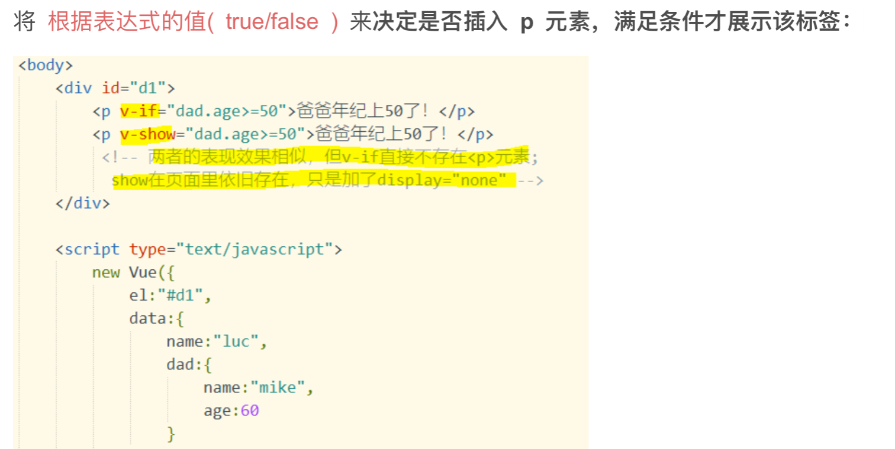
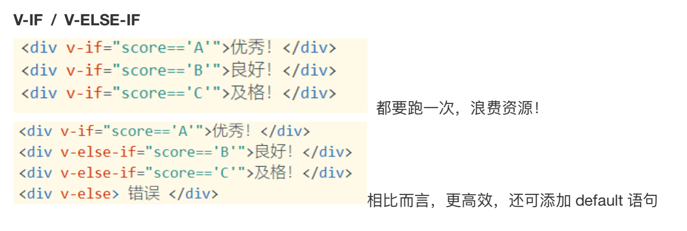
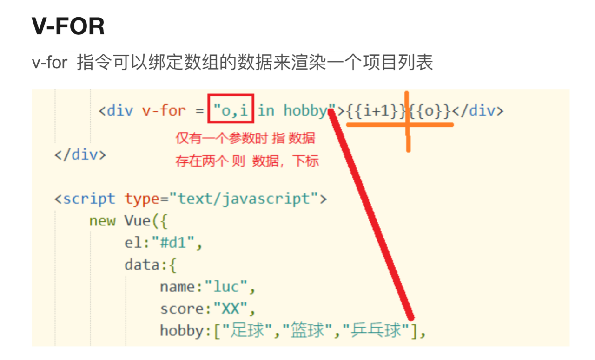
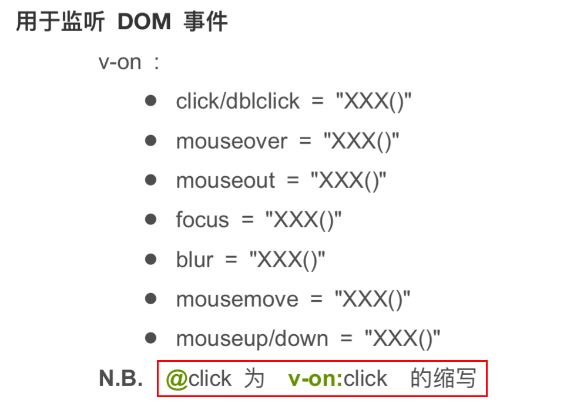
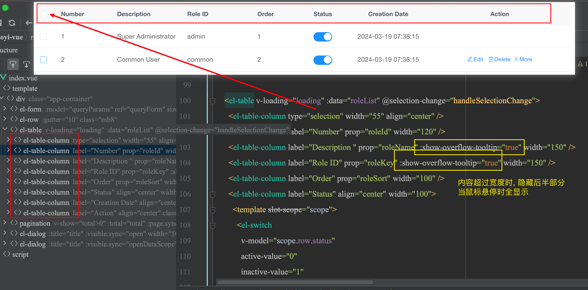
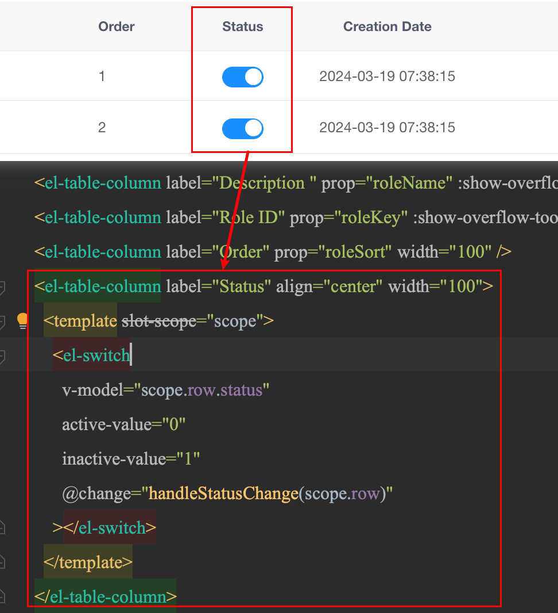
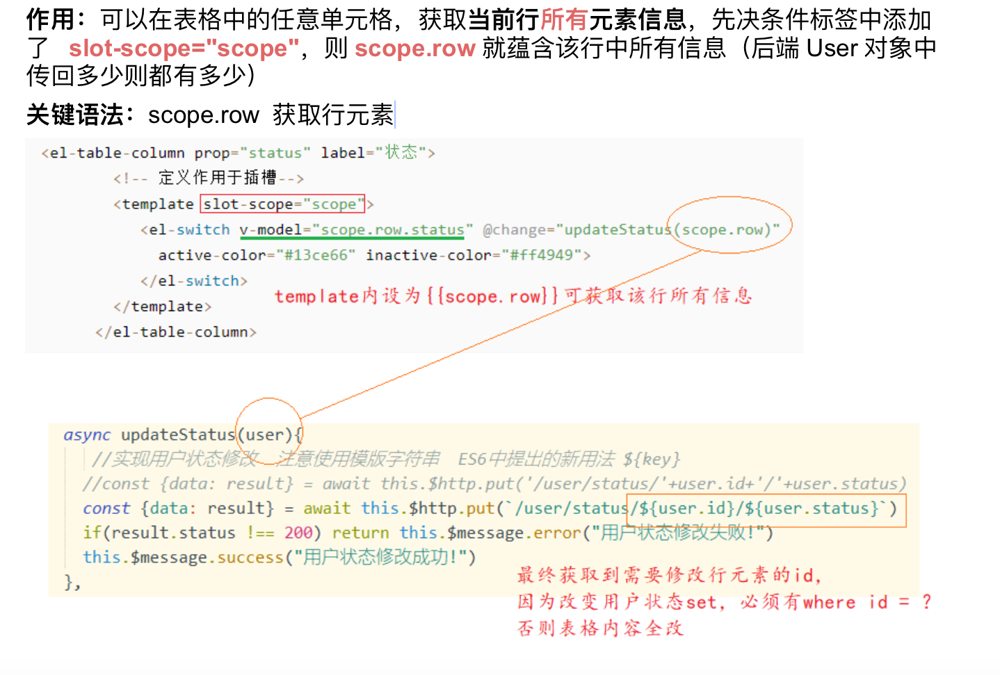
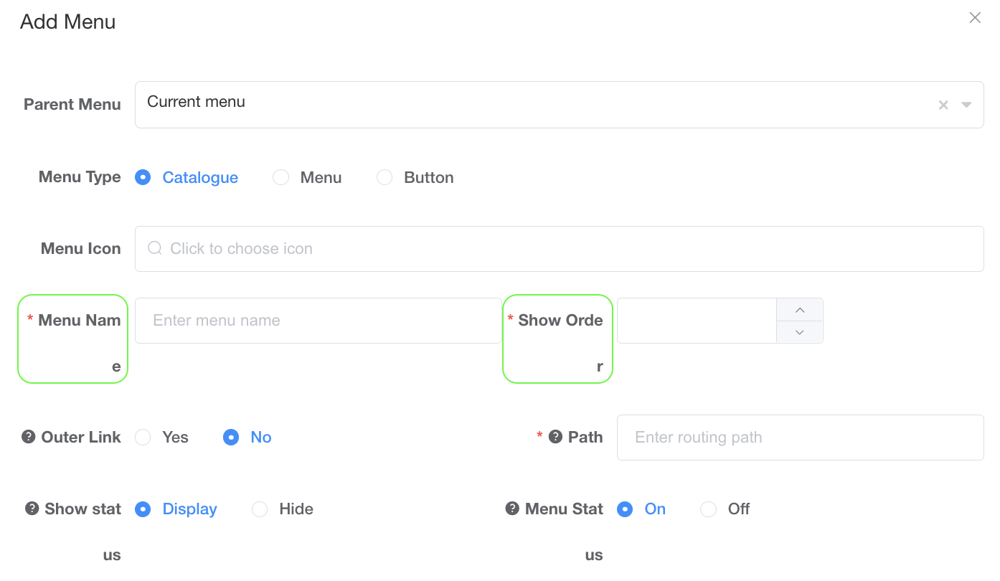
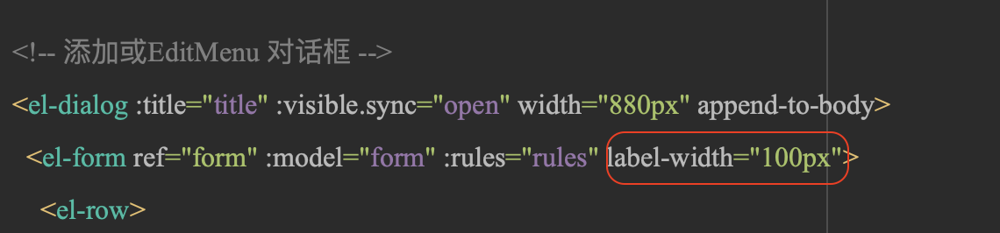
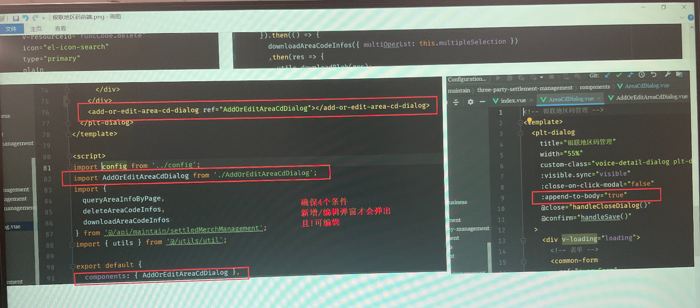

# 01.常见属性

- v-model: 绑定参数, 实现数据驱动视图
- v-html: 解析{{value}}属性内的html标签
- v-if: 基于判断结果决定是否显示标签





- v-for实现对data中列表数据的循环



- v-on则用于监听事件:



- v-bind标签用于 将data中的值 绑定到 html标签 的属性上, 比如a标签的href, src的img, button标签的disable, div标签的class、style, input标签在checkbox类型下的checked等, 

```html

<button v-bind:disabled="isButtonDisabled">Submit</button>

<!-- 基于data中的isActive属性值, 决定className里是否有active字段 --> 
<div v-bind:class="{ active: isActive, 'text-danger': hasError }"></div>

<div v-bind:style="{ color: activeColor, fontSize: fontSize + 'px' }"></div>
<input type="checkbox" v-bind:checked="isSelected">

<!-- IMP 简写模式 --> 

```


- :disabled="single" —— 仅选单个时可点, 比如 编辑按钮, 注意single在data部分有定义, 为布尔值true
  :disabled="multiple" —— 选中多个时也可点, 比如 删除按钮, , 注意single在data部分有定义, 为布尔值true

- el-table-column为el-table内部子元素标签:
  - prop 为 list内部元素 绑定的参数名, 比如 角色名称绑定 roleName



- 状态栏目为 嵌入视图template, 内部为el-switch (toggle), active-value/inactive-value对应值开闭值; 




# 02.重要概念


## 1.生命周期函数

**初始化阶段**存在四种基本函数：beforeCreate / create / beforeMount / Mounted

- **beforeCreate**

**说明**：在实例初始化之后，数据观测 (data observer) 和 event/watcher 事件配置之前被调用。

**解析**：VUE对象被JS刚解析，实例化成功（开辟一块内存空间），内部属性均为null

- **Create**

**说明**：在实例创建完成后被立即调用

**解析**：Vue对象开始加载属性 以及 属性值，一旦完成，对象实例化成功，仅限于创建，不执行

- **beforeMount**

**说明**：在挂载开始之前被调用，相关的 render 函数首次被调用。

**解析**：Vue对象中 el："#app" 通过指定id，将指定区域交给Vue对象管理

- **mounted** => 实例化成功！

**说明**：实例被挂载后调用，这时 el 被新创建的 vm.$el 替换了。

**解析**：当对象创建完成 并在 指定区域开始"渲染"——将区域中的 标签表达式 进行解析加载，一旦成功，mounted执行完成，用户可以看到解析后的页面

**Vue对象修改**：

- beforeUpdate
- Updated

**Vue对象销毁**

- beforeDestroy

- destroyed


## 2.作用域插槽

Vue 框架中的作用域插槽（Scoped Slots）和 React 中的父子组件间的参数传递有一些相似之处。

Vue 框架中的作用域插槽 **允许子组件向父组件传递数据**，**以便在父组件中进行处理或渲染** (最常见为 scope.row 为子组件传入父组件中处理)。通过使用 `<slot>` 元素和 `v-slot` 指令，子组件可以将数据传递给父组件，并定义父组件如何接收和使用这些数据。

类似地，React 中的父组件可以通过 props 将数据传递给子组件。父组件可以将数据作为 prop 传递给子组件，并在子组件中通过 `this.props` 访问这些数据。

虽然在实现上有一些差异，但作用域插槽和父子组件间的参数传递都可以实现组件之间的数据交流和共享。它们都提供了一种在组件层级间传递数据的方式，以实现更灵活和可组合的组件架构。

需要注意的是，作用域插槽在 Vue 中是一种特定的语法和机制，而父子组件间的参数传递在 React 中是一种常见的模式。虽然它们在概念上相似，但在具体实现和语法上可能有一些差异。


案例一:



案例二: 


# 99.Troubleshoot

## 表单的label超出两行

问题: label部分溢出, 且发现所有行都是一样宽度的label width






## 引入的add/edit框未显示

确保:

- template区进行组件渲染;
- script区import组件;
- export defaut中components添加了组件;
- 若点击新增或编辑按钮仍未显示, 在父组件上添加:append-to-body




