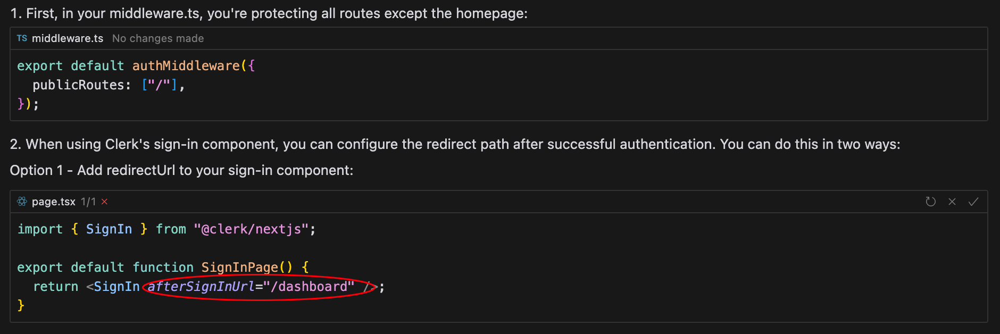
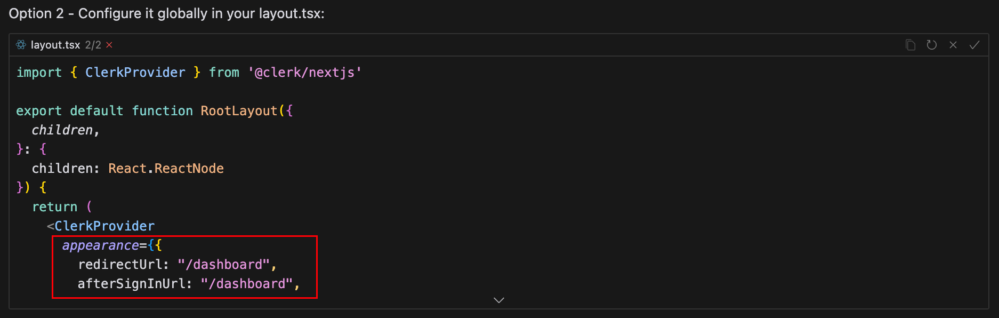

# 01.Clerk - 登录

## 1.1.基础使用

- 直接使用clerk包里的useAuth获取是否为登录状态

```html
import { useAuth } from "@clerk/nextjs";

const { isSignedIn } = useAuth();


<div>
    <Link href={isSignedIn ? "/dashboard" : "/sign-up"}>
      <Button variant="premium" className="md:text-lg p-4 md:p-6 rounded-full font-semibold">
        Start Generating For Free
      </Button>
    </Link>
</div>
```

- sign-up/in组件直接封装clerk包里SignUp/in组件

```react
import { SignUp } from "@clerk/nextjs";

export default function Page() {
  return <SignUp />;
};

// -----------------------

import { SignIn } from "@clerk/nextjs";

export default function Page() {
  return <SignIn />;
}
```


## 1.2.登录成功后跳转路径







# 02.Stripe - 支付

- 环境变量中配置密钥信息

```properties
STRIPE_API_KEY=***
STRIPE_WEBHOOK_SECRET=***
```

- 点击subscribe和topUp时, 调用不同的url即可

```react
// 充值
  const onTopUp = async () => {
    try {
      setLoading(true);
      console.log("top up btn pressed");
      // 充值 对应 paymentType 为 payment
      const response = await axios.get("/api/stripe?paymentType=payment");
      console.log(response, "response-onTopUp");
      window.location.href = response.data.url;
    } catch (error) {
      toast.error("Something went wrong");
    } finally {
      setLoading(false);
    }
  };

  // 注册会员
  const onSubscribe = async () => {
    console.log("onSubscribe upgrade btn");
    try {
      setLoading(true);
      // 注册 直接请求 stripe
      const response = await axios.get("/api/stripe");

      window.location.href = response.data.url;
    } catch (error) {
      toast.error("Something went wrong");
    } finally {
      setLoading(false);
    }
  };
```


# 03.React-flow


## 自定义Control

在 React Flow 中，您可以自定义 Control 组件的样式，包括放大和缩小按钮的边框颜色以及按钮内的 + 和 - 号颜色。您可以通过使用 CSS 或内联样式实现这一点。

以下是一个示例代码，说明如何仅保留放大和缩小按钮，并自定义它们的样式：

```jsx
import React from 'react';
import ReactFlow, { Controls } from 'react-flow-renderer';
import './CustomControls.css'; // 导入自定义样式

const CustomControls = () => {
  return (
    <Controls>
      <div className="custom-controls">
        <button className="zoom-button" onClick={() => {/* 放大逻辑 */}}>
          +
        </button>
        <button className="zoom-button" onClick={() => {/* 缩小逻辑 */}}>
          -
        </button>
      </div>
    </Controls>
  );
};

const App = () => {
  return (
    <ReactFlow>
      {/* 你的其他节点和连线 */}
      <CustomControls />
    </ReactFlow>
  );
};

export default App;
```

然后在 `CustomControls.css` 中定义样式：

```css
.custom-controls {
  display: flex;
  flex-direction: column;
}

.zoom-button {
  border: 2px solid #3498db; /* 自定义边框颜色 */
  background-color: white; /* 按钮背景颜色 */
  color: #3498db; /* 自定义 + 和 - 号颜色 */
  padding: 10px;
  margin: 5px;
  cursor: pointer;
  font-size: 20px;
  border-radius: 5px;
  transition: background-color 0.3s;
}

.zoom-button:hover {
  background-color: #3498db; /* 鼠标悬停时的背景颜色 */
  color: white; /* 鼠标悬停时的文字颜色 */
}
```

在这个例子中，您可以根据需要调整颜色和样式。请确保在 React Flow 组件中使用自定义的 Control 组件，并传入适当的放大和缩小逻辑。这样就可以实现您想要的效果。

