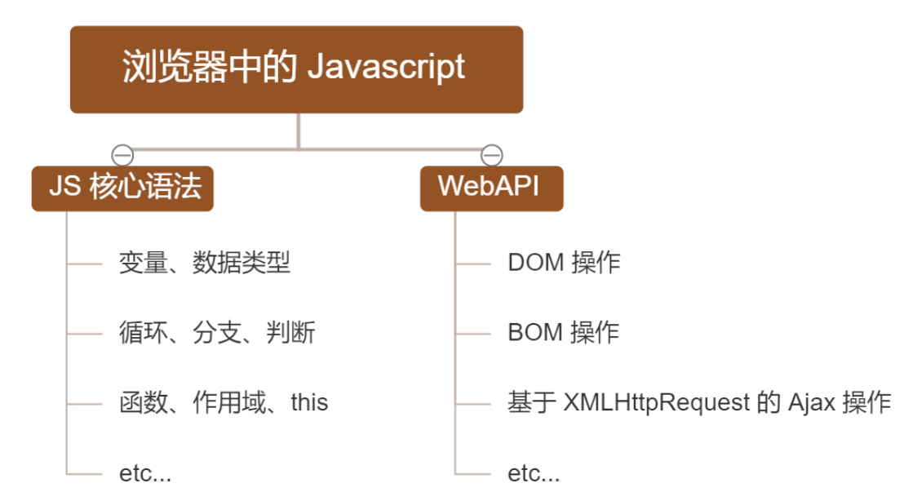
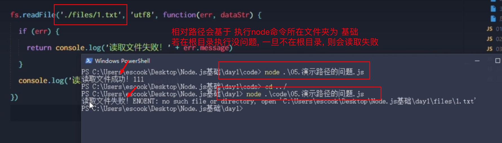
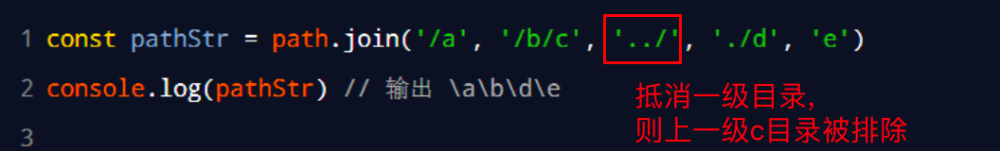
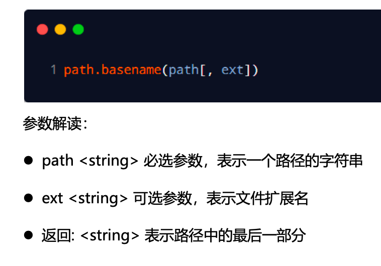
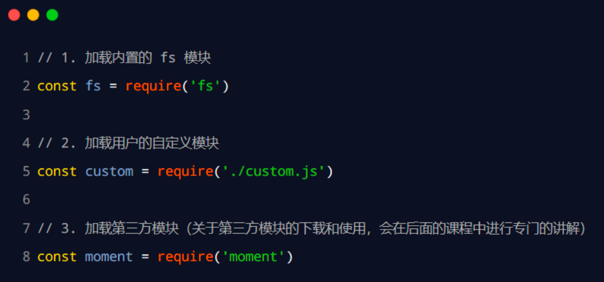
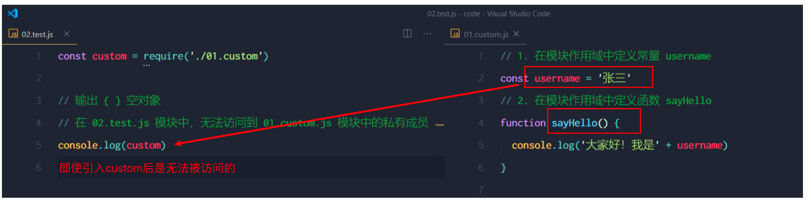
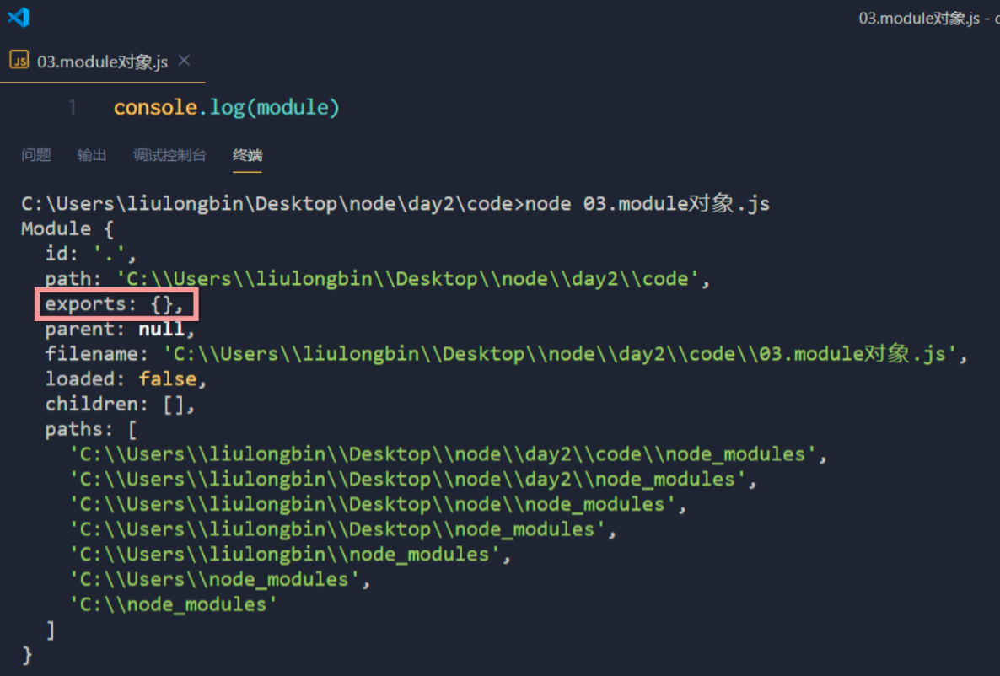
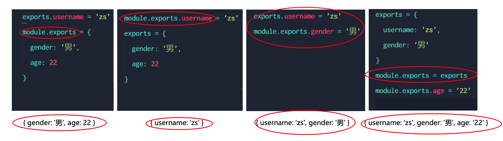
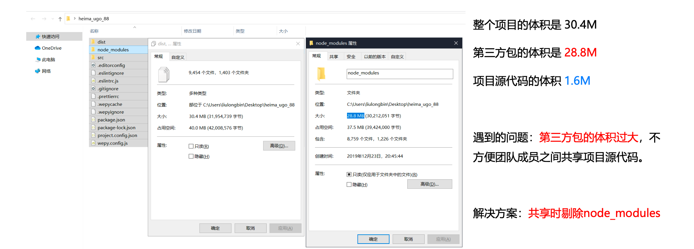
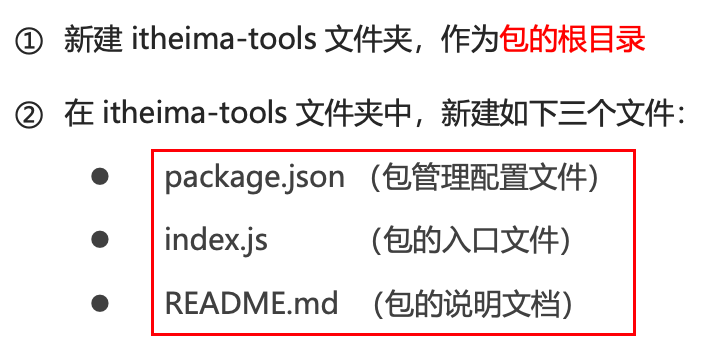

# 01.基础回顾

## JS组成部分




## 浏览器解析器

为什么 JavaScript 可以在浏览器中被执行 ? 

- Chrome 浏览器 => V8 (解析引擎性能最佳)

- Firefox 浏览器 => OdinMonkey（奥丁猴）

- Safri 浏览器 => JSCore

- IE 浏览器 => Chakra（查克拉）


## Node概述

① 浏览器是 JavaScript 的前端运行环境

② Node.js 是 JavaScript 的后端运行环境

③ 注意: Node.js 中 <u>无法调用</u> DOM、BOM、Ajax 等 浏览器内置 API


## 学习路径

框架如雨后春笋、层出不穷 ：

① 基于 Express 框架（http://www.expressjs.com.cn/），可以快速构建 Web 应用

② 基于 Electron 框架（https://electronjs.org/），可以构建跨平台的桌面应用

③ 基于 restify 框架（http://restify.com/），可以快速构建 API 接口项目

④ 读写和操作数据库、创建实用的命令行工具辅助前端开发、etc…

> 浏览器中的 JavaScript 学习路径：
>
> - JavaScript 基础语法 + 浏览器内置 API（DOM + BOM） + 第三方库（jQuery、art-template 等）
>
> Node.js 的学习路径：
>
> - JavaScript 基础语法 + Node.js 内置 API 模块（fs、path、http等）+ 第三方 API 模块（express、mysql 等）


# 02.内置模块

## 2.1.文件系统模块fs

fs 模块是 Node.js 官方提供的、用来操作文件的模块。它提供了一系列的方法和属性，用来满足用户对文件的操作需求。例如：

- fs.readFile() 方法，用来读取指定文件中的内容
- fs.writeFile() 方法，用来向指定的文件中写入内容

### 读取内容

```js
const fs = require('fs')

fs.readFile('/file/1.txt', 'utf-8', function (err, dataStr) {
    // 读取失败err为错误信息
    // 读取成功dataStr为字符串内容
})
```

### 写入内容

```js
const fs = require('fs')

fs.writeFile('/file/2.txt', 'abcdefg', function (err) {
    // 第三个参数默认为'utf-8', 可选填
    
    // 写入失败err为错误信息
  if (err) {
    console.log('写入失败')
  }
})
```


### 路径问题处理

问题描述:



解决办法:

```js
// 使用__dirname

const fs = require('fs')

fs.writeFile(__dirname + '/file/2.txt', 'abcdefg', function (err) {
   // ...
})
```


## 2.2.路径模块path


### path.join() - 目录拼接



### path.basename() - 获取文件名

- ext如‘.html’



###  path.extname() - 获取路径拓展名


## 2.3.HTTP模块

### 基本代码示例

```js
// step 1: 导入并创建服务器对象
const http = require('http')
const server = http.createServer()

// step 2: on为服务器绑定 request 事件处理函数
server.on("request", (req, res) => {
    // req 为请求对象
    console.log(`有人来访! Some one visit! url: ${req.url}; method: ${req.method}`)

    // 基于路径动态返回
    const url = req.url
    let content = '<h1>404 NOT FOUND</h1>'

    if (url === '/' || url === '/index.html') {
        content = '<h1>首页</h1>'
    } else if (url === '/about.html') {
        content = '<h1>关于页面</h1>'
    }

    // res 为响应对象
    // 注意配置解码格式 否则中文乱码
    res.setHeader('Content-Type', 'text/html; charset=utf-8')
    res.end(content)
})

// step 3: listen监听启动
server.listen(80, () => {
    console.log('server has been launched')
})
```


### 返回网页时钟页面

```js

const http = require('http')
const fs = require('fs')
const path = require('path')

const server = http.createServer()

server.on("request", (req, res) => {
    const url = req.url

    // 注意: 此处若设置header html中引用的css script文件都无法请求到
    // res.setHeader('Content-Type', 'text/html; charset=utf-8')
    fs.readFile(path.join(__dirname, url), (err, str) => {
        if (err) return res.end('<h1>404 NOT FOUND</h1>')
        return res.end(str)
    })
  
})
    server.listen(80, () => {
        console.log('server has been launched')
})
```


## 2.4.实践:网页时钟案例(fs+path)

- 将html文件中的style、script标签提取出来, 生成对应的外链文件;
- 替换原html文本中的style、script标签为外联标签, style处替换为`<link rel="stylesheet" href="./index.css" />`, script替换为`<script src="./index.js"></script>`;
- 生成替换后的html文件, 打开时钟仍正常显示

```js
const fs = require('fs')
const path = require('path')

const styleReg = /<style>[\s\S]*<\/style>/
const scriptReg = /<script>[\s\S]*<\/script>/

function resolveCSS(str) {
    const style = styleReg.exec(str)
    const css = style[0].replace('<style>', '').replace('</style>', '')
    fs.writeFile(__dirname + '/index.css', css, function (err) {
        if (err) console.log('error while writting file')
        console.log('css export success!')
    })
}

function resolveScript(str) {
    const script = scriptReg.exec(str)
    const scriTxt = script[0].replace('<script>', '').replace('</script>', '')
    fs.writeFile(__dirname + '/index.js', scriTxt, function (err) {
        if (err) console.log('error while writting file')
        console.log('script export success!')
    })
}

function resolveHTML(str) {
    const newHTML = 
          str.replace(styleReg, '<link rel="stylesheet" href="./index.css"/>')
        .replace(scriptReg, '<script src="./index.js"></script>')
    
    fs.writeFile(__dirname + '/index.html', newHTML, function (err) {
        if (err) console.log('error while writting file')
        console.log('HTML export success!')
    })
}

fs.readFile(path.join(__dirname, 'orig/index.html'), 'utf-8', function (err, dataStr) {
    if (err) console.log('error while reading file')
    resolveCSS(dataStr)
    resolveScript(dataStr)
    resolveHTML(dataStr)
})
```


# 03.模块化

## 1.基础

### 加载模块

- 使用require() 方法，可以加载需要的内置模块、用户自定义模块、第三方模块进行使用。例如：
- 每次使用require(), 都是确实的加载+执行的操作, 比如模块里有console.log()语句, 它是会被打印执行的




### 模块作用域

概念: 和函数作用域类似，在自定义模块中定义的变量、方法等成员，只能在当前模块内被访问，这种模块级别的访问限制，叫做`模块作用域`

优点: 防止 **参数 全局变量污染** 的问题




## 2.Module对象

### 概念

- 既然模块都有作用域, 如何与外部共享模块内部的资源和内容呢? —— Module对象
- 每个js文件都包含一个内置的Module对象, 它存储了和当前模块有关的信息, 可重点关注内部的export属性




### module.exports对象

- 利用module.exports进行 导出属性 或 方法 的挂载
- 此时, 在另一个js中引入该对象打印, 就不再是空对象{ }, 而是`{username: 'zs', sayHello: [Function], age: 20}`
- **注意**: <u>导出结果 始终 以 module.exports = {...} 为准</u>


### 使用误区

注意：为了防止混乱，建议大家不要在同一个模块中同时使用 exports 和 module.exports




## 3.包管理工具npm

#### 基础

- 全称: Node Package Manager, 无需单独下载, 会随node.js一起下载

```shell
# 初始化 - 快速创建 package.json
npm init -y

# 安装依赖
npm install
npm i 	# 简写

# 包下载
npm install package-name
npm i package-name


# 卸载
npm uninstall package-name

# 默认会下载最新版 可用@指定版本
npm i moment@2.2.2

# 安装指定包并记录到devDep
npm i package-name -D
npm install package-name --save-dev

# 切换仓库源
npm config get registry
npm config set registry=https://registry.npm.taobao.org/
```


初次装包完成后，在项目文件夹下多一个叫做 node_modules 的文件夹和 package-lock.json 的配置文件。其中：

- node_modules 文件夹用来存放所有已安装到项目中的包。require() 导入第三方包时，就是从这个目录中查找并加载包。
- package-lock.json 配置文件用来记录 node_modules 目录下的每一个包的下载信息，例如<u>包的名字、版本号、下载地址</u>等。	

注意：程序员不要手动修改 node_modules 或 package-lock.json 文件中的任何代码，npm 包管理工具会自动维护它们。


#### 全局包

- 全局包不会安装到node_modules, 而是如C:\Users\用户目录\AppData\Roaming\npm\node_modules
- 只有工具性质的包，才有全局安装的必要性。因为它们提供终端命令

```shell
# 全局包下载
npm i package-name -g

# 如: i5ting_toc 是一个可以把 md 文档转为 html 页面的小工具
npm install -g i5ting_toc
i5ting_toc -f /mydoc/markdown.md -o
```


#### 包版本

包的版本号是以“点分十进制”形式进行定义的，总共有三位数字，例如 2.24.0

其中每一位数字所代表的的含义如下：

​	第1位数字：大版本

​	第2位数字：功能版本

​	第3位数字：Bug修复版本

版本号提升的规则：<u>只要前面的版本号增长了，则后面的版本号归零</u>。


#### 项目共享问题

- 如图所示, 一个项目整体包含的第三方包体积会很庞大, 所以一般会剔除node_modules;




#### 发布包到npm

- 在包根目录下运行`npm publish`
- `npm unpublish 包名 --force` 即可删除包

包结构案例:



# Node版本管理器(NVM)

## Installation and configuration

```shell
# install
brew install nvm

# mkdir
mkdir $HOME/Installation\&Soft/01-it/nvm

# ~/.bash_profile
export NVM_DIR="$HOME/Installation\&Soft/01-it/nvm"
[ -s "/opt/homebrew/opt/nvm/nvm.sh" ] && \. "/opt/homebrew/opt/nvm/nvm.sh" 
[ -s "/opt/homebrew/opt/nvm/etc/bash_completion.d/nvm" ] && \. "/opt/homebrew/opt/nvm/etc/bash_completion.d/nvm" 

# source shell config file
source ~/.bash_profile
```


## commands

```shell

```

