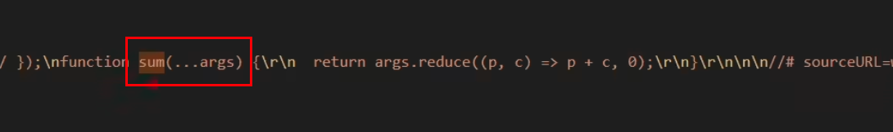
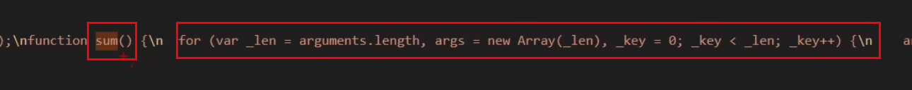
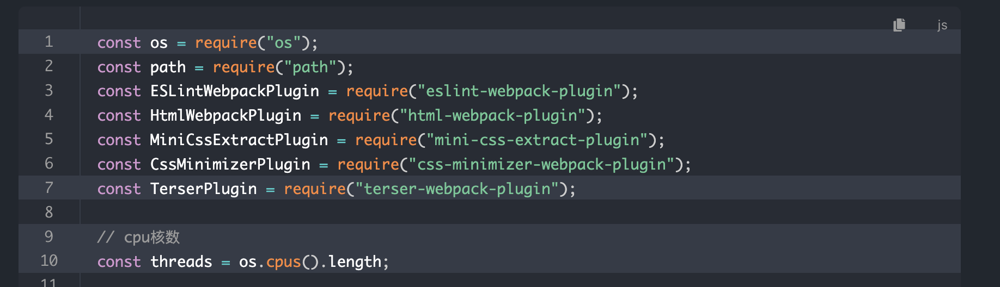
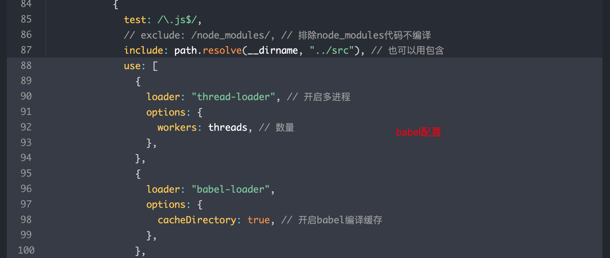
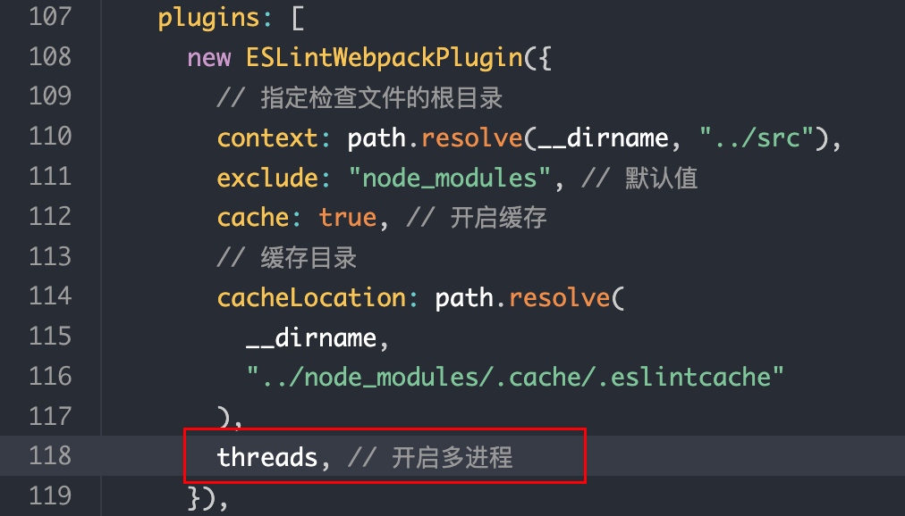
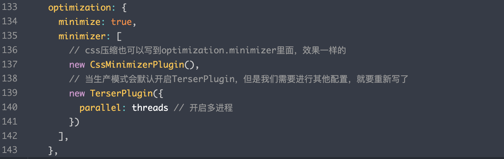

资料地址:

https://yk2012.github.io/sgg_webpack5/

# 01.前言

## 为什么需要打包工具?

开发时，我们会使用框架（React、Vue），ES6 模块化语法，Less/Sass 等 css 预处理器等语法进行开发。

这些代码要想在浏览器运行必须经过编译 成为 浏览器能识别的 JS、Css 等语法，才能运行。

除此之外，打包工具还能 <u>压缩代码、做兼容性处理、提升代码性能</u> 等。


## 案例展示

案例: 如下的代码, 打开index.html, 由于module引入的问题, 并不能进行计算与打印

- 解决办法: webpack打包
- 注意: 打包后index.html原先引用main.js处需改为dist目录下的main.js

```
webpack_code 
		└── public
    		├── index.html # 引入src里的main.js
    └── src 
        ├── js 
        │   ├── count.js # 计算
        │   └── sum.js # 计算
        └── main.js # 引入计算文件, console.log计算结果
```

```html
<!DOCTYPE html>
<html lang="en">
  <head>
    <meta charset="UTF-8" />
    <meta http-equiv="X-UA-Compatible" content="IE=edge" />
    <meta name="viewport" content="width=device-width, initial-scale=1.0" />
    <title>webpack5</title>
  </head>
  <body>
    <h1>Hello Webpack5</h1>
    <!-- 准备一个使用样式的 DOM 容器 -->
    <div class="box1"></div>
    <!-- 引入打包后的js文件，才能看到效果 -->
    <script src="../dist/main.js"></script>
  </body>
</html>
```


# 02.基本操作

## 1.安装

- 默认 Webpack 会将文件打包输出到 dist 目录下，我们查看 dist 目录下文件:
  - 开发模式下, 编译文件比较繁杂, 且lambda都未出现 ;
  - 以最精简方法打包, 比如lambda出现 —— 所以说可以压缩代码 ;

```shell
# 初始化package.json
npm init -y

# 下载依赖
npm i webpack webpack-cli -D

# 运行指令
npx webpack ./src/main.js --mode=development
npx webpack ./src/main.js --mode=production
```


## 2.配置文件

### 大纲

- **entry**: 指示 Webpack 从哪个文件开始打包

- **output**: 指示 Webpack 打包完的文件输出到哪里去，如何命名等

- **loader**: webpack 本身只能处理 js、json 等资源，其他资源需要借助 loader，Webpack 才能解析

- **plugins**: 扩展 Webpack 的功能

- **mode**:

​		主要由两种模式：开发模式：development || 生产模式：production


### 详例

```js
const path = require("path");

module.exports = {
  // 入口
  // 相对路径和绝对路径都行
  entry: "./src/main.js",
  
  // 输出
  output: {
    path: path.resolve(__dirname, "dist"), // 输出到 当前文件夹下的dist文件夹
    filename: "js/main.js", // 入口文件输出路径+文件名
  },
  // 加载器
  module: {
    rules: [],
  },
  // 插件
  plugins: [],
  // 模式
  mode: "development", // 开发模式
};
```


## 3.样式资源处理

#### 依赖下载

- Webpack 本身是不能识别Css、Less、Sass、Scss、Styl 样式资源，需借助 Loader 来解析样式资源
- 安装loader到本地开发环境即可 ( 生产环境肯定是打完包才扔上去 ! )

```shell
npm i css-loader -D
npm i style-loader -D
npm i less-loader -D
npm i sass-loader sass -D
npm i stylus-loader -D
```


#### 配置文件

- module.rules中配置: 针对不同ext文件, 采用不同的loader

```js
const path = require("path");

module.exports = {
  entry: "./src/main.js",
  output: {
    path: path.resolve(__dirname, "dist"),
    filename: "main.js",
  },
  module: {
    rules: [
      {
        test: /\.css$/,
        use: ["style-loader", "css-loader"],
      },
      {
        test: /\.less$/,
        use: ["style-loader", "css-loader", "less-loader"],
      },
      {
        test: /\.s[ac]ss$/,
        use: ["style-loader", "css-loader", "sass-loader"],
      },
      {
        test: /\.styl$/,
        use: ["style-loader", "css-loader", "stylus-loader"],
      },
    ],
  },
  plugins: [],
  mode: "development",
};
```


## 4.处理图片资源

- module.rules中添加以下配置; 
- **注意点**: 
  - 此时运行`npx webpack`, dist目录下多出对应图片文件, 但样式文件却没有? 都被打进main.js里
  - 假设有3张图片, 发现输出的图片文件就只有2张，则有1张图片以 data URI 形式内置到 js 中 (因为它被base64处理)

```js
		{
        test: /\.(png|jpe?g|gif|webp)$/,
        type: "asset",
        parser: {
          dataUrlCondition: {
            maxSize: 10 * 1024 // 小于10kb的图片会被base64处理
          }
        }
      },
```


## 5.输出路径划分与优化

```js
const path = require("path");

module.exports = {
  entry: "./src/main.js",
  output: {
    path: path.resolve(__dirname, "dist"),
    filename: "static/js/main.js", // 将webpack默认打包的js放到static/js/下
    clean: true, // 优化: 自动将上次打包目录资源清空
  },
  module: {
    rules: [
      {
        test: /\.css$/,
        // use 数组里面 Loader 执行顺序是从右到左
        use: ["style-loader", "css-loader"],
      },
      {
        test: /\.less$/,
        use: ["style-loader", "css-loader", "less-loader"],
      },
      {
        test: /\.s[ac]ss$/,
        use: ["style-loader", "css-loader", "sass-loader"],
      },
      {
        test: /\.styl$/,
        use: ["style-loader", "css-loader", "stylus-loader"],
      },
      {
        test: /\.(png|jpe?g|gif|webp)$/,
        type: "asset",
        parser: {
          dataUrlCondition: {
            maxSize: 40 * 1024, // 小于40kb的图片会被base64处理
          },
        },
        generator: {
          // 将图片文件输出到 static/imgs 目录中
          // 将图片文件命名 [hash:8][ext][query]
          // [hash:8]: hash值取8位
          // [ext]: 使用之前的文件扩展名
          // [query]: 添加之前的query参数, 比如通过url请求的图片
          filename: "static/imgs/[hash:8][ext][query]",
        },
      },
    ],
  },
  plugins: [],
  mode: "development",
};
```


## 6.字体图标与媒体资源

- module.rules里定义: 

```js
		{
        test: /\.(ttf|woff2?|map4|map3|avi)$/,
        type: "asset/resource",
        generator: {
          filename: "static/media/[hash:8][ext][query]",
        },
      },
```

> `type: "asset/resource"`和`type: "asset"`的区别：
>
> 1. `type: "asset/resource"` 相当于`file-loader`, 将文件转化成 Webpack 能识别的资源，其他不做处理
> 2. `type: "asset"` 相当于`url-loader`, 将文件转化成 Webpack 能识别的资源，同时小于某个大小的资源会处理成 data URI 形式


# 03.Eslint

## 1.基本步骤

- 安装eslint依赖 `npm i eslint-webpack-plugin eslint -D`
- webpack.config.js中添加为plugins (不同webpack版本存在loader或plugin差异, 需查阅)
- 添加配置文件 ( 3种形式: js文件、json文件 或 直接在package.json写 )
- 配置`.eslintignore`, 避免对dist目录下文件进行扫描


## 2.webpack.config.js

```js
const ESLintWebpackPlugin = require("eslint-webpack-plugin");

plugins: [
    new ESLintWebpackPlugin({
      // 指定检查文件的根目录
      context: path.resolve(__dirname, "src"),
    }),
 ],
```


## 3..eslintrc.js

- 由于规则过于繁琐, 且大部分规则为约定俗成, 所以可以采取直接extends继承方式 ;

- rules 具体规则 :

  - `"off"` 或 `0` - 关闭规则

  - `"warn"` 或 `1` - 开启规则，使用警告级别的错误：`warn` (不会导致程序退出)

  - `"error"` 或 `2` - 开启规则，使用错误级别的错误：`error` (当被触发的时候，程序会退出)

```js
module.exports = {
  // 继承 Eslint 规则
  extends: ["eslint:recommended"],
  env: {
    node: true, // 启用node中全局变量
    browser: true, // 启用浏览器中全局变量
  },
  parserOptions: {
    ecmaVersion: 6, // ec6版本
    sourceType: "module",
  },
  rules: {
    "no-var": 2, // 不能使用 var 定义变量
  },
};
```


## 4..eslintignore

```
# 忽略dist目录下所有文件
dist
```


# 04.Babel

## 1.作用

- webpack可以处理js, 但并不能处理 所有浏览器都能解析的js;
- Webpack 只能编译 js 中 `ES 模块化`语法，导致 js 不能在 IE 等浏览器运行, 因此需要作**<u>兼容性处理</u>**

### 示例

- 未安装babel编译如下, 部分浏览器无法识别



- 安装后编译为如下, 旧版本语言习惯(如 遍历获取参数、lambda箭头函数换为function函数), 适配所有浏览器




## 2.基本流程

- 安装依赖 `npm i babel-loader @babel/core @babel/preset-env -D`
- webpack.config.js中添加为plugins (不同webpack版本存在loader或plugin差异, 需查阅)
- 添加配置文件 ( 3种形式: js文件、json文件 或 直接在package.json写 )


## 3.webpack.config.js

- module.rules下添加: 

```js
		{
        test: /\.js$/,
        exclude: /node_modules/, // 排除node_modules代码不编译
        loader: "babel-loader",
      },
```


## 4.配置文件

**四种配置方式**: 

- babel.config.*

  > - `babel.config.js`
  > - `babel.config.json`

- .babelrc.*

  > - `.babelrc`
  > - `.babelrc.js`
  > - `.babelrc.json`

- `package.json` 中 `babel`：不需要创建文件，在原有文件基础上写

- `webpack.config.js` 中直接写


```js
// babel.config.js

module.exports = {
  presets: ["@babel/preset-env"],
};
```


# 05.高级优化

## 1.提升开发体验

sourceMap

为什么需要? 

- 编译后在inspect-source-main.js可以看到编译后的代码, 但一旦某处报错, 非常不好定位
- 


## 2.提升打包构建速度

### 2.1.HotModuleReplacement

- 常规情况下, 开发时我们修改了其中一个模块代码，Webpack 默认会将所有模块全部重新打包编译，速度很慢 ;
- hot module replacement（HMR/热模块替换）：在程序运行中，替换、添加或删除 作了更改的模块，而无需重新加载整个页面

```js
module.exports = {
  // 其他省略
  devServer: {
    host: "localhost", 
    port: "3000",
    open: true, 
    hot: true, // 开启HMR功能（只能用于开发环境）
  },
};
```


### 2.2.OneOf

- Module.rules下存在许多子项目, 若不特殊配置, 则每次都遍历一次, 但其实每个文件只会匹配一个项目
- 如何优化? 

```js
module: {
    rules: [
      {
        oneOf: [ // 嵌套一层oneOf即可
          {
            test: /\.css$/,
            use: ["style-loader", "css-loader"],
          },
          ...
          ]
}]}
```


### 2.3.Include/Exclude

- 对于babel与Eslint, 一般都需要用exclude或include来限定作用范围, 以避免重复处理
- 比如node_modules, 内部的第三方插件都是处理过的, 无需重复操作
- exclude或include只能二选一, 2者都用会报错

```js
{
            test: /\.js$/,
            // exclude: /node_modules/
            include: path.resolve(__dirname, "../src"), // 也可以用包含
            loader: "babel-loader",
},
```

```js
plugins: [
    new ESLintWebpackPlugin({
      // 指定检查文件的根目录
      context: path.resolve(__dirname, "../src"),
      exclude: "node_modules", // 默认值
    }),
]
```


### 2.4.Cache

- 每次打包时 js 文件都要经过 Eslint 检查 和 Babel 编译, 因此可以缓存之前的 Eslint 检查 和 Babel 编译结果

```js
{
            test: /\.js$/,
            include: path.resolve(__dirname, "../src"), 
            loader: "babel-loader",
            // 缓存babel编译结果  
            options: {
              cacheDirectory: true, // 1.开启babel编译缓存
              cacheCompression: false, // 2.缓存文件不要压缩
            },
  },
```

```js
plugins: [
    new ESLintWebpackPlugin({
      context: path.resolve(__dirname, "../src"),
      exclude: "node_modules",
      
      cache: true, // 1.开启缓存
      // 2.配置缓存目录
      cacheLocation: path.resolve(
        __dirname,
        "../node_modules/.cache/.eslintcache"
      ),
    }),
]
```


### 2.5.Thread

- 获取 CPU 的核数

```javascript
// nodejs核心模块，直接使用
const os = require("os");
// cpu核数
const threads = os.cpus().length;
```

- 下载包

```text
npm i thread-loader -D
```

- 使用
  - 目前打包的内容都很少，因为启动进程开销原因 (启动每个线程约有600ms开销)，使用多进程打包反而会显著延长打包时间










## 3.減少代码体积

### Tree Shaking

- 开发时我们定义了一些工具函数库，或者引用第三方工具函数库或组件库, 如果没有特殊处理, 打包时会引入整个库，但实际应用的部分可能不多 ;
- Tree Shaking 是一个术语，通常用于描述移除 JavaScript 中的没有使用上的代码 ;
-  Webpack 已经默认开启了这个功能，无需其他配置

**注意：它依赖 `ES Module`。**


### Babel

可减少Babel生成文件的体积


### Image Minimizer

- 项目中引用了较多图片，那么图片体积会比较大，将来请求速度比较慢 => 可以对图片进行压缩，减少图片体积

**注意：如果项目中图片都是在线链接，那么就不需要了。本地项目静态图片才需要进行压缩。**

`image-minimizer-webpack-plugin`: 用来压缩图片的插件


## 4.优化代码运行性能


Include-Exclude

CodeSplit