# 创建代码块快捷键

输入shortcut以后 按tap

```
ul>li*3 # no comment 

.post # 创建class为post的div

h4.title # 创建class为title的h4

Lorem #

```


# 基础知识

## div标签内容水平垂直居中


### 方法一：使用Flexbox

Flexbox 是一个现代的布局模型，可以非常容易地实现元素的 水平和垂直居中。

```css
.container {
  display: flex;
  justify-content: center; /* 水平居中 */
  align-items: center; /* 垂直居中 */
  height: 100vh; /* 视窗高度，确保容器足够高 */
}
```

```html
<div class="container">
  <div>这里是居中的内容</div>
</div>
```

### 方法二：使用Grid

CSS Grid 也是一个强大的布局系统，可以用来实现元素的居中。

```css
.container {
  display: grid;
  height: 100vh; /* 视窗高度 */
}

.container > div {
  margin: auto; /* 自动计算外边距 */
}
```

```html
<div class="container">
  <div>这里是居中的内容</div>
</div>
```

### 方法三：使用绝对定位和transform

这种方法通过将元素的左、右、上、下设置为0，并使用 `margin: auto` 来实现水平和垂直居中。

```css
.container {
  position: relative;
  height: 100vh; /* 视窗高度 */
}

.centered {
  position: absolute;
  top: 0;
  left: 0;
  right: 0;
  bottom: 0;
  margin: auto;
  width: 50%; /* 设置宽度 */
  height: 50%; /* 设置高度 */
}
```

```html
<div class="container">
  <div class="centered">这里是居中的内容</div>
</div>
```

### 方法四：使用table-cell和vertical-align

这种方法模拟了表格布局的行为。

```css
.container {
  display: table-cell;
  text-align: center; /* 水平居中 */
  vertical-align: middle; /* 垂直居中 */
  height: 100vh; /* 视窗高度 */
}
```

```html
<div class="container">
  <div>这里是居中的内容</div>
</div>
```

选择哪种方法取决于你的具体需求和项目的兼容性要求。Flexbox 和 Grid 通常是现代浏览器中实现居中最简单和最有效的方法。


## position与display属性的区别

### `display` 属性

`display` 属性用于设置元素生成的框的类型。主要的值包括：

- `block`：元素呈现为块级元素，独占一行，可以设置宽度和高度。
- `inline`：元素呈现为内联元素，不会独占一行，宽度和高度由内容决定。
- `inline-block`：元素呈现为内联块级元素，不会独占一行，但可以设置宽度和高度。
- `none`：元素不会被显示，也不会占据空间。

### `position` 属性

`position` 属性用于设置元素的定位方式。主要的值包括：

- `static`：默认值，元素按照正常文档流进行定位。
- `relative`：元素相对于其正常位置进行定位，可以通过 `top`, `right`, `bottom`, `left` 属性调整位置。
- `absolute`：元素相对于最近的非 `static` 定位的祖先元素进行定位，如果没有则相对于 `body`。
- `fixed`：元素相对于浏览器窗口进行定位，即使页面滚动，元素位置也不会改变。
- `sticky`：元素根据用户的滚动位置进行定位。

### 区别和联系

- **控制内容不同**：`display` 控制元素的显示类型和布局方式，而 `position` 控制元素的定位方式。
- **影响布局**：`display` 的改变会影响元素在 文档流中的布局，而 `position` 的改变会影响 元素的定位方式，可能会脱离文档流。
- **使用场景**：`display` 常用于控制元素的布局，如列表项的显示方式；`position` 常用于控制元素的具体位置，如弹出菜单的定位。


## display属性options详解

CSS中的Display属性是一个非常强大的工具，它控制着HTML元素的布局方式。我们来看看你提到的几种Display属性：Grid, Flexbox, Inline, Block, 以及Inline Block，它们各自的特点和用途。

### **1. Grid**

Grid布局是CSS的一种布局方式，允许开发者创建复杂的响应式网页布局结构，更容易、更灵活地设计网格。它允许我们定义行和列，然后将元素放置到这些行列所定义的网格区域内。它最适合于创建复杂的页面布局，特别是当你需要对齐项目，或者在两个轴（即行和列）上控制它们的大小时。

### **2. Flexbox**

Flexbox，或者称为灵活盒子模型，是一种设计页面布局的工具。它为盒状模型提供了一种更加有效的方式来在容器内分配空间，即使在未知大小的项目上也是如此。它主要用于一维布局（即在行或列中），使得在不同屏幕大小上的元素对齐、分布空间和调整大小变得简单。

### **3. Inline**

`Inline`布局是默认的布局模式，用于如`<span>, <a>, , <strong>, <small>`这样的内联元素。内联元素不会开始一个新的行，它们在文档流中水平排列，直到填满行的宽度，然后移动到下一行。内联元素不可以设置宽度和高度。

### **4. Block**

`Block`布局对应于块级元素，如`<div>`、`<p>`等。块级元素会占据它所在的整个容器的宽度，即使它本身的内容没有那么宽。每个块级元素也都会从新的一行开始，并且可以设置宽度和高度。

### **5. Inline-Block**

`Inline-Block`结合了内联元素和块级元素的特点。它不会像块级元素那样独占一行，允许其他元素在同一行显示，但是它允许设置元素的宽度和高度，这是传统内联元素不支持的。`Inline-Block`适合于需要在同一行内并排显示的元素，同时需要调整它们的大小。

总的来说，这些布局方式提供了不同的工具和方法，以应对各种页面布局的挑战。选择哪一种取决于你的具体需求，比如你是需要更灵活的一维布局（Flexbox），还是需要构建复杂的两维布局（Grid），或者是其它情况。


# 语法简写


## min/clamp

```css
.container {
  width:800px;
  max-width:90%;
}

.container {
  width: min(800px, 90%);
}

.container {
  width: clamp(400px , 50vw, 800px);
}
```


## not

- 选中 不是第一个子元素 的button

```css
.button:not(:first-child){ 
  background-color: red;
}
```


## has

- 选中 包含svg元素的button

```css
button:has(svg){
  padding-right: 14px; display: flex;
  align-items: center;
  gap: 10px;
  fil1：
  white;
}
```


## 渐变字体

### 实现

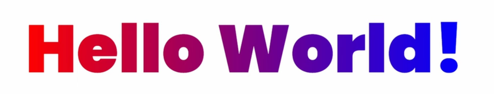

- 将 h1背景设为 颜色渐变;
- background-clip 将 定义背景的绘制区域，但当它与 `text` 值一起使用时，它可以裁剪背景以适应文本内容, 也就是 只有有文字的地方才有背景;
- 将 字体本身设为透明;

```css
h1 {
  background: linear-gradient(to right, red, blue);
  background-clip: text; 
  color: transparent;
｝
```


### background-clip

`background-clip` 属性定义了背景（包括图像和颜色）的绘制区域。它可以取以下几种值：

1. `border-box`: 默认值。背景延伸到边框的外边缘，包括边框和内边距。

2. `padding-box`: 背景被裁剪到内边距框，即背景覆盖内容和内边距，但不包括边框。

3. `content-box`: 背景被裁剪到内容框，即背景只应用于元素的内容区，不包括内边距和边框。

4. `text` (非标准): 这个值不是CSS规范的一部分，但它被一些浏览器支持，尤其是WebKit和Blink引擎的浏览器。它使得背景透过文本显示，通常与 `color: transparent;` 一起使用来创建文本渐变等效果。

这些值决定了背景绘制的范围。例如，如果你有一个带有边框和内边距的元素，并且你希望背景色或背景图片仅填充内容区而不扩展到边框或内边距，你可以设置 `background-clip: content-box;`。

此外，`background-clip` 可以和 `background-origin` 结合使用，后者指定了背景定位区域，可以是 `padding-box`、`border-box` 或 `content-box`。默认情况下，`background-origin` 的值为 `padding-box`，这意味着背景图像是相对于内边距框进行定位的。


## 粘性滑动框

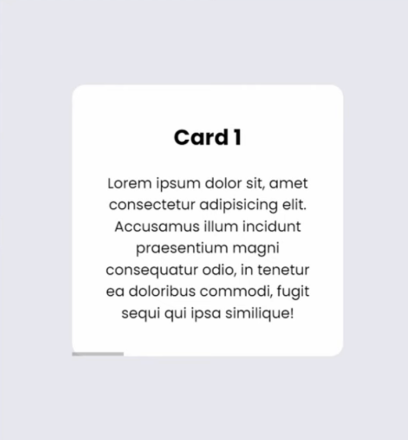

```css
.wrapper {
  display: flex;
  gap: 20px;
  width: 300px;
  overflow-x: scroll;
  scroll-snap-type: x mandatory;
  /** 
  启用了滚动快照功能，并指定了滚动快照的方向为水平（x），以及滚动行为是强制性的（mandatory），
  意味着用户滚动停止时，浏览器会自动调整滚动位置以使最近的快照点对齐。
  **/
｝
  
.card {
  scroll-snap-align: center;
  /** 
  指定了每个卡片作为滚动快照目标时应该对齐的位置——这里是居中对齐。
  这意味着当用户滚动到一个卡片时，该卡片将会被 尽可能地放置在视口的中央。 
  **/
  box-sizing: border-box;
  /**
  确保内边距padding和边框border包含在元素的总宽度和高度之内，这对于保持设计的一致性非常重要
  **/
  padding: 20px 30px;
  flex-shrink: 0;
  width: 300px; /* 宽度同容器, 注意必须配置box-sizing */
  background-color: white;
  border-radius: 14px;
  text-align: center;
}
```


# Tailwind速查

```jsx
text-[1rem] // 字体大小
text-customized-green // 颜色
```


# display属性

## inline

- **在同一行内显示**：行内元素不会独占一行，而是与其他行内元素在同一行内显示，直到行满为止。
- **宽度和高度**：行内元素的宽度和高度由其内容决定，不能通过 `width` 和 `height` 属性显式设置。
- **垂直对齐**：可以使用 `vertical-align` 属性来控制行内元素的垂直对齐方式

- \ 标签的默认 display 属性值是 inline

## block

- **`block`**：使 `` 标签独占一行。
- **`inline-block`**：使 `` 标签表现得像行内元素，但可以设置宽度和高度。
- **`flex`** 或 **`grid`**：使 `` 标签成为 Flex 容器或 Grid 容器


# 响应式屏幕断点

在前端开发中，为了适配各种屏幕尺寸，通常会使用响应式设计（Responsive Design）。响应式设计的核心是通过CSS媒体查询（Media Queries）来定义不同屏幕尺寸下的样式规则。以下是一些常用的屏幕尺寸断点，这些断点可以帮助你覆盖从手机到大屏幕显示器的各种设备：

## 常用的屏幕尺寸断点

1. **超小屏幕（Extra Small, xs）**
   - **宽度**：< 576px
   - **设备**：大多数手机竖屏模式

2. **小屏幕（Small, sm）**
   - **宽度**：≥ 576px
   - **设备**：大多数手机横屏模式，小型平板电脑竖屏模式

3. **中等屏幕（Medium, md）**
   - **宽度**：≥ 768px
   - **设备**：小型平板电脑横屏模式，中型平板电脑竖屏模式

4. **大屏幕（Large, lg）**
   - **宽度**：≥ 992px
   - **设备**：中型平板电脑横屏模式，桌面显示器

5. **超大屏幕（Extra Large, xl）**
   - **宽度**：≥ 1200px
   - **设备**：大型桌面显示器

6. **超超大屏幕（Extra Extra Large, xxl）**
   - **宽度**：≥ 1400px
   - **设备**：超宽显示器，多显示器配置

## CSS媒体查询示例

以下是一个使用CSS媒体查询的示例，展示了如何针对不同的屏幕尺寸设置样式：

```css
/* 超小屏幕（< 576px） */
@media (max-width: 575.98px) {
  .container {
    width: 100%;
  }
  .nav-item {
    flex-direction: column;
  }
}

/* 小屏幕（≥ 576px） */
@media (min-width: 576px) and (max-width: 767.98px) {
  .container {
    width: 540px;
  }
  .nav-item {
    flex-direction: row;
  }
}

/* 中等屏幕（≥ 768px） */
@media (min-width: 768px) and (max-width: 991.98px) {
  .container {
    width: 720px;
  }
  .nav-item {
    flex-direction: row;
  }
}

/* 大屏幕（≥ 992px） */
@media (min-width: 992px) and (max-width: 1199.98px) {
  .container {
    width: 960px;
  }
  .nav-item {
    flex-direction: row;
  }
}

/* 超大屏幕（≥ 1200px） */
@media (min-width: 1200px) and (max-width: 1399.98px) {
  .container {
    width: 1140px;
  }
  .nav-item {
    flex-direction: row;
  }
}

/* 超超大屏幕（≥ 1400px） */
@media (min-width: 1400px) {
  .container {
    width: 1320px;
  }
  .nav-item {
    flex-direction: row;
  }
}
```


# 字体大小自适应

## 字体大小参考


在Tailwind CSS中，你可以使用响应式前缀来实现字体大小的屏幕自适应。Tailwind CSS提供了一系列的响应式断点，你可以根据不同的屏幕尺寸应用不同的样式。

以下是一个示例，展示了如何使用Tailwind CSS的响应式前缀来设置字体大小：

```html
<div class="text-base sm:text-lg md:text-xl lg:text-2xl xl:text-3xl">
  这是一个响应式字体大小的示例。
</div>
```


在这个示例中：

- `text-base` 是默认的字体大小。
- `sm:text-lg` 表示在小屏幕（sm）及以上尺寸时，字体大小为 `lg`。
- `md:text-xl` 表示在中等屏幕（md）及以上尺寸时，字体大小为 `xl`。
- `lg:text-2xl` 表示在大屏幕（lg）及以上尺寸时，字体大小为 `2xl`。
- `xl:text-3xl` 表示在超大屏幕（xl）及以上尺寸时，字体大小为 `3xl`。

## 默认断点

Tailwind CSS的默认断点如下：

- `sm`: 640 px
- `md`: 768 px
- `lg`: 1024 px
- `xl`: 1280 px
- `2xl`: 1536 px

你可以根据需要调整这些断点和对应的字体大小，以实现最佳的屏幕自适应效果。

## 字体大小

在Tailwind CSS中，默认的字体大小定义如下：

- `text-sm`: 0.875rem (14px)
- `text-base`: 1rem (16px)
- `text-lg`: 1.125rem (18px)
- `text-xl`: 1.25rem (20px)
- `text-2xl`: 1.5rem (24px)
- `text-3xl`: 1.875rem (30px)

## 字重

- `font-thin`: 对应 CSS 的 `font-weight: 100`
- `font-extralight`: 对应 CSS 的 `font-weight: 200`
- `font-light`: 对应 CSS 的 `font-weight: 300`
- `font-normal`: 对应 CSS 的 `font-weight: 400`
- `font-medium`: 对应 CSS 的 `font-weight: 500`
- `font-semibold`: 对应 CSS 的 `font-weight: 600`
- `font-bold`: 对应 CSS 的 `font-weight: 700`
- `font-extrabold`: 对应 CSS 的 `font-weight: 800`
- `font-black`: 对应 CSS 的 `font-weight: 900`

## 行间距/行高

- `leading-none`: 没有行间距
- `leading-tight`: 紧密行间距
- `leading-snug`: 比紧密稍大的行间距
- `leading-normal`: 正常行间距
- `leading-relaxed`: 放松的行间距
- `leading-loose`: 比较宽松的行间距

```html
<body>
  <p class="leading-none">这是行高为 1 的文本。</p>
  <p class="leading-tight">这是行高为 1.25 的文本。</p>
  <p class="leading-snug">这是行高为 1.375 的文本。</p>
  <p class="leading-normal">这是行高为 1.5 的文本。</p>
  <p class="leading-relaxed">这是行高为 1.625 的文本。</p>
  <p class="leading-loose">这是行高为 2 的文本。</p>
</body>
```


这些值是基于默认的根字体大小为16px。如果你改变了根字体大小，这些值也会相应调整。

要避免代码重复，可以使用Tailwind CSS的“@apply”指令将这些重复的样式组合成一个自定义的类。这样可以在多处使用相同的类，而不是每次都重复写相同的样式。

首先，创建一个自定义的CSS文件（例如，`styles.css`），并在文件中定义你的自定义类：
```css
/* styles.css */
@tailwind base;
@tailwind components;
@tailwind utilities;

.custom-text-sizes {
  @apply sm:text-lg md:text-xl lg:text-2xl xl:text-3xl;
}
```

然后，在你的Tailwind配置文件（例如，`tailwind.config.js`）中导入这个自定义CSS文件:
```javascript
module.exports = {
  content: [
    './src/**/*.{js,jsx,ts,tsx}', // 根据你的项目路径调整
  ],
  theme: {
    extend: {},
  },
  plugins: [],
};
```

最后，在你的组件或HTML文件中使用这个自定义类：
```html
<div class="custom-text-sizes">
  这是带有自定义文本大小的内容。
</div>
```

这样就减少了重复代码，并且使你的代码更具可读性和可维护性。


# Position属性

> static - relative - absolute - fixed - sticky


`position: static;` 和 `position: relative;` 在 CSS 中虽然看起来相似，但实际上有着不同的行为和用途。理解它们之间的区别有助于更好地控制元素在页面上的位置。


## `position: static;`（默认值）
- **默认值**：所有 HTML 元素的默认 `position` 值都是 `static`。
- **行为**：当一个元素的 `position` 属性设置为 `static` 时，它会按照正常的文档流进行布局，不会受到 `top`、`bottom`、`left` 或 `right` 属性的影响。
- **特点**：
  - 不会影响其他元素的布局。
  - 不能设置 `z-index` 来改变堆叠顺序。
  - 无法通过 `top`、`bottom`、`left` 或 `right` 进行偏移。

## `position: relative;`
- **行为**：当一个元素的 `position` 属性设置为 `relative` 时，它仍然按照正常的文档流进行布局，但可以通过 `top`、`bottom`、`left` 或 `right` 属性进行偏移。
- **特点**：
  - 可以设置 `z-index` 来改变堆叠顺序。
  - 偏移量是相对于 <u>元素原本的位置</u>，而不是相对于父元素或其他元素。
  - 其他元素的布局不会因为它的偏移而受到影响。


# clsx

`clsx` 是一个用于条件性地构建 className 字符串的小型实用工具库。它的作用是在你需要根据条件动态生成 className 字符串时，提供一种简洁而灵活的方式。特别是在使用像 TailwindCSS 这样的实用工具类库时，`clsx` 会非常有帮助。

下面是 `clsx` 的几个主要功能和优点：

1. **条件渲染**: 根据条件添加或移除类名。例如，你可以使用布尔值来决定是否包括某个类名。
2. **简洁的 API**: `clsx` 提供了一个非常简洁的 API，让你能够轻松地组合多个类名。
3. **避免复杂的字符串拼接**: 不需要手动进行字符串拼接，减少了代码的复杂性和错误。
4. **支持对象和数组**: 可以传递对象和数组来动态生成类名。

以下是一个简单的示例，展示了如何使用 `clsx` 与 TailwindCSS 一起定义样式：

```javascript
import clsx from 'clsx';

const Button = ({ isPrimary, isDisabled }) => {
  const buttonClasses = clsx(
    'py-2 px-4 font-semibold rounded-lg',
    {
      'bg-blue-500 text-white': isPrimary,
      'bg-gray-500 text-black cursor-not-allowed': isDisabled,
    }
  );

  return <button className={buttonClasses} disabled={isDisabled}>Click me</button>;
};
```

在上面的例子中：

- `clsx` 根据 `isPrimary` 和 `isDisabled` 的值来动态地生成 `className` 字符串。
- 如果 `isPrimary` 为 `true`，按钮将会有 `bg-blue-500` 和 `text-white` 类。
- 如果 `isDisabled` 为 `true`，按钮将会有 `bg-gray-500`、`text-black` 和 `cursor-not-allowed` 类，并且 `disabled` 属性被设置。

通过使用 `clsx`，可以更方便地将多个类名条件性地组合在一起，而不需要手动拼接字符串。

# Flexbox

## 容器属性

- flex-container需要将display: flex

- **flex-direction**: row / column / row-reverse / column-reverse

> 当direction设置为N, 则N轴为main axis, 另一个轴为cross axis;

- **justify-content**: 设定主轴排列方式

<u>`flex-start | flex-end | center | space-between | space-around (两侧间距相同) | space-evenly(项目间距相同)`</u>

- **align-items**: 设定交叉轴排列方式

<u>`flex-start | flex-end | center | stretch | baseline`</u>

- **flex-wrap**: no-wrap / wrap 当宽度高度超过容器时, 是否换行, no-wrap则永远保持在一行

- **flex-flow**: flex-direction + flex-wrap, 比如 flex-flow: row wrap;

- **align-content**: 只有当flex-wrap的值为wrap时, 且items超过一行时才生效, 用于配制 行与行之间的对齐方式

<u>`stretch | flex-start | flex-end | center | space-between | space-around(两侧间距相同) | space-evenly(项目间距相同)`</u>


## items属性

- **order**: 调整 调整单个item 的 顺序

- **align-self**: 调整 单个item 的 align-item ( 即 位于交叉轴上 ) 的顺序

- **flex-basis**: 默认为auto, 表示基于内容宽度, 调整 单个item 在 主轴方向 的宽度, 如果设为0, 则假设\<div>内部有文字, 宽度就是文字内容的宽度
- **flex-grow**: 默认为0, 不自动扩大, 调整 单个item 在 主轴方向 上剩余空间扩展的比率
- **flex-shrink**: 默认为1, 必要时缩小以适配容器, 与flex-grow相反概念, 默认值为1, 下例中, 若box的flex-shrink设为0, 则任何时候都不缩放, 会导致C被撑出容器外

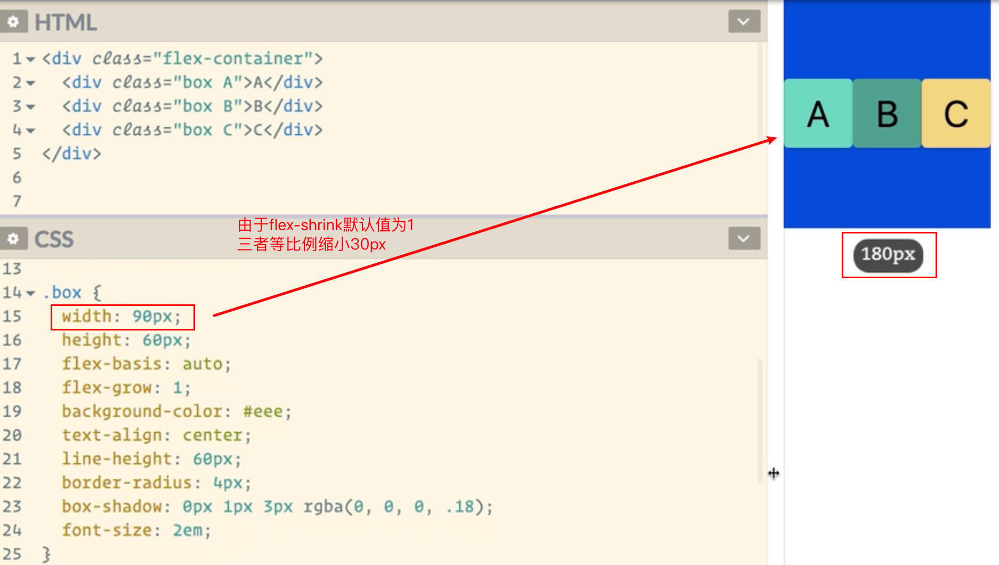

- **flex: A B C** 其实为 flex-grow flex-shrink flex-basis 三个参数的缩写

> flex: 1 1 0%;
> flex: 0 0 auto;


#### align-self属性

`align-self` 是 CSS Flexbox 布局中的一个属性，用于单独控制某个 flex 项目在交叉轴（cross axis）上的对齐方式。默认情况下，flex 项目的对齐方式由其父容器的 `align-items`属性决定，但 `align-self` 可以覆盖这个默认值，为单个 flex 项目设置不同的对齐方式。

##### 可能的值
- **auto**：默认值，继承父容器的 `align-items` 属性值。
- **flex-start**：项目在交叉轴的起点对齐。
- **flex-end**：项目在交叉轴的终点对齐。
- **center**：项目在交叉轴的中间对齐。
- **baseline**：项目在基线对齐（适用于文本内容）。
- **stretch**：项目在交叉轴上拉伸以填充整个容器（默认行为）。

##### 示例

假设我们有一个 Flexbox 容器，包含多个 flex 项目：

```html
<div class="container">
    <div class="item item1">Item 1</div>
    <div class="item item2">Item 2</div>
    <div class="item item3">Item 3</div>
</div>
```

```css
.container {
    display: flex;
    align-items: center; /* 默认对齐方式为居中 */
    height: 200px; /* 设置容器高度以便观察效果 */
    border: 1px solid black;
}

.item {
    width: 100px;
    height: 50px;
    margin: 10px;
    background-color: lightblue;
}

.item1 {
    align-self: flex-start; /* 项目1在交叉轴的起点对齐 */
}

.item2 {
    align-self: center; /* 项目2在交叉轴的中间对齐 */
}

.item3 {
    align-self: flex-end; /* 项目3在交叉轴的终点对齐 */
}
```


## 案例1: 手机端导航栏

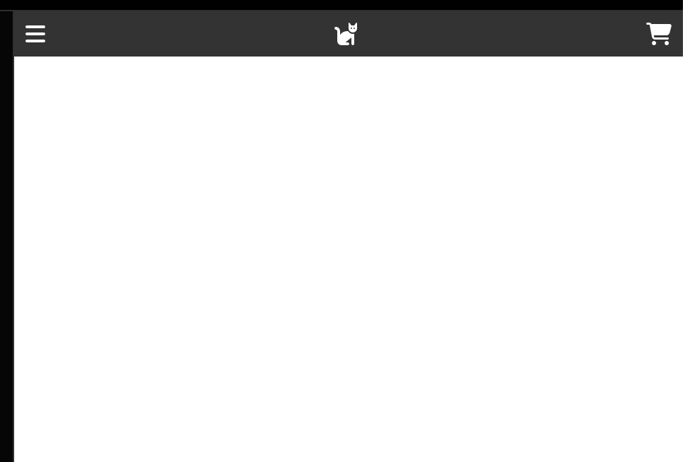

```html
<ul>
  <li>
    <i class="fa fa-bars"></i>
  </li>
  <li class="logo">
    <i class="fa fa-cat"></i>
  </li>
  <li>
    <i class="fa fa-cart-shopping"></i>
  </li>
</ul>
```


```css
ul {
  display: flex;
  padding: 4px 8px;
  background-color: #333;
}

ul li {
  color: #fff;
}

ul li.logo {
  flex: 1 1 auto; /* 中间的Logo如果宽度变大则撑大, 缩小则缩小 */
  text-align: center;
}
```


## 案例2: 部落格文章列表

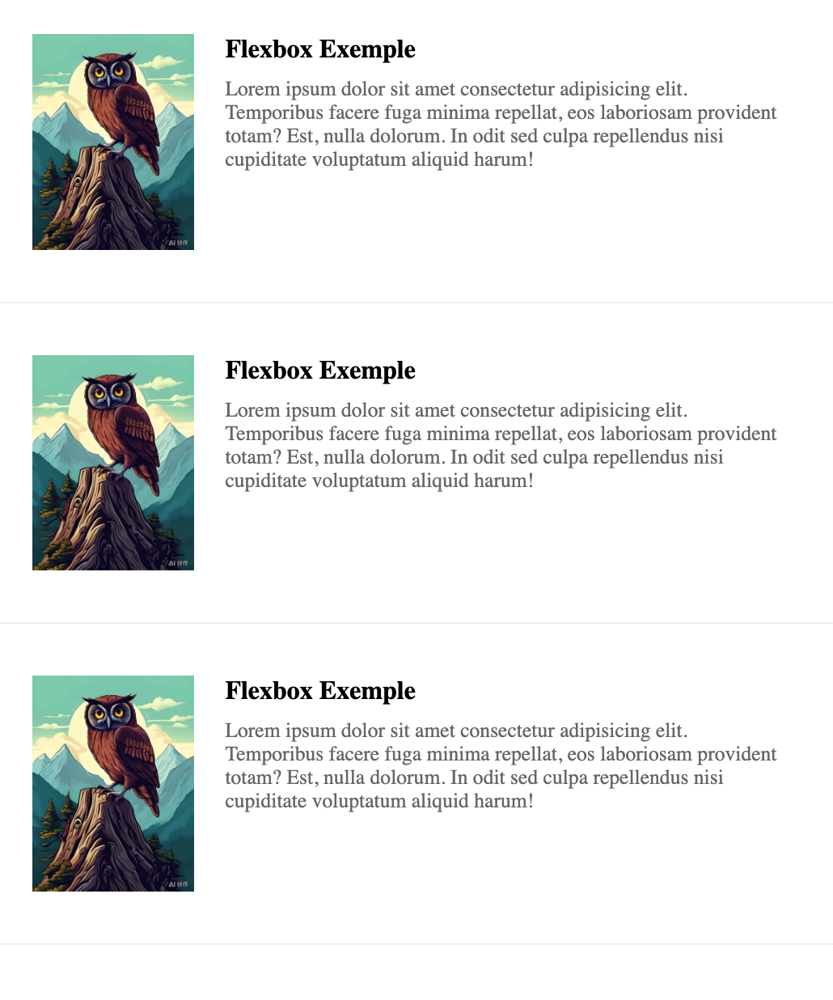


```html
<div class="post">
  <div class="thumbnail">
    
  </div>
  <div class="content">
    <h4 class="title">
      Flexbox Exemple
    </h4>
    <div class="excerp">
      Lorem ipsum dolor sit amet consectetur adipisicing elit. Temporibus facere fuga minima repellat, eos laboriosam provident totam? Est, nulla dolorum. In odit sed culpa repellendus nisi cupiditate voluptatum aliquid harum!
    </div>
  </div>
</div>
```


```css
body {
  /* body一般自带margin */
  margin: 0;  
}

.post {
  display: flex;
  flex-direction: row;
  padding: 2em;
  border-bottom: 1px solid #eee;
}

.post .thumbnail {
  /* 图片容器大小为200px, 空间不足时缩小, 空间足够时也不会扩大 */
  flex: 0 1 200px;
  min-width: 100px;
}

.post .thumbnail img {
  display: block;
	border-radius: 100%;
  width: 100%;
  height: auto;
}

.content {
  display: flex;
  flex-direction: column;
  margin-left: 1.2rem; 
  /* 内容始终占最大的grow, 宽度基于内容决定, 若内容字数少但仍有剩余空间时, content仍会撑满 */
  flex: 1 1 auto;	
}

.content h4 {
  font-weight: bold;
  margin: 0 0 8px 0;
}

.content .excerp {
  font-size: .8em;
  color: #666;
}
```


# 图片属性

## img标签

` width | height | max-width | max-height | margin | padding | border | border-radius | position | top | right | bottom | left | float | vertical-align | opacity | transform | transition | animation | filter (如增加黑白度grayscale) `


## 元素背景图片

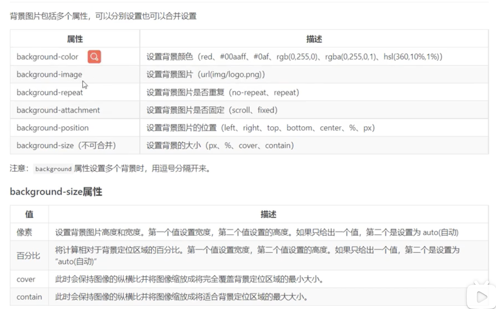


# transform属性

CSS 的 `transform` 属性用于对元素进行二维或三维变换。你可以应用多个变换函数来实现旋转、缩放、移动、斜切等效果。以下是 `transform` 属性中可以使用的一些主要变换函数：

### 1. translate
用于移动元素。

- **`translate(x, y)`**：移动元素至 `(x, y)` 位置。可以使用像素或百分比。
- **`translateX(x)`**：只在 x 轴上移动。
- **`translateY(y)`**：只在 y 轴上移动。
- **`translateZ(z)`**：在三维空间中沿 z 轴移动（仅在 3D 变换中使用）。
- **`translate3d(x, y, z)`**：在三维空间中移动元素。

示例：
```css
transform: translate(50px, 100px);
transform: translateX(50px);
transform: translateY(100px);
```

### 2. scale
用于缩放元素。

- **`scale(x, y)`**：按 x 和 y 轴缩放元素。
- **`scaleX(x)`**：只在 x 轴上缩放。
- **`scaleY(y)`**：只在 y 轴上缩放。
- **`scaleZ(z)`**：在三维空间中沿 z 轴缩放（仅在 3D 变换中使用）。
- **`scale3d(x, y, z)`**：在三维空间中缩放元素。

示例：
```css
transform: scale(1.5, 2);
transform: scaleX(1.5);
transform: scaleY(2);
```

### 3. rotate
用于旋转元素。

- **`rotate(angle)`**：以指定的角度旋转元素，角度单位可以是 `deg`（度）、`rad`（弧度）、`grad`（百分度）或 `turn`（圈）。
- **`rotateX(angle)`**：绕 x 轴旋转（在 3D 变换中使用）。
- **`rotateY(angle)`**：绕 y 轴旋转（在 3D 变换中使用）。
- **`rotateZ(angle)`**：绕 z 轴旋转（在 3D 变换中使用）。
- **`rotate3d(x, y, z, angle)`**：绕指定的三维向量旋转。

示例：
```css
transform: rotate(45deg);
transform: rotateX(45deg);
transform: rotateY(45deg);
transform: rotateZ(45deg);
transform: rotate3d(1, 1, 0, 45deg);
```

### 4. skew
用于斜切元素。

- **`skew(x-angle, y-angle)`**：按 x 和 y 轴斜切元素。
- **`skewX(angle)`**：只在 x 轴上斜切。
- **`skewY(angle)`**：只在 y 轴上斜切。

示例：
```css
transform: skew(20deg, 10deg);
transform: skewX(20deg);
transform: skewY(10deg);
```

### 5. perspective
用于给元素增加透视效果。

- **`perspective(n)`**：为 3D 变换设置视距，`n` 是视距的长度（以像素为单位）。

示例：
```css
transform: perspective(500px);
```

### 6. matrix
用于在一个函数中设置移动、缩放、旋转和斜切。

- **`matrix(a, b, c, d, e, f)`**：二维矩阵变换。
- **`matrix3d(n0, n1, n2, ..., n15)`**：三维矩阵变换。

示例：
```css
transform: matrix(1, 0.5, -0.5, 1, 20, 30); /* 矩阵变换 */
transform: matrix3d(1, 0, 0, 0, 0, 1, 0, 0, 0, 0, 1, 0, 20, 30, 40, 1); /* 3D矩阵变换 */
```

### 例子
综合使用以上属性，可以创建复杂的变换效果。例如：
```css
.element {
  transform: translate(50px, 100px) scale(1.5) rotate(45deg) skew(10deg, 5deg);
}
```

这个例子将元素移动到 `(50px, 100px)` 位置，缩放到 1.5 倍，旋转 45 度，并沿 x 轴和 y 轴分别斜切 10 度和 5 度。

通过组合多种 `transform` 函数，你可以实现丰富多彩的变换效果，从而增强网页的视觉体验。

# requestAnimationFrame

`requestAnimationFrame` 是 JavaScript 中用于动画的一个方法。它提供了一种在浏览器的刷新周期中执行动画的方法，使动画更加平滑和高效。

### 主要特点
1. **同步浏览器刷新**：`requestAnimationFrame` 会把你的 动画回调函数放在浏览器的下一个重绘周期中执行，这样可以确保动画的更新与浏览器的刷新同步，避免不必要的重绘和重排。
2. **节能和性能优化**：在后台标签页或窗口中，使用 `requestAnimationFrame` 的动画会被暂停或降低优先级，从而节省系统资源。

### 使用示例
下面是一个简单的使用 `requestAnimationFrame` 创建动画的示例：

```html
<!DOCTYPE html>
<html>
<head>
    <title>requestAnimationFrame Example</title>
    <style>
        #box {
            width: 50px;
            height: 50px;
            background-color: red;
            position: absolute;
            top: 0;
            left: 0;
        }
    </style>
</head>
<body>
    <div id="box"></div>
    <script>
        let box = document.getElementById('box');
        let start = null;

        function animate(timestamp) {
            if (!start) start = timestamp;
            let progress = timestamp - start;
            box.style.left = Math.min(progress / 10, 200) + 'px';
            if (progress < 2000) {
                requestAnimationFrame(animate);
            }
        }

        requestAnimationFrame(animate);
    </script>
</body>
</html>
```

在这个示例中：
1. `animate` 函数是一个动画回调函数，会在每个刷新周期调用。
2. `timestamp` 是一个高精度时间戳，表示从页面加载到当前回调执行时的时间。
3. `requestAnimationFrame(animate)` 会持续调用 `animate`，直到动画完成。

### 详细解释
- **初始化**：第一次调用 `requestAnimationFrame` 时，`start` 变量被设置为动画开始的时间戳。
- **计算进度**：通过 `timestamp - start` 计算出动画已经进行的时间。
- **更新位置**：将动画元素的 `left` 样式属性设置为一个随时间增加的值（每10毫秒增加1像素）。
- **循环调用**：如果动画未完成（即 `progress < 2000`），继续调用 `requestAnimationFrame`，否则动画结束。

### 取消动画
如果需要取消动画，可以使用 `cancelAnimationFrame` 方法。示例如下：

```javascript
let animationId = requestAnimationFrame(animate);

function stopAnimation() {
    cancelAnimationFrame(animationId);
}
```

`cancelAnimationFrame` 方法可以停止由 `requestAnimationFrame` 发起的动画循环，从而停止动画。

### 总结
`requestAnimationFrame` 是一个强大的工具，适用于需要频繁更新 UI 的情况，如 <u>动画和游戏开发</u>。它能提高动画的流畅度和性能，并减少资源消耗。


# CSS代码实践


## 问题列表宽度自适应


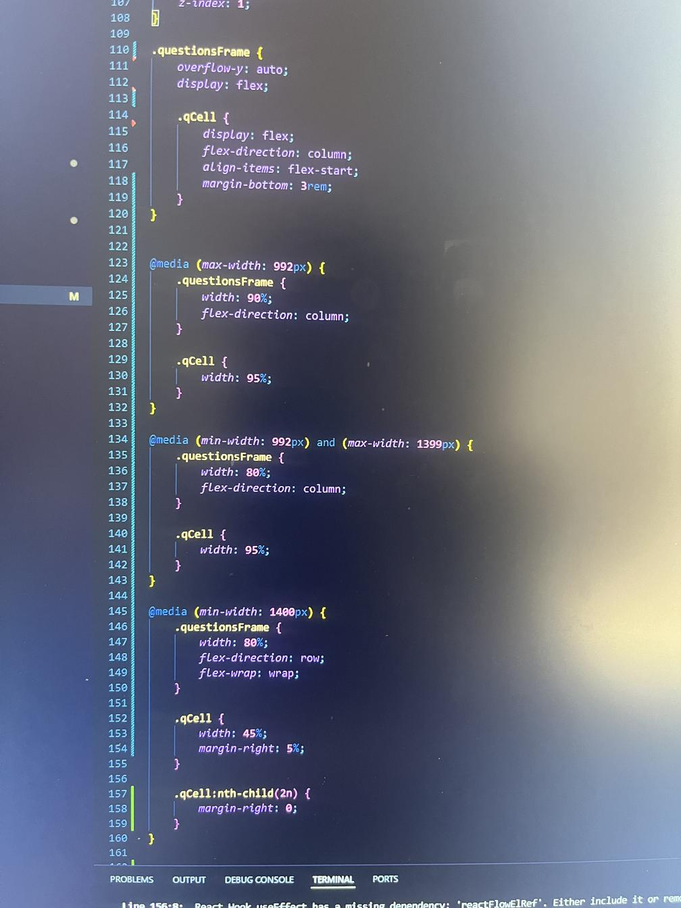

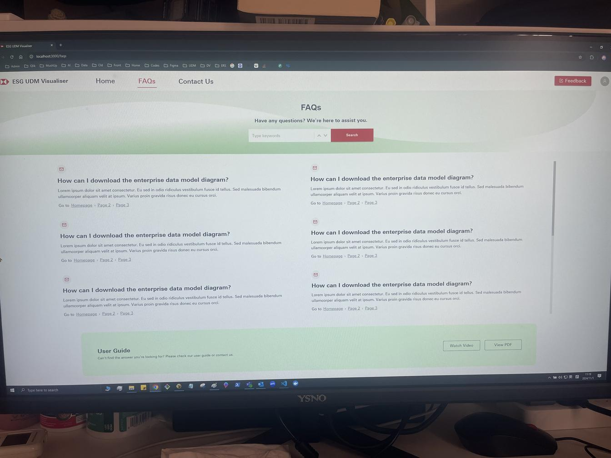

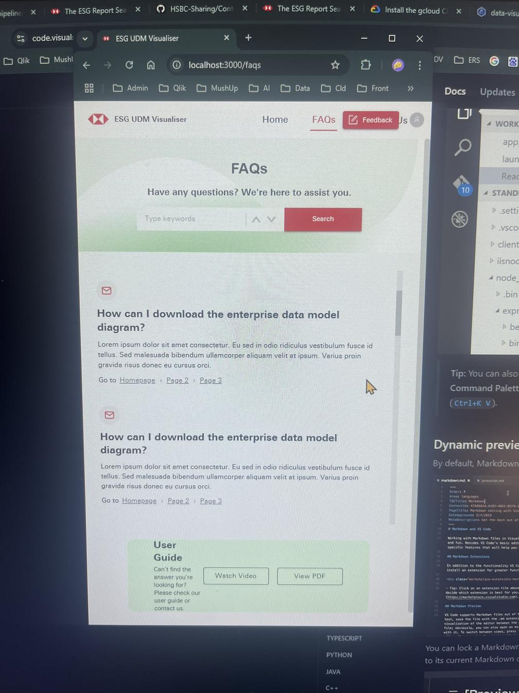


## 如何实现父级div由子集div撑起来

要使父级 `div` 的高度由子级 `div` 的高度撑起来，默认情况下，父级 `div` 会根据子级 `div` 的内容自动调整高度。如果父级 `div` 没有设置固定高度，或者没有特殊的 CSS 属性（例如 `float` 或 `position: absolute`），父级 `div` 会根据子级 `div` 的内容撑开。

然而，有些情况下，例如使用了浮动元素或绝对定位的元素，可能会导致父级 `div` 不能正确撑开。在这些情况下，可以使用以下方法来确保父级 `div` 按照子级 `div` 的高度自动调整。

### 方法 1: 清除浮动
如果子元素使用了浮动（`float`），可以在父元素中使用清除浮动的方法来实现。

**HTML**：
```html
<div class="parent">
    <div class="child">子元素内容</div>
</div>
```

**CSS**：
```css
.parent::after {
    content: "";
    display: table;
    clear: both;
}
```

### 方法 2: 使用 `display: flex`
使用 Flexbox 是另一种常见方法，可以确保父级 `div` 根据子级 `div` 的内容自动调整高度。

**HTML**：
```html
<div class="parent">
    <div class="child">子元素内容</div>
</div>
```

**CSS**：
```css
.parent {
    display: flex;
    flex-direction: column;
}
```

### 方法 3: 使用 `display: inline-block`
可以将父级 `div` 设置为 `inline-block`，这样它会根据子级 `div` 的内容自动调整高度。

**HTML**：
```html
<div class="parent">
    <div class="child">子元素内容</div>
</div>
```

**CSS**：
```css
.parent {
    display: inline-block;
}
```

### 方法 4: 使用 `position: relative` 和 `position: absolute`
如果子元素使用了绝对定位，可以使用一个伪元素来确保父元素的高度。

**HTML**：
```html
<div class="parent">
    <div class="child">子元素内容</div>
</div>
```

**CSS**：
```css
.parent {
    position: relative;
}

.child {
    position: absolute;
    top: 0;
    left: 0;
}

.parent::after {
    content: "";
    display: block;
    clear: both;
}
```

### 总结
通常情况下，如果没有特殊样式干扰，父级 `div` 会默认根据子级 `div` 的高度自动调整。如果因为使用了浮动或绝对定位等导致父级 `div` 不能撑开，可以使用清除浮动、Flexbox 或伪元素的方法来解决这个问题。选择适合你项目需求的方法即可。

## CSS伪元素

### Case 1

问题描述

react-split-pane包内的Resizer vertical是一个span标签, 由于不在本地, 应急地将它设置为一定的灰色圆角宽高长条, 希望其在容器中居中, 却只能通过margin-top实现... 但当view legends下移, 长条则偏上

目标

在Resizer vertical的span标签内部添加一个灰色圆角宽高长条元素, span高度100%, 内部元素居中即可 —— 使用 伪元素 !

解决

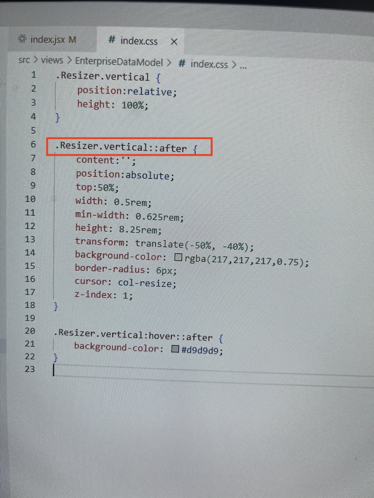


### Case 2

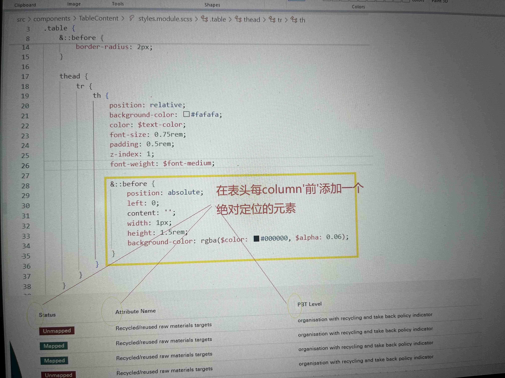


## 首页不同section间跳转

**前情:** 

类似于如下url, 区别仅在于#后部分, 不同的#将跳转到quickstart.html, 如何实现该功能?

`https://flask-restful.readthedocs.io/en/latest/quickstart.html#data-formatting`

`https://flask-restful.readthedocs.io/en/latest/quickstart.html#resourceful-routing`


**实现:**

```html
<!DOCTYPE html>
<html lang="en">
<head>
    <meta charset="UTF-8">
    <meta name="viewport" content="width=device-width, initial-scale=1.0">
    <title>Quickstart</title>
</head>
<body>
    <h1>Flask-Restful Quickstart</h1>
    
    <h2 id="data-formatting">Data Formatting</h2>
    <p>This section talks about data formatting.</p>
    
    <h2 id="resourceful-routing">Resourceful Routing</h2>
    <p>This section discusses resourceful routing.</p>
    
    <h2 id="another-section">Another Section</h2>
    <p>This section contains additional information.</p>

    <script>
        // 获取 URL 的 hash 部分
        const hash = window.location.hash;
        if (hash) {
            // 如果有 hash，滚动到对应的锚点
            const element = document.querySelector(hash);
            if (element) {
                element.scrollIntoView();
            }
        }
    </script>
</body>
</html>

```


# Bugfix Log


## 20241219-相同文件二次上传失败

上传同一个文件，删除后再次上传，未触发onChange

- 删除文件，同时浏览器缓存值
- 适配typescript的类型检查要求
- 其他：使用react-dropzone、react-file-upload

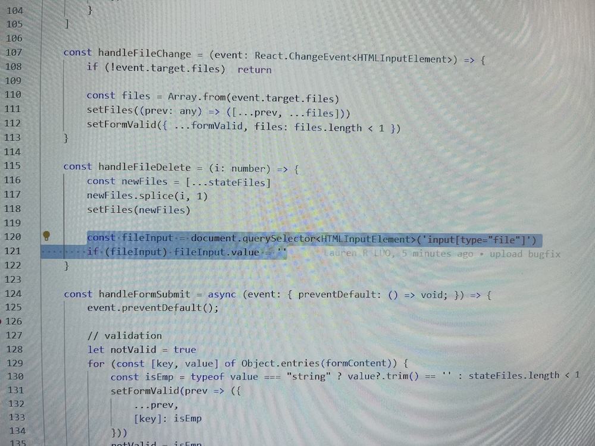


## tooltip文字向左对齐后右侧易出现留白

以下两者搭配可解决: 

```css
text-align: justify;    
max-width: 300px; 
```


2. 文字过长显示省略号悬浮出全文

```html
<p style={{
                                    margin: 0,overflow: 'hidden',
                                    textOverflow: 'ellipsis',
                                    whiteSpace: 'nowrap', }}>{column.name}</p>
```


