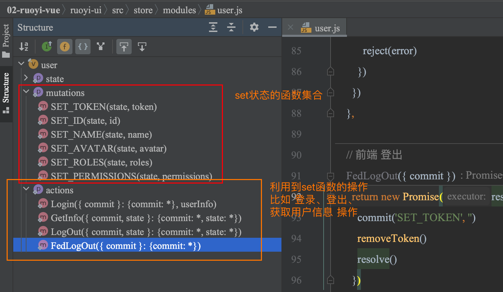

# HTML


# CSS

## div标签内容水平垂直居中


### 方法一：使用Flexbox
Flexbox 是一个现代的布局模型，可以非常容易地实现元素的 水平和垂直居中。

```css
.container {
  display: flex;
  justify-content: center; /* 水平居中 */
  align-items: center; /* 垂直居中 */
  height: 100vh; /* 视窗高度，确保容器足够高 */
}
```

```html
<div class="container">
  <div>这里是居中的内容</div>
</div>
```

### 方法二：使用Grid
CSS Grid 也是一个强大的布局系统，可以用来实现元素的居中。

```css
.container {
  display: grid;
  height: 100vh; /* 视窗高度 */
}

.container > div {
  margin: auto; /* 自动计算外边距 */
}
```

```html
<div class="container">
  <div>这里是居中的内容</div>
</div>
```

### 方法三：使用绝对定位和transform
这种方法通过将元素的左、右、上、下设置为0，并使用 `margin: auto` 来实现水平和垂直居中。

```css
.container {
  position: relative;
  height: 100vh; /* 视窗高度 */
}

.centered {
  position: absolute;
  top: 0;
  left: 0;
  right: 0;
  bottom: 0;
  margin: auto;
  width: 50%; /* 设置宽度 */
  height: 50%; /* 设置高度 */
}
```

```html
<div class="container">
  <div class="centered">这里是居中的内容</div>
</div>
```

### 方法四：使用table-cell和vertical-align
这种方法模拟了表格布局的行为。

```css
.container {
  display: table-cell;
  text-align: center; /* 水平居中 */
  vertical-align: middle; /* 垂直居中 */
  height: 100vh; /* 视窗高度 */
}
```

```html
<div class="container">
  <div>这里是居中的内容</div>
</div>
```

选择哪种方法取决于你的具体需求和项目的兼容性要求。Flexbox 和 Grid 通常是现代浏览器中实现居中最简单和最有效的方法。


## position与display属性的区别

### `display` 属性
`display` 属性用于设置元素生成的框的类型。主要的值包括：
- `block`：元素呈现为块级元素，独占一行，可以设置宽度和高度。
- `inline`：元素呈现为内联元素，不会独占一行，宽度和高度由内容决定。
- `inline-block`：元素呈现为内联块级元素，不会独占一行，但可以设置宽度和高度。
- `none`：元素不会被显示，也不会占据空间。

### `position` 属性
`position` 属性用于设置元素的定位方式。主要的值包括：
- `static`：默认值，元素按照正常文档流进行定位。
- `relative`：元素相对于其正常位置进行定位，可以通过 `top`, `right`, `bottom`, `left` 属性调整位置。
- `absolute`：元素相对于最近的非 `static` 定位的祖先元素进行定位，如果没有则相对于 `body`。
- `fixed`：元素相对于浏览器窗口进行定位，即使页面滚动，元素位置也不会改变。
- `sticky`：元素根据用户的滚动位置进行定位。

### 区别和联系
- **控制内容不同**：`display` 控制元素的显示类型和布局方式，而 `position` 控制元素的定位方式。
- **影响布局**：`display` 的改变会影响元素在 文档流中的布局，而 `position` 的改变会影响 元素的定位方式，可能会脱离文档流。
- **使用场景**：`display` 常用于控制元素的布局，如列表项的显示方式；`position` 常用于控制元素的具体位置，如弹出菜单的定位。


## display属性options详解

CSS中的Display属性是一个非常强大的工具，它控制着HTML元素的布局方式。我们来看看你提到的几种Display属性：Grid, Flexbox, Inline, Block, 以及Inline Block，它们各自的特点和用途。

### **1. Grid**

Grid布局是CSS的一种布局方式，允许开发者创建复杂的响应式网页布局结构，更容易、更灵活地设计网格。它允许我们定义行和列，然后将元素放置到这些行列所定义的网格区域内。它最适合于创建复杂的页面布局，特别是当你需要对齐项目，或者在两个轴（即行和列）上控制它们的大小时。

### **2. Flexbox**

Flexbox，或者称为灵活盒子模型，是一种设计页面布局的工具。它为盒状模型提供了一种更加有效的方式来在容器内分配空间，即使在未知大小的项目上也是如此。它主要用于一维布局（即在行或列中），使得在不同屏幕大小上的元素对齐、分布空间和调整大小变得简单。

### **3. Inline**

`Inline`布局是默认的布局模式，用于如`<span>, <a>, , <strong>, <small>`这样的内联元素。内联元素不会开始一个新的行，它们在文档流中水平排列，直到填满行的宽度，然后移动到下一行。内联元素不可以设置宽度和高度。

### **4. Block**

`Block`布局对应于块级元素，如`<div>`、`<p>`等。块级元素会占据它所在的整个容器的宽度，即使它本身的内容没有那么宽。每个块级元素也都会从新的一行开始，并且可以设置宽度和高度。

### **5. Inline-Block**

`Inline-Block`结合了内联元素和块级元素的特点。它不会像块级元素那样独占一行，允许其他元素在同一行显示，但是它允许设置元素的宽度和高度，这是传统内联元素不支持的。`Inline-Block`适合于需要在同一行内并排显示的元素，同时需要调整它们的大小。

总的来说，这些布局方式提供了不同的工具和方法，以应对各种页面布局的挑战。选择哪一种取决于你的具体需求，比如你是需要更灵活的一维布局（Flexbox），还是需要构建复杂的两维布局（Grid），或者是其它情况。


# Javascript


## typeOf 与 instanceOf

在JavaScript中，`typeof`和`instanceof`是两个用于检查数据类型和对象实例的运算符，它们各自有不同的用途和行为。

### `typeof`
- `typeof`是一个**<u>一元运算符</u>**，用于返回操作数的数据类型的一个字符串
- 可以用来检查基本数据类型，如`number`, `string`, `boolean`, `undefined`, `object`, `function`
- `对于`null`和数组，`typeof`会返回`object`，这有时可能会引起混淆

**示例**:
```javascript
console.log(typeof 42); // 输出: "number"
console.log(typeof "Hello"); // 输出: "string"
console.log(typeof true); // 输出: "boolean"
console.log(typeof undefined); // 输出: "undefined"
console.log(typeof {a: 1}); // 输出: "object"
console.log(typeof function(){}); // 输出: "function"
console.log(typeof null); // 输出: "object"
console.log(typeof [1, 2, 3]); // 输出: "object"
```

### `instanceof`
`instanceof`是一个 <u>**二元运算符**</u>，用于检查一个对象是否是某个构造函数的实例。它返回一个布尔值。`instanceof`主要用于检查对象的类型，特别是自定义对象和内置对象。

**示例**:
```javascript
function Car(make, model, year) {
  this.make = make;
  this.model = model;
  this.year = year;
}

const myCar = new Car("Toyota", "Corolla", 2020);
console.log(myCar instanceof Car); // 输出: true
console.log(myCar instanceof Object); // 输出: true
console.log(myCar instanceof Array); // 输出: false
```

### 区别总结
- `typeof`用于检查基本数据类型和函数，返回一个 表示类型的字符串。
- `instanceof`用于检查对象是否是特定构造函数的实例，返回一个布尔值。
- <u>`typeof`对于`null`和数组返回`object`，而`instanceof`可以准确地识别这些对象的具体类型</u>。


## 闭包是什么? 

闭包（Closure）是编程语言中的一个概念，特别是在 函数式编程语言 中。它指的是一个函数与其引用的外部变量（或环境）的组合。简单来说，闭包允许一个函数访问并操作其定义范围之外的变量，即使在其定义范围已经结束之后。

### 闭包的作用：
1. **封装性**：闭包可以隐藏数据，只提供API给外部使用，有助于实现 **数据隐藏 和 模块化编程**。
2. **状态保持**：闭包可以保持函数调用之间状态的持久性，这对于实现某些类型的数据结构（如迭代器、缓存等）非常有用。
3. **函数作为一等公民**：在支持闭包的语言中，函数可以作为参数传递给其他函数，也可以作为返回值从函数中返回，这增加了编程的灵活性和表达力。

### 闭包的缺点：
1. **内存消耗**：闭包会持有外部变量的引用，如果这些变量不被释放，可能会导致内存泄漏。
2. **可读性和维护性**：闭包可能会使代码逻辑变得复杂，尤其是在大型项目中，闭包的使用可能会降低代码的可读性和可维护性。
3. **性能影响**：闭包的创建和使用可能会比普通函数有更高的性能开销，尤其是在频繁调用的场景中。

### 示例：
在JavaScript中，闭包的例子如下：

```javascript
function createCounter() {
    let count = 0;
    return function() {
        count += 1;
        return count;
    };
}

let counter = createCounter();
console.log(counter()); // 输出 1
console.log(counter()); // 输出 2
```

在这个例子中，`createCounter` 函数返回了一个内部函数，这个内部函数引用了外部函数的变量 `count`。每次调用返回的函数时，`count` 的值都会增加，显示了闭包如何保持状态。

总的来说，闭包是一个强大的工具，但需要谨慎使用，以避免潜在的问题。


## ==与===

- == 数据类型不用相等, 例如，`5 == '5'`会返回`true`
- === 则为严格相等, 类型与值都必须向灯


## Promise

### 回调地狱

场景: 获取第一次ajax请求获取的id, 作为第二次ajax请求的参数 —— 在没有promise时, 只能通过嵌套ajax实现

```html
<!DOCTYPE html>
<html>
<head>
    <meta charset="UTF-8">
    <meta name="viewport" content="width=device-width,initial-scale=1.0">
    <title>Promise Practice</title>
    <script src="https://ajax.googleapis.com/ajax/libs/jquery/3.6.0/jquery.min.js"></script>
</head>
<script>
    $.ajax({
        type: 'GET',
        url: './data1.json',
        success: res => {
            const { id } = res

            $.ajax({
                type: 'GET',
                data: { id },
                url: './data2.json',
                success: res => {
                    const { username } = res

                    $.ajax({
                        type: 'GET',
                        data: { ...res },
                        url: './data3.json',
                        success: res => {
                            const { final } = res
                            console.log(final)
                        }
                    })
                }
            })
        }
    })
</script>
</html>
```


### Promise实例

<u>Promise实例通过new获取, 构造方法接收2个参数:</u> 

- resolve方法, 参数 为 成功执行的结果
- reject方法, 参数 为 失败执行的结果


<u>Promise实例内含三个参数: State, Result以及prototype本身, 后者包含多个方法, 如then</u>

- promise默认的state是 pending
- 调用resolve变 为 fullfilled
- 调用reject变为 为 rejected
- 只有state变化才会触发then里的两个方法
- pending -> fullfilled 以及 pending -> rejected 都是单向的, 无法倒退


```html
<script>
    const p = new Promise((resolve, reject) => {
        resolve("成功执行的结果")
        reject("失败执行的结果")
    })
    
    console.dir(p)
</script>
```


### then方法参数

方法接收2个参数, 均为方法, 成功执行时执行的方法 以及 失败执行时执行的方法, 参数分别为成功执行时 传入resolve方法的参数 以及 失败执行时传入reject方法的参数

```html
<script>
    const p = new Promise((resolve, reject) => {
        //resolve("成功执行的结果")
        reject("失败执行的结果")
    })
    
    p.then(
    (value) => {
        console.log('Run succeeds, here\'s the result: ', value)
    }, 
    (err) => {
        console.log('Run fails, here\'s the reason: ', err)
    })
</script>
```


### then方法返回值

返回值仍旧为一个Promise实例, 所以支持then方法连续链式调用;

返回的Promise实例state为pending, 所以不会自动执行下一步then的2个参数方法;

如何改变Promise实例的状态, 在then成功方法里用return则为fullfilled, return返回的参数就是下一步then里的value参数, 如果成功方法内部报错则为rejected, 参数就是下一步then里的reason/err参数;


### catch方法

执行时机

- promise方法状态改为rejected时;
- promise方法执行体内部报错时;

```html
<script>
	new Promise((resolve, reject) => {
    
  }).then(value => {
    console.log('succeed', value)
  }).catch(err => {
    console.log('error', err)
  })
</script>
```


### 解决办法

```html
<!DOCTYPE html>
<html>

<head>
    <meta charset="UTF-8">
    <meta name="viewport" content="width=device-width,initial-scale=1.0">
    <title>Promise Practice</title>
    <script src="https://ajax.googleapis.com/ajax/libs/jquery/3.6.0/jquery.min.js"></script>
</head>

<script>
    new Promise((resolve, reject) => {
        $.ajax({
            type: 'GET',
            url: './data1.json',
            success: res => {
                const { id } = res
    // ---- 初始方法体中的resolve为必须 ----
                resolve(id)  
            }
        })
    }).then(value => {
        $.ajax({
            type: 'GET',
            data: { value },
            url: './data2.json',
            success: res => {
                const { username } = res
                return username
            }
        })
    }).then(value => {
        $.ajax({
            type: 'GET',
            data: { value },
            url: './data3.json',
            success: res => {
                const { final } = res
                console.log(final)
            }
        })
    }).catch(err => {
        console.log(err)
    })
    
</script>

</html>
```


# ES6

## 操作数组的方法map、filter、reduce、find

在ES6中，JavaScript提供了一些强大的数组方法，包括`map`、`filter`、`reduce`和`find`。这些方法可以帮助你更高效地处理数组数据。下面是这些方法的详细说明和示例：

### 1. `map`
`map`方法创建一个新数组，其结果是对原数组中的每个元素应用一个函数后的返回值。

**语法**:
```javascript
array.map(function(currentValue, index, arr), thisValue)
```

**示例**:
```javascript
const numbers = [1, 2, 3, 4];
const doubled = numbers.map(num => num * 2);
console.log(doubled); // 输出: [2, 4, 6, 8]
```

### 2. `filter`
`filter`方法创建一个新数组，包含所有通过提供函数实现的测试的元素。

**语法**:
```javascript
array.filter(function(currentValue, index, arr), thisValue)
```

**示例**:

```javascript
const numbers = [1, 2, 3, 4, 5, 6];
const evens = numbers.filter(num => num % 2 === 0);
console.log(evens); // 输出: [2, 4, 6]
```

### 3. `reduce`
`reduce`方法对数组中的 <u>每个元素执行一个由您提供的`reducer`函数</u> (升序执行)，将其结果汇总为单个输出值。

**语法**:

```javascript
array.reduce(function(total, currentValue, currentIndex, arr), initialValue)
```

**示例**:

```javascript
const numbers = [1, 2, 3, 4];
const sum = numbers.reduce((total, num) => total + num, 0);
console.log(sum); // 输出: 10
```

### 4. `find`
`find`方法返回数组中满足提供的测试函数的第一个元素的值。否则返回`undefined`。

**语法**:
```javascript
array.find(function(currentValue, index, arr), thisValue)
```

**示例**:
```javascript
const numbers = [1, 2, 3, 4, 5];
const found = numbers.find(num => num > 3);
console.log(found); // 输出: 4
```

这些方法都是非破坏性的，意味着它们不会改变原数组，而是返回一个新的数组或值。这使得它们在处理数据时非常有用，尤其是在需要保持原始数据不变的情况下。


# DOM

## javascript如何添加、移除、移动、复制、创建和查找节点 ?

在JavaScript中，你可以使用一系列的DOM（文档对象模型）方法来添加、移除、移动、复制、创建和查找节点。下面是一些常用的方法：

### 创建节点

1. **创建元素节点**
   ```javascript
   let newElement = document.createElement('div'); // 创建一个新的div元素
   ```

2. **创建文本节点**
   ```javascript
   let textNode = document.createTextNode('这是一个文本节点'); // 创建一个新的文本节点
   ```

### 添加节点

1. **添加子节点**
   ```javascript
   let parent = document.getElementById('parentElement');
   parent.appendChild(newElement); // 将newElement添加为parent的最后一个子节点
   ```

2. **在特定位置插入节点**
   ```javascript
   let referenceNode = document.getElementById('referenceElement');
   parent.insertBefore(newElement, referenceNode); // 在referenceNode之前插入newElement
   ```

### 移除节点

1. **移除子节点**
   ```javascript
   let child = document.getElementById('childElement');
   child.parentNode.removeChild(child); // 从其父节点中移除child节点
   ```

### 复制节点

1. **复制节点**
   ```javascript
   let originalNode = document.getElementById('originalElement');
   let cloneNode = originalNode.cloneNode(true); // 复制originalNode，参数true表示深复制，包括其所有子节点
   ```

### 移动节点

1. **移动节点**通常通过先移除节点，然后将其添加到新位置来实现。例如：
   ```javascript
   let nodeToMove = document.getElementById('nodeToMove');
   let newParent = document.getElementById('newParent');
   newParent.appendChild(nodeToMove); // 将nodeToMove移动到newParent下
   ```

### 查找节点

1. **通过ID查找**
   ```javascript
   let elementById = document.getElementById('elementId');
   ```

2. **通过标签名查找**
   ```javascript
   let elementsByTagName = document.getElementsByTagName('div'); // 获取所有div元素
   ```

3. **通过类名查找**
   ```javascript
   let elementsByClassName = document.getElementsByClassName('className'); // 获取所有具有特定类名的元素
   ```

4. **通过选择器查找**
   ```javascript
   let elementBySelector = document.querySelector('#selector'); // 获取第一个匹配的选择器
   let elementsBySelector = document.querySelectorAll('.selector'); // 获取所有匹配的选择器
   ```

这些方法提供了在JavaScript中操作DOM节点的基本功能。根据具体需求，你可能需要组合使用这些方法来实现更复杂的操作。


## cookie、sessionStorage、localStorage区别

Cookie、sessionStorage 和 localStorage 都是浏览器提供的存储机制，但它们在用途、存储容量、生命周期和作用域等方面有所不同。下面是它们的主要区别：

1. **存储容量**：
   - **Cookie**：通常每个域名最多存储4KB的数据。
   - **localStorage** 和 **sessionStorage**：通常可以存储5MB左右的数据，具体取决于浏览器。

2. **生命周期**：
   - **Cookie**：可以设置过期时间，如果不设置，则关闭浏览器时失效。如果设置了过期时间，则会在指定时间后失效。
   - **localStorage**：除非被清除，否则永久保存。
   - **sessionStorage**：仅在当前会话（窗口或标签页）有效，关闭后即失效。

3. **作用域**：
   - **Cookie**：不限于当前页面，可以被 同域名下 的所有页面访问。
   - **localStorage** 和 **sessionStorage**：仅在 当前域名下 有效，localStorage 可以被同域名下的所有页面访问，而 sessionStorage 仅在当前页面或标签页有效。

4. **网络传输**：
   - **Cookie**：每次HTTP请求都会携带Cookie数据，这可能会影响性能，尤其是当存储大量数据时。
   - **localStorage** 和 **sessionStorage**：数据不会随HTTP请求发送到服务器，只在客户端保存。

5. **用途**：
   - **Cookie**：常用于存储用户的 身份认证信息、购物车数据 等，需要在客户端和服务器之间传递的数据。
   - **localStorage**：适合存储 不经常改变的数据，如 用户偏好设置、主题 等。
   - **sessionStorage**：适合存储只在当前会话中需要的数据，如表单数据、临时状态等。

总结来说，选择哪种存储机制取决于你的具体需求，包括数据的大小、生命周期、是否需要在客户端和服务器之间传递等因素。


# Vue

## computed、watch、methods

在Vue框架中，`computed`、`watch`和`methods`是三种不同的特性，它们各自有不同的用途和特点：

1. **Computed Properties (`computed`)**
   - **缓存**：`computed`属性是 基于它们的依赖进行缓存的。只有在它的相关依赖发生改变时才会重新求值, 类似于useEffet传入的第二个依赖项数组
2. **Watch**
   - **监听**：`watch`用于观察和响应Vue实例上的数据变动。当需要 <u>在数据变化时 执行异步或开销较大的操作</u> 时，这个方式是最有用的。
   - **深度监听**：`watch`可以进行深度监听，即可以 <u>监听对象内部</u> 的变化。
   - **适用于异步操作**：如果你需要在某个数据变化时做一些事情，而这些事情涉及到异步操作或者其他复杂的逻辑，使用`watch`会更合适。
3. **Methods**
   - **无缓存**：`methods`中的函数每次都会执行，不会缓存结果。
   - **事件触发**：通常用于定义事件处理函数，如点击事件、表单提交等。
   - **灵活性**：`methods`提供了最大的灵活性，可以定义任何类型的函数，不限于数据响应式相关的操作。

**区别总结**：
- `computed`适用于 <u>依赖数据变化时 自动更新</u> 的场景，且具有缓存特性，适合做数据的复杂计算。
- `watch`适用于需要 <u>在数据变化时执行异步操作或开销较大</u> 的操作。
- `methods`用于定义可由事件触发或手动调用的函数，无缓存特性。


## Computed、watch使用场景

在Vue框架中，`computed`和`watch`是两个非常有用的特性，它们可以帮助你更有效地处理响应式数据和状态管理。下面是一些场景，你可以根据这些场景来决定何时使用`computed`或`watch`：

### Computed

`computed`属性是基于它们的依赖进行缓存的。只有在相关依赖发生改变时它们才会重新求值。这意味着只要依赖的数据没有变化，多次访问`computed`属性会立即返回之前的计算结果，而不必再次执行函数。

**使用场景：**

1. **数据转换或格式化：** 当你需要对数据进行转换或格式化，并且这个转换依赖于其他响应式数据时，使用`computed`。例如，你有一个用户的全名需要根据姓和名来计算。

2. **复杂逻辑计算：** 当需要进行一些复杂的计算，而这些计算依赖于多个响应式数据时，使用`computed`。例如，计算用户的总积分，这个积分可能依赖于用户的多个行为数据。

3. **缓存计算结果：** 当计算过程比较耗时，且依赖的数据不经常变化时，使用`computed`来缓存结果，避免不必要的重复计算。

### Watch

`watch`允许你观察和响应Vue实例上的数据变动。当你有一些数据需要随着其它数据变动而变动时，你很容易滥用`watch`——特别是如果你之前使用过AngularJS的话。然而，通常更好的想法是使用`computed`属性而不是命令式的`watch`回调。

**使用场景：**

1. **异步操作或开销较大的操作：** 当你需要在数据变化时执行异步或开销较大的操作时，使用`watch`。例如，当用户信息变化时，需要发送一个API请求更新用户信息。

2. **深度监听：** 当你需要监听一个对象的深层嵌套属性的变化时，可以使用`watch`的深度监听功能。例如，监听用户的详细信息对象中的某个属性变化。

3. **复杂或特殊逻辑：** 当`computed`无法满足需求，需要更复杂的逻辑处理时，可以使用`watch`。例如，监听用户列表的变化，并在用户数量达到一定阈值时触发某些操作。

### 结合使用

在实际开发中，你可能会同时使用`computed`和`watch`。例如，<u>你可能有一个`computed`属性来计算用户的总积分，同时使用`watch`来监听积分变化，并在积分达到某个阈值时发送通知</u>。

总结来说，<u>`computed`更适合于提供数据的计算结果，而`watch`更适合于 观察数据变化 并 执行副作用操作<u>(比如发起一个API请求)</u>。根据你的具体需求和场景，合理选择使用`computed`或`watch`可以提高代码的可读性和性能。


## vuex中的action和mutation区别

在Vuex中，`action`和`mutation`是两种不同的机制，用于 处理状态（state） 的变更。它们各自有不同的用途和限制，下面是它们的主要区别：



1. **目的和用途**：
   - **Mutation**：
     - Mutations是用于 修改状态的唯一途径。
     - 它们必须是同步函数，这意味着在mutation函数中<u>不能包含异步操作</u>。
     - 每个mutation都有一个字符串的事件类型（type）和一个回调函数（handler），该回调函数接受状态（state）作为第一个参数。
     - 通过提交（commit）一个mutation来改变状态。
   - **Action**：
     - Actions类似于mutation，但它们 <u>不直接修改状态，而是提交mutation来变更状态</u>。
     - Actions可以包含任意异步操作，如API调用或定时器。
     - Actions通过分发（dispatch）来触发，它们可以接受一个与store实例具有相同方法和属性的context对象，并可以调用context.commit来提交一个mutation。

2. **同步与异步**：
   - **Mutation**：必须是同步的。一旦mutation被触发，Vuex store的内部状态就会立即改变，因此异步操作是不允许的，因为这会导致状态快照的不一致。
   - **Action**：可以包含异步操作。由于actions不直接修改状态，而是通过提交mutation来实现，因此它们可以包含异步逻辑。

3. **调用方式**：
   - **Mutation**：通过`store.commit('mutationType', payload)`来调用。
   - **Action**：通过`store.dispatch('actionType', payload)`来调用。

4. **组合与复用**：
   - **Action**：可以更容易地进行组合和复用，因为它们可以包含异步逻辑，并且可以通过 分发其他actions来实现逻辑的组合
   - **Mutation**：通常是单一的，直接修改状态，不易于复用和组合

总结来说，`mutation`用于同步地修改状态，而`action`用于处理异步操作并通过提交`mutation`来间接修改状态。这种分离有助于保持状态变更的可追踪性和可预测性，同时也提供了更好的代码组织和复用性。


# 速查JS

## 正则表达式

### 1.删除JS里的双斜线注释

为了构建一个能够匹配双斜线后接一个或多个空格，再接多个中文字符、字母、数字或中英文标点的正则表达式，我们可以扩展之前提供的正则表达式。以下是满足这些条件的正则表达式：

```regex
//\s+[\u4e00-\u9fa5A-Za-z0-9\u0020-\u007E\uFF01-\uFF5E]+
```

这里对正则表达式的各部分进行解释：

- `//`：匹配两个连续的斜线。
- `\s+`：匹配一个或多个空白字符（包括空格、制表符等）。如果你想只匹配空格，可以替换为 ` +`。
- `[\u4e00-\u9fa5A-Za-z0-9\u0020-\u007E\uFF01-\uFF5E]+`：这部分匹配一个或多个指定范围内的字符。
  - `\u4e00-\u9fa5`：匹配中文字符。
  - `A-Za-z0-9`：匹配英文大小写字母和数字。
  - `\u0020-\u007E`：匹配基本拉丁文（包括英文标点符号）。
  - `\uFF01-\uFF5E`：匹配全角标点符号（即中文标点符号）。

注意，`\u0020-\u007E` 包含了从空格到波浪号的所有可打印的 ASCII 字符，这涵盖了大部分常用的英文标点符号。而 `\uFF01-\uFF5E` 范围内包含了全角标点符号，即中文标点符号。


### 2.删除字符串“-txt-number”或“-number”后缀

```regex
/-(txt-\d+|\d+)$/
```


## 遍历获取

有一个数组, 内部对象有一个id属性, 我希望获取所有id属性用.间隔拼接起来的长字符串, 如何用js实现?

你可以使用 JavaScript 提供的一些内置方法，如 `map` 和 `join`，来实现将数组中的对象的 `id` 属性提取并用点（`.`）间隔拼接成一个长字符串。

示例代码

假设你有一个数组 `arr`，每个对象都有一个 `id` 属性：

```javascript
const arr = [
  { id: 1, name: 'Alice' },
  { id: 2, name: 'Bob' },
  { id: 3, name: 'Charlie' }
];
```

你可以使用以下代码来实现：

```javascript
const idsString = arr.map(item => item.id).join('.');
console.log(idsString); // 输出: "1.2.3"
```

代码解释

1. **`map` 方法**：`map` 方法遍历数组中的每一个元素，并返回一个新数组，其中包含每个元素执行回调函数后的返回值。这里我们用 `map` 将每个对象的 `id` 属性提取出来，形成一个数组 `[1, 2, 3]`。
2. **`join` 方法**：`join` 方法将数组中的所有元素连接成一个字符串，并使用指定的分隔符将每个元素分开。在这里我们使用 `'.'` 作为分隔符。

完整示例

以下是一个完整的示例，包括数组定义和最终的输出：

```javascript
const arr = [
  { id: 1, name: 'Alice' },
  { id: 2, name: 'Bob' },
  { id: 3, name: 'Charlie' },
  { id: 4, name: 'David' }
];

const idsString = arr.map(item => item.id).join('.');
console.log(idsString); // 输出: "1.2.3.4"
```

处理边界情况

你可能需要处理一些边界情况，例如数组为空或对象缺少 `id` 属性。以下是一个更健壮的实现：

```javascript
const arr = [
  { id: 1, name: 'Alice' },
  { id: 2, name: 'Bob' },
  { name: 'Charlie' }, // 缺少 id
  { id: 4, name: 'David' }
];

const idsString = arr
  .filter(item => item.id !== undefined) // 过滤掉没有 id 的对象
  .map(item => item.id) // 提取 id
  .join('.'); // 用 '.' 连接

console.log(idsString); // 输出: "1.2.4"
```

在这个示例中，`filter` 方法用于过滤掉那些缺少 `id` 属性的对象，确保最后得到的字符串只包含有效的 `id`。


## reduce使用

**案例**: url中的aaa-bbb-ccc转变为标题Aaa-Bbb-Ccc

```jsx
function formatString(str) {
  return str.split('-')
    .reduce((acc, word) => acc + (word.charAt(0).toUpperCase() + word.slice(1)) + ' ', '')
    .trim();
}

// 测试示例
const input = "dsd-sfsdf-efef";
const result = formatString(input);
console.log(result);  // 输出: "Dsd Sfsdf Efef"
```


## set沿用原数组并新增元素

```js
setExpandedNodes(
	prevStat => (
		{
			...prevStat,
			[target]: true
		}
	)
)
```


## 字符串按空格按最平衡长度切分子串

方法入参为字符串s和数字n, 方法将返回该字符串 以空格(可为1个也可能为多个)切分的子串数组, 字串数量最多为n, 但并非所有空格处都要被切分, 目标为所有子串的长度尽量接近,  比如对于字符串s = ‘xxxxxxxx yyyyyyyyy ssss eeer’, n=3, 应该返回[‘xxxxxxxx’, ‘yyyyyyyyy’, ‘ssss eeer’]

```js
function splitStringWithBalancedLength(s, n) {
  // 去掉字符串两端的空格
  s = s.trim();

  // 如果字符串为空或者n为0，直接返回空数组
  if (!s || n <= 0) return [];

  // 将字符串按空格分割成单词数组
  const words = s.split(/\s+/);

  // 如果单词数小于等于n，直接返回每个单词作为一个子串
  if (words.length <= n) return words;

  const result = [];
  let currentChunk = '';
  let currentLength = 0;
  let chunksLeft = n;

  for (let word of words) {
    // 计算如果加入当前单词后的总长度
    const nextLength = currentLength + word.length + (currentChunk ? 1 : 0);

    // 如果加入当前单词后不会超过平均长度，或者这是最后一个子串
    if (nextLength <= Math.ceil(s.length / n) || chunksLeft === 1) {
      currentChunk += (currentChunk ? ' ' : '') + word;
      currentLength = nextLength;
    } else {
      // 否则，将当前子串加入结果数组，并开始新的子串
      result.push(currentChunk);
      currentChunk = word;
      currentLength = word.length;
      chunksLeft--;
    }
  }

  // 将最后一个子串加入结果数组
  if (currentChunk) {
    result.push(currentChunk);
  }

  return result;
}
```


# Troubleshooting


## 1. tooltip文字向左对齐后右侧易出现留白

以下两者搭配可解决: 

```css
text-align: justify;    
max-width: 300px; 
```


2. 文字过长显示省略号悬浮出全文

```html
<p style={{
                                    margin: 0,overflow: 'hidden',
                                    textOverflow: 'ellipsis',
                                    whiteSpace: 'nowrap', }}>{column.name}</p>
```


